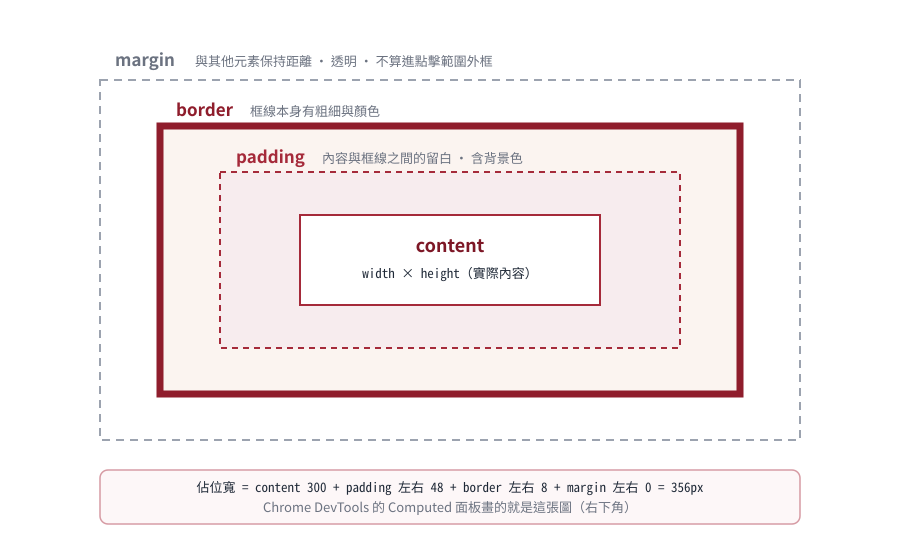

# Django 課程先備
## HTML / CSS 先備

給「沒寫過網頁」就要學 Django template 的你。

**目標：看得懂 `templates/base.html` 的每一行，並知道 Bootstrap 在幫你做什麼。**

<!--
授課提示：開場可請學生打開任一常用網站按 F12，
指著 Elements 面板說「你現在看到的就是本冊要教的東西」。
-->

---

## 本課程的兩個專案：本冊為兩者共用

| 階段 | 專案 | 你會實作的頁面 |
|---|---|---|
| 第一階段 | **LearnBoard 學言板**（`learnboard/`） | 留言牆、登入／註冊、發表／編輯留言 |
| 第二階段 | **LearnMart 學購商城**（`learnmart/`） | 商品目錄、購物車、訂單 |

- 本冊所有 HTML/CSS 概念在兩個專案都會用到
- 內文標有「**LearnMart 對照**」的例子是第二階段的伏筆；第一階段請對照 `learnboard/templates/board/` 的同名版面
- 第 6 章實查對象：LearnBoard 的 `base.html` 與留言卡

<!--
授課提示：說明課程順序——先用最小的留言板學會全套基本功，
再用同一套功夫挑戰功能更完整的商城。兩個專案的模板結構高度相似。
-->

---

## 網頁三件套：各司其職

| 技術 | 負責 | 比喻 | 本課程用量 |
|---|---|---|---|
| **HTML** | 內容與結構 | 骨架 | 大量（template） |
| **CSS** | 外觀與排版 | 化妝＋服裝 | Bootstrap 代勞＋少量自訂 |
| JavaScript | 行為與互動 | 反應神經 | 本課程幾乎不用 |

Django 的角色：在伺服器端**把資料填進 HTML 模板**再回傳。

> 所以：不懂 HTML 就看不懂 Django 在做什麼。

<!--
授課提示：明確宣佈本課程不教 JS，降低焦慮。
強調順序：先骨架（HTML）、再化妝（CSS），最後 Django 才接得上。
-->

---

## 如何練習：一個檔案 + 一個瀏覽器就夠

```text
practice/
└── index.html      ← 用任何文字編輯器編輯
```

1. 編輯 `index.html`
2. 用瀏覽器直接開啟這個檔案（雙擊或拖進視窗）
3. 修改 → 存檔 → 重新整理

**必學工具：開發者工具（F12）**

- **Elements**：即時檢視 HTML 結構
- **Computed**：查看某元素的 CSS 最終計算值（含 box model 圖）

> 不需要伺服器；第 3 章之後才會由 Django 接手提供 HTML。

<!--
授課提示：花 2 分鐘帶 F12 的 Elements 與 Computed 面板。
之後所有「為什麼長這樣」的問題，第一動作都是打開 F12 自己查。
-->

---

## 六章地圖

| 章 | 主題 | 對應課程專案 |
|---:|---|---|
| 1 | HTML 文件結構 | `templates/base.html` 的 head |
| 2 | 常用標籤 | 留言卡、商品卡版面 |
| 3 | 表單標籤 | 搜尋列、註冊表單 |
| 4 | CSS 基礎 | `static/css/site.css` |
| 5 | RWD 概念 | Bootstrap grid、斷點 |
| 6 | 實查 LearnBoard | base.html、message_list.html |

每章同樣有「動手試」與附簡答的觀念檢核。

<!--
授課提示：告訴學生第 6 章是驗收站——能讀懂真實專案的模板才算過關。
-->

---

# 第 1 章
## HTML 文件結構

**本章成果：**能畫出一份 HTML 文件的層級，說出 head 與 body 各放什麼。

<!--
授課提示：本章目標只有兩個：標籤解剖圖、head/body 分工。
語意細節交給第 2 章。
-->

---

## 1-1 元素解剖：標籤、屬性、內容

```html
<a href="https://djangoproject.com" target="_blank">
  Django 官網
</a>
```

```text
<a ...>  開始標籤
</a>     結束標籤
href=    屬性名稱        屬性值一律用引號包住
"..."    屬性值
中間文字  內容
```

- 元素 = 開始標籤 ＋ 內容 ＋ 結束標籤
- 屬性提供「額外設定」，寫在開始標籤內

**常見錯誤：** 忘記結束標籤 → 版面整個跑掉。F12 的 Elements 面板會自動幫你補齊成奇怪形狀，那就是線索。

<!--
授課提示：示範刪掉 </a> 後版面如何被拖累，
讓「成對」的重要性被親眼看見。
-->

---

## 1-2 最小 HTML 文件

<div style="display: flex; gap: 24px; align-items: flex-start;">
<div style="flex: 1;">

```html
<!DOCTYPE html>
<html lang="zh-Hant">
  <head>
    <meta charset="utf-8">
    <title>我的練習頁</title>
  </head>
  <body>
    <h1>Hello</h1>
  </body>
</html>
```

</div>
<div style="flex: 1;">

| 區塊 | 角色 |
|---|---|
| `<!DOCTYPE html>` | 宣告「我是現代 HTML」（固定寫法） |
| `<html>` | 整份文件根元素 |
| `<head>` | 給瀏覽器看的資訊（不顯示在畫面） |
| `<body>` | 使用者看到的內容 |

</div>
</div>

**你應該看到：** 分頁標題變成「我的練習頁」——那就是 `<title>`。

<!--
授課提示：DOCTYPE 和 lang 不必深究原因，當成固定咒語；
重點是 head/body 的分工：一個給機器、一個給人。
-->

---

## 1-3 head 裡的三個常客

```html
<meta charset="utf-8">          <!-- 字元編碼：中文不亂碼 -->
<meta name="viewport" content="width=device-width, initial-scale=1">
<title>學言板</title>
<link rel="stylesheet" href="style.css">   <!-- 接上 CSS -->
```

- `charset`：沒有它中文可能變亂碼
- `viewport`：手機依裝置寬度顯示——RWD 的入場券（Deck 01 3-17 會回頭講）
- `link`：把外部 CSS 接進來；兩個課程專案的 `base.html` 正是這樣載入 Bootstrap 與 `site.css`

<!--
授課提示：打開 templates/base.html 前 15 行對照，
學生會發現四行全部都在，多出來的是 Django template 語法（第 6 章揭曉）。
-->

---

## 1-4 巢狀與縮排：HTML 是一棵樹

```html
<body>                      ← 祖父
  <header>                  ← 父
    <h1>學購</h1>            ← 子
  </header>
  <main>
    <article>…</article>
  </main>
</body>
```

- 縮排只是慣例，但**強烈建議每層 2 格**，樹狀關係一目了然
- 巢狀不可交叉：`<b><i></b></i>` 是非法形狀

**你應該看到：** F12 Elements 面板就是這棵樹的互動版，點哪個節點、畫面就高亮哪塊區域。

<!--
授課提示：請學生在 F12 點幾個節點玩高亮，
建立「DOM 樹 ↔ 畫面區塊」的直覺映射。
-->

---

## 1-5 註解與空元素

```html
<!-- 這段註解不會顯示 -->

   <!-- 空元素：沒有內容，不需要結束標籤 -->
<br>
<input name="q">
```

- 註解寫法：`<!-- ... -->`
- img、input、br 等**空元素**天生沒有內容，也就沒有結束標籤

**常見錯誤：**把 `</img>` 補上去——不需要，反而困惑。

<!--
授課提示：alt 屬性先埋一句「無障礙＋圖片壞掉時的替代文字」，
Deck 01 6-14 會完整回收。
-->

---

## 第 1 章｜動手試與觀念檢核

**動手試：**做出你的第一頁：

```html
<!DOCTYPE html>
<html lang="zh-Hant">
<head><meta charset="utf-8"><title>自我介紹</title></head>
<body><h1>大家好，我是 OOO</h1></body>
</html>
```

**觀念檢核：**

1. `<head>` 裡的內容會顯示在畫面上嗎？　**答：大多不會**
2. viewport meta 缺了會怎樣？　**答：手機可能以桌面寬度縮放顯示**
3. `<input>` 需要結束標籤嗎？　**答：不需要（空元素）**

<!--
授課提示：三分鐘小關卡，全部通過才進第 2 章。
-->

---

# 第 2 章
## 常用標籤

**本章成果：** 能認出課程專案模板中九成的標籤，並知道各自語意。

<!--
授課提示：本節用「商品卡」貫穿：一張卡片就會用到
article、img、h2、p、a、button——教完直接能讀 home.html。
-->

---

## 2-1 標題與段落

```html
<h1>學購商城</h1>       <!-- 一頁最好只有一個 h1 -->
<h2>熱銷商品</h2>
<p>這是說明文字段落。</p>
```

- h1～h6 是**大綱層級**，不是字體大小（大小交給 CSS）
- `<p>` 包一段文字；多餘空白與換行會被壓縮成一格

<!--
授課提示：示範在 HTML 裡按十個空格與三個 Enter，
瀏覽器只顯示一格——想換行請用 <br> 或拆成兩個 <p>。
-->

---

## 2-2 a：連結是網站的血管

```html
<a href="/products/3/">看這個商品</a>
<a href="https://example.com" target="_blank">外部連結</a>
```

- `href` 指定目的地；`target="_blank"` 開新分頁
- **Django 接手後**：href 常由模板語法產生

```django
<a href="">回留言牆</a>
```

網址不再寫死，由 Django 的命名路由算出來（Deck 01 第 3 章回收）。

<!--
授課提示：先讓學生手寫死 href，再投影  版本，
問「哪種寫法改路由時不用改一百個檔案？」
-->

---

## 2-3 img：src 與 alt 缺一不可

```html

```

| 屬性 | 作用 |
|---|---|
| `src` | 圖片網址（第二階段 LearnMart 由 media 提供；留言板沒有圖片） |
| `alt` | 圖讀不出時的替代文字＋螢幕閱讀器的描述 |

**你應該看到：** 把 src 改成不存在的路徑 → 瀏覽器顯示破圖＋alt 文字。

<!--
授課提示：故意改壞 src 讓 alt 現身，
順便預告 Deck 01 商品卡的 onerror fallback 練習。
-->

---

## 2-4 清單：ul / ol / li

```html
<ul>
  <li>3C</li>
  <li>書籍</li>
</ul>

<ol>
  <li>加入購物車</li>
  <li>結帳</li>
</ol>
```

- `ul` 無序（圓點）、`ol` 有序（編號）
- 導覽選單本質上也是一份 ul/li 清單，再用 CSS 排成橫排

<!--
授課提示：打開 base.html 的分類下拉選單或任何清單處對照。
-->

---

## 2-5 div 與 span：兩種通用容器

```html
<div class="card">          <!-- 區塊容器：自己佔一整行 -->
  <span class="badge">熱銷</span>   <!-- 行內容器：跟著文字走 -->
  <p>商品說明…</p>
</div>
```

| 標籤 | 顯示行為 | 典型用途 |
|---|---|---|
| `div` | block（換行） | 版面切塊 |
| `span` | inline（不換行） | 幫一小段文字加樣式 |

它們沒有語意，純粹為了「掛 class 好上妝」。

<!--
授課提示：block/inline 的差別第 4 章 display 屬性會正式登場，
此處先給視覺印象即可。
-->

---

## 2-6 語意標籤：讓結構會說話

```html
<body>
  <header>…logo、導覽…</header>
  <nav>…主選單…</nav>
  <main>…這頁的主要內容…</main>
    <article>…一張商品卡／一篇留言…</article>
  <footer>…版權、聯絡…</footer>
</body>
```

好處：

- 螢幕閱讀器能跳著唸（無障礙）
- 程式碼可讀性遠勝滿地 div

**課程專案對照：**`templates/base.html` 的骨架就是 header/nav/main/footer。

<!--
授課提示：請學生打開 base.html 數語意標籤數量，
體感「真實專案不是全用 div」。
-->

---

## 2-7 button vs a：語意決定用途

```html
<a href="/products/1/">查看詳情</a>     <!-- 移動到某處 → a -->

<form method="post">
  <button type="submit">加入購物車</button>  <!-- 觸發動作 → button -->
</form>
```

| 情境 | 用 |
|---|---|
| 要「去」某個網址 | `a` |
| 要「做」某件事（送表單） | `button type="submit"` |

> 之後的鐵律也在此埋點：**改變資料的操作一律走 form + POST + button**（Deck 02）。

<!--
授課提示：「a 是去、button 是做」口訣送出。
購物車的加減數量按鈕都是 button+form，可以預告。
-->

---

## 第 2 章｜動手試與觀念檢核

**動手試：**組出一張迷你商品卡：

```html
<article class="card">
  <h2>機械鍵盤</h2>
  <p>NT$350</p>
  <a href="#">詳情</a>
</article>
```

**觀念檢核：**

1. 一頁能有幾個 h1？　**答：建議一個**
2. img 缺 alt 的風險？　**答：無障礙差、圖掛了使用者不知道那是什麼**
3. 「加入購物車」該用 a 還是 button？　**答：button（觸發動作）**

<!--
授課提示：第 3 題是 Deck 02 安全章節的遠因，
現在答對的人之後學 POST-only 會特別快。
-->

---

# 第 3 章
## 表單標籤：資料回傳伺服器的橋

**本章成果：**能組出 GET 搜尋表單與 POST 資料表單，說出每個屬性的角色。

<!--
授課提示：本章是 Deck 02 第 1 章的直接地基。
name 屬性（3-2）是最容易被忽略卻最關鍵的一顆螺絲，務必重敲。
-->

---

## 3-1 form：action 與 method

```html
<form action="/search/" method="get">
  …輸入欄位放這裡…
  <button type="submit">搜尋</button>
</form>
```

| 屬性 | 意義 |
|---|---|
| `action` | 資料送到哪個網址 |
| `method` | `get`（查詢）或 `post`（改變狀態） |

- 送出時，瀏覽器把所有「有 name 的欄位」收集成 key=value
- GET 會把參數接到網址上：`/search/?q=鍵盤`

<!--
授課提示：送一次搜尋讓學生看網址列變化，
問「q=鍵盤 的 q 是從哪裡來的？」→ 答案在下一頁。
-->

---

## 3-2 input：type 家族與關鍵的 name

```html
<input type="text" name="q" value="預設值" placeholder="搜尋商品">
```

- `type`：text / number / email / password / hidden…
- `name`：送給伺服器的 key——**沒有 name 的欄位不會被送出**
- `value`：目前的值；`placeholder` 只是灰色提示字

```html
<input type="hidden" name="product" value="3">
```

hidden 一樣會被送出——也一樣能被使用者竄改（安全伏筆）。

**你應該看到：** 刪掉 `name="q"` 後再搜尋，網址列不再出現 q 參數。

<!--
授課提示：兩件事必做：(1) 刪 name 看 GET 參數消失；
(2) 用 F12 改 hidden value 體感「瀏覽器不可信」，Deck 02 的信任邊界圖在此埋點。
-->

---

## 3-3 label：點得到的名字

```html
<label for="q">關鍵字</label>
<input id="q" name="q">
```

- `for` 對應欄位的 `id`；綁定後點文字就能聚焦欄位
- 也是螢幕閱讀器唸出欄位名稱的依據（無障礙必備）

> id 是文件內唯一識別；name 是送出的參數名。兩者常相同但意義不同。

<!--
授課提示：示範點 label 文字讓 input 聚焦。
id vs name 的對比請學生抄進筆記。
-->

---

## 3-4 select 與 textarea

```html
<select name="rating">
  <option value="5">★★★★★</option>
  <option value="4">★★★★</option>
</select>

<textarea name="comment" rows="3" placeholder="分享心得"></textarea>
```

- select：下拉選單；value 才是送出的值，標籤文字只是顯示
- textarea：多行文字；用 rows 控制高度

**課程專案對照：** 第一階段留言板的發表表單就是 textarea；第二階段商城的評分選單才是 select。

---

## 3-5 上傳檔案：enctype 特殊規格

```html
<form method="post" enctype="multipart/form-data">
  <input type="file" name="image">
</form>
```

- 一般表單只會送文字；要傳檔案必須宣告 `multipart/form-data`
- 忘了它 → 伺服器收不到檔案，而且不會報錯，只是沒資料

**LearnMart 對照（第二階段伏筆）：**商品新增／編輯表單都有這一行；Django 端還要 `request.FILES` 配合。第一階段的留言表單只送文字，不需要 enctype。

<!--
授課提示：「忘了 enctype 不報錯只是空手」是實務超級大坑，
請學生抄進筆記。
-->

---

## 第 3 章｜動手試與觀念檢核

**動手試：**GET 搜尋表單：

```html
<form action="" method="get">
  <label for="kw">搜尋</label>
  <input id="kw" name="q">
  <button type="submit">Go</button>
</form>
```

送出後觀察網址列。

**觀念檢核：**

1. 欄位沒有 name 會怎樣？　**答：不會被送出**
2. GET 和 POST 的用途差別？　**答：查詢 vs 改變狀態**
3. 上傳檔案少了 enctype 會怎樣？　**答：靜默失敗，收不到檔案**

<!--
授課提示：第 1 題務必實作驗證，這是 form 最常見的初學者翻車點。
-->

---

# 第 4 章
## CSS 基礎

**本章成果：**能讀懂選擇器與規則、看懂 box model，並知道 Bootstrap utility class 在做什麼。

<!--
授課提示：目標是「讀懂」而非「從零手刻」。
本課程外觀由 Bootstrap 代勞，學生需要的是看懂它加了什麼。
-->

---

## 4-1 三種套用 CSS 的方式

```html
<!-- 1. 行內樣式（優先度高，但難維護） -->
<p style="color: red;">…</p>

<!-- 2. 頁內樣式表 -->
<style>p { color: red; }</style>

<!-- 3. 外部檔案（本課程標準做法） -->
<link rel="stylesheet" href="style.css">
```

| 方式 | 適合 |
|---|---|
| inline | 一次性微調（少用） |
| `<style>` | 單頁實驗 |
| 外部 `.css` 檔 | 全站共用——兩個專案的 `static/css/site.css` |

<!--
授課提示：打開 base.html 找出兩個 link：
Bootstrap CDN 與 site.css。順序有意義——後載入的可以覆蓋前者。
-->

---

## 4-2 規則語法：誰 → 改什麼

```css
h1 {                        /* 選擇器 */
  color: #8f1d2c;           /* 屬性: 值; */
  font-size: 28px;
}
```

```text
選擇器 { 屬性: 值; }
```

- 一條規則可多個屬性；值有單位（px、rem、%）
- 註解用 `/* ... */`

**你應該看到：** 改 `color` 存檔重新整理，標題變色——CSS 的回饋迴圈就是這麼快。

<!--
授課提示：讓每個學生把 site.css 某個顏色改錯一版再改回來，
確認「編輯→存檔→重新整理」的循環沒問題。
-->

---

## 4-3 選擇器四兄弟

```css
p          { }   /* 元素：所有 <p> */
.card      { }   /* class：class="card" 的元素（最常用） */
#header    { }   /* id：唯一的那個 */
.card p    { }   /* 後代：.card 裡面的 <p> */
```

```html
<article class="card featured">    <!-- 可掛多個 class，空格分隔 -->
```

> Bootstrap 的本質：一大包寫好的 class。`class="btn btn-primary"` 就是套用兩條現成規則。

<!--
授課提示：class 是絕對主力。請學生在 home.html 數一張商品卡掛了幾個 class。
-->

---

## 4-4 疊加與優先權：最後說的、說得越準的贏

```css
p        { color: gray; }     /* 先被套用 */
.card p  { color: navy; }     /* 更具體 → 贏 */
```

判斷直覺（由弱到強）：

1. 元素選擇器 `p`
2. class `.card`
3. 行內 `style="…"`
4. `!important`（核彈，別用）

同強度時，**寫在越後面**的贏。

**常見錯誤：**「明明改了卻沒變」九成是被更具體或更晚的規則覆蓋——F12 Computed 面板會列出每一條規則的勝負。

<!--
授課提示：示範一次「改了沒效」的排查流程：
F12 → 選元素 → 看 Styles/Computed 面板找被劃掉的屬性。
這個技能之後調 Bootstrap 樣式天天用。
-->

---

## 4-5 Box model：每個元素都是一個盒子



<!--
授課提示：用 F12 Computed 面板把同一張圖叫出來對照，
再改一次 padding 讓學生看到留白即時變化。
-->

---

## 4-5A Box model 快問快答

```css
.card {
  padding: 16px;
  border: 4px solid #8f1d2c;
  margin-bottom: 24px;
}
```

1. 內容與框線之間的空白是？　**答：padding**
2. 相鄰元素之間的距離是？　**答：margin**
3. `width` 預設只算 content；Bootstrap 用 border-box 讓 width 含 padding＋border

> Bootstrap 全站套了 `box-sizing: border-box`，所以你設多寬就幾乎是多寬。

<!--
授課提示：border-box 只需知道結論與好處，
細節等遇到尺寸怪異時再回來查。
-->

---

## 4-6 display：元素的排版性格

| display | 行為 | 例子 |
|---|---|---|
| `block` | 獨佔一行，可設寬高 | div、p、h1 |
| `inline` | 隨文字流動，寬高無效 | span、a |
| `inline-block` | 排一起但可設寬高 | 小徽章 |
| `flex` | 子元素排成彈性列／欄 | navbar |

```css
.nav-menu {
  display: flex;      /* 子項目橫排 */
  gap: 12px;          /* 項目間距 */
}
```

**常見錯誤：**給 `span` 設 `width` 卻沒反應——它是 inline，寬高無效。

<!--
授課提示：flex 只教到「能讓子元素排成一直列」即可；
Bootstrap 的 d-flex 就是 display:flex 的 class 版。
-->

---

## 第 4 章｜動手試與觀念檢核

**動手試：**

```html
<style>
  .box { padding: 12px; border: 2px solid red; margin: 8px; }
</style>
<div class="box">盒子 A</div>
<div class="box">盒子 B</div>
```

用 F12 觀察兩盒之間的距離來源。

**觀念檢核：**

1. `.card` 是哪種選擇器？　**答：class**
2. padding 和 margin 差在哪？　**答：框線內 vs 框線外**
3. 為什麼 span 設寬度無效？　**答：預設 inline**
4. `d-flex` 對應哪條 CSS？　**答：display: flex**

<!--
授課提示：四題全對代表第 4 章過關，可以進 RWD。
-->

---

# 第 5 章
## RWD：同一份 HTML，各種螢幕都好看

**本章成果：**能解讀 Bootstrap 斷點 class，理解 mobile-first 的「以上生效」規則。

<!--
授課提示：本章是 Deck 01 3-18、3-19 的先修。
教完這裡，主教材那兩頁會變成複習而不是新知。
-->

---

## 5-1 media query：CSS 的條件判斷

```css
/* 螢幕寬度 768px 以上才套用 */
@media (min-width: 768px) {
  .menu { display: flex; }
}
```

- 條件成立才套用該組規則
- 手機直向約 375px；平板 768px；桌機常見 1200px 以上

> RWD 不是偵測設備型號，而是**依視窗寬度**決定樣式。

<!--
授課提示：讓學生拖曳瀏覽器視窗寬度看 LearnBoard 留言牆欄數變化，
再打開 F12 的裝置模擬模式（手機圖示）玩一輪。
-->

---

## 5-2 mobile-first：小螢幕是預設值

```html
<div class="row row-cols-1 row-cols-md-3">
```

讀法：

| class | 生效範圍 |
|---|---|
| `row-cols-1` | 一律：每列 1 欄（手機預設） |
| `row-cols-md-3` | **md（768px）以上**：每列 3 欄 |

- `md` 不是「只有 md 時」，而是「md 起持續生效」
- 沒寫前綴的 class 是所有寬度的基底

**你應該看到：** 把手機模擬調到 767px 與 768px 各看一次——欄數在邊界切換。

<!--
授課提示：「以上生效」是 Deck 01 3-19 的檢核題，
在這裡先用實驗建立直覺。768 前後各測一次的動作請全班做。
-->

---

## 5-3 為什麼本課程用 Bootstrap？

| 不用框架 | 用 Bootstrap |
|---|---|
| 自己寫 grid、斷點、元件 | CDN 一行引入即可開始 |
| 需要建置工具（Node/Sass） | 純 CSS，不需建置 |
| 樣式品質參差不齊 | 元件一致、文件完整 |

代價：class 很長、頁面長得像 Bootstrap。

本課程立場：**先學會在其上客製**（`static/css/site.css`），之後想換 Tailwind 或自製都容易。

<!--
授課提示：說明這是教學取捨而非業界唯一解；
學生問 Tailwind 時給予肯定並指向課後自學。
-->

---

## 第 5 章｜觀念檢核

1. `col-md-6` 在 400px 寬的手機上佔幾欄？　**答：整列（退回預設行為）**
2. 斷點 class 是「只有那個寬度」還是「那個寬度以上」？　**答：以上**
3. RWD 依據的是設備型號嗎？　**答：不是，是視窗寬度**

<!--
授課提示：第 1 題最容易錯——正確心智：
沒有 md 前綴的基底 class 才管小螢幕。
-->

---

# 第 6 章
## 實查 LearnBoard：把所學對號入座

**本章成果：** 能逐段讀懂 `templates/base.html`，分清 HTML 與 Django template 語法的界線。

<!--
授課提示：本章請務必投影真實檔案逐段走讀，
學生第一次看到 Django template 與 HTML 混在一起會緊張，這是正常反應。
-->

---

## 6-1 base.html 上半部：head 全家福

```html
<head>
  <meta charset="utf-8">
  <meta name="viewport" content="width=device-width, initial-scale=1">
  <title>學言板 LearnBoard</title>
  <link href="https://cdn…/bootstrap.min.css" rel="stylesheet">
  <link href="" rel="stylesheet">
</head>
```

| 你看到的 | 屬於 |
|---|---|
| `<meta>`、`<link>` | **HTML**（第 1、4 章） |
| ``、`` | **Django template 語法** |

> 判別口訣：`` 與 `{{ }}` 是 Django 的，其餘是 HTML。CSS 的載入順序＝覆蓋順序。

<!--
授課提示：帶學生用「口訣」把這段切成兩色高亮，
HTML 與 Django 各一色，混淆立刻現形。
-->

---

## 6-2 base.html 下半部：骨架與洞

<div style="display: flex; gap: 24px; align-items: flex-start;">
<div style="flex: 1;">

```html
<body>
  <nav class="navbar navbar-expand-lg navbar-dark sticky-top">
    …品牌連結、登入／註冊按鈕…
  </nav>

  <main class="container py-4">
    …提示訊息…
    
  </main>

  <footer>…</footer>
</body>
```

</div>
<div style="flex: 1;">

- navbar 由 Bootstrap classes 排版（`d-flex` 心智的進化版）
- `` 是一個「洞」：每頁把自己的內容填進來
- `py-4` = padding-top/bottom utility（box model 的 class 化）

</div>
</div>

**你應該看到：** 子模板只寫 `` ＋填洞，導覽列自動出現在每一頁。

<!--
授課提示：block 機制屬於 Deck 01 第 3 章；
此處只需建立「父版型＋洞」的心智，不必展開語法。
-->

---

## 6-3 留言卡解讀練習

```html
<article class="card border-0 shadow-sm mb-3">
  <div class="card-body">
    <div class="fw-semibold small">{{ post.author.username }}</div>
    <p class="post-content">{{ post.content|linebreaksbr }}</p>
  </div>
</article>
```

逐項自問：

1. 哪些是 HTML 標籤／屬性？（article/div/class）
2. 哪些是 Django 變數與 filter？（`{{ post.content|linebreaksbr }}`）
3. `card`、`shadow-sm` 在做什麼？（Bootstrap 卡片元件＋柔和陰影）

**觀念檢核：**

1. `{{ }}` 和 `` 差在哪？　**答：輸出變數 vs 流程指令**
2. `h-100` 是 HTML 標題嗎？　**答：不是，是 Bootstrap class（height:100%）**

<!--
授課提示：h2 class="h5" 是經典困惑點——標籤是大綱語意、
class 是視覺大小，兩者獨立。此題值得當場點名。
-->

---

## 完成檢查清單

- [ ] 能畫出 HTML 文件的樹狀結構並說出 head/body 分工
- [ ] 認得留言卡會用到的全部標籤（a/p/div/span/article…）
- [ ] 能組出 GET 搜尋表單，並說明 name 屬性的關鍵角色
- [ ] 能讀懂 `.card p { }` 選到了誰，以及優先權勝負
- [ ] 能用 F12 解釋一段留白來自 padding 還是 margin
- [ ] 能說出 `row-cols-md-3` 的生效範圍
- [ ] 打開 base.html 能區分 HTML 與 ``／`{{ }}`

全部打勾 → 你已準備好進入 [Deck 01：兩個 Django 專案的共通基礎](../01_django_foundations_and_two_projects/00_overview.md)。

<!--
授課提示：checklist 可當闖關單。全冊授課時間建議 2~3 小時。
第 6 章若時間不足，至少完成 6-3 商品卡練習再放學。
-->
