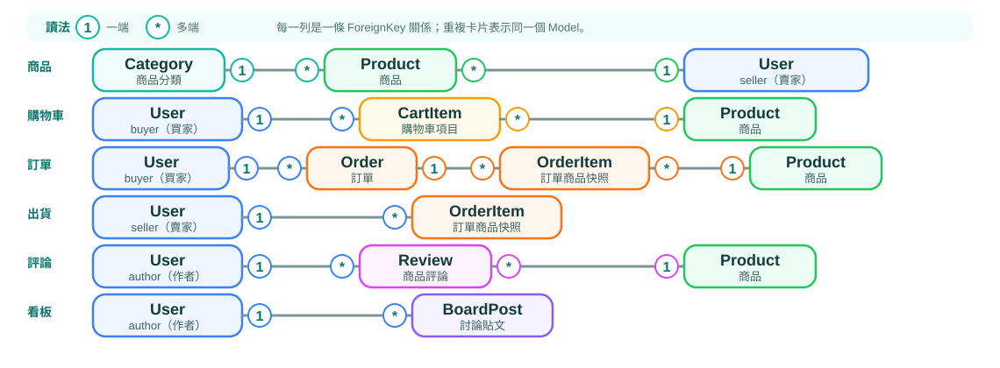

<!-- _class: cover -->

# Django 01
## 專案的共通基礎

<div class="box">瀏覽器 → URL → View → Model / ORM → Template → 響應式頁面</div>

從可重現的 Python 環境開始，走完 Django 全端架構生命週期

---

## 0-1 這份整合教材服務哪兩個專案？

本冊把兩個 repository 中重複的 Django 基礎合併成一條教學線；每個概念都先講共通規則，再指出兩個專案的實際落點：

| LearnBoard 學言板 | LearnMart 學購商城 |
|---|---|
| `board/` app、`Message`、留言牆 | `marketplace/` app、`Product`、商品目錄 |
| `Message.author` 可為 NULL | `Product.seller`、自訂 `User.role` |
| `?q=` 搜尋留言 | `?q=`＋`?category=` 篩選商品 |
| `ListView`＋分頁 | `ListView`＋分頁＋圖片／分類 |
| `templates/board/` | `templates/marketplace/` |

本冊以環境、Request 與頁面整合為主；Model、ORM 與 Admin 的完整教學集中在 01B。

<!--
授課提示：開場用這頁做前測——請學生在兩個專案中各指出一個 URL、View、Template 與 Model。答得出的共通內容快速帶過，把時間留給差異。
-->

---

## 0-2 學完後要能讀懂什麼？

完成本冊並搭配 01B 後，你應該能：

- 從零同步並啟動 LearnBoard 與 LearnMart 的本機環境
- 說明一次 HTTP request 如何得到 response
- 看懂 URL、function view、template 與 context 的合作方式
- 讀懂兩個專案的 Model 欄位、關聯、migration 與基本 ORM
- 追蹤留言搜尋、商品搜尋／分類、分頁與卡片的資料流
- 分辨「教學縮小版」與兩個 repository 的目前實作

> 目標不是背 API，而是能回答：「資料從哪裡來？經過什麼？最後在哪裡顯示？」

<!--
授課提示：開場定錨頁。請學生抄下底部引句「資料從哪裡來？經過什麼？最後在哪裡顯示？」，整學期每次實作都回扣這三問。
-->

---

## 0-3 課程地圖：基礎、資料層與頁面整合

| 學習順序 | 核心問題 | 可觀察成果 |
|---|---|---|
| 01 第 1～3 章 | 環境、Request 與 Template 如何合作？ | 能啟動並顯示頁面 |
| 01 第 4 章 | 頁面資料如何持久化？ | 認識資料角色與關係圖 |
| 01B 第 0～7 章 | 如何設計、查詢與管理資料？ | Model、ORM、Admin 實作 |
| 01 第 5 章 | 是否準備好接回頁面？ | 完成資料層檢核 |
| 01 第 6～7 章 | 如何組成商品目錄與留言牆？ | 搜尋、詳情與分頁 |

第 4～5 章保留六頁銜接，不另排一輪 Model／ORM 完整教學。
Deck 02 再進入表單、身份驗證、權限與商城交易流程。

---

## 0-4 學習方式：每章都走同一個循環

1. **問題**：為什麼需要這個機制？
2. **心智模型**：先用一句話掌握角色
3. **最小範例**：一次只加入一個新概念
4. **語法拆解**：參數與回傳值放在相近頁面
5. **雙專案對照**：回到 `learnboard/` 或 `learnmart/` 的真實檔案
6. **可觀察結果**：知道成功長什麼樣
7. **觀念檢核＋實作任務**：題目在投影片，答案與步驟在配套手冊

<!--
授課提示：向學生聲明這個循環之後不再重複解釋，看到新章節自動對號入座，可降低認知負擔。
-->

---

## 0-5 兩個專案的讀檔路線

遇到同一個 Django 概念時，依下表選一條路線實作；另一欄用來確認概念能遷移，而不是要求兩個專案都改一遍。

| 共通概念 | LearnBoard 學言板 | LearnMart 學購商城 |
|---|---|---|
| Project／App | `learnboard/config/`、`learnboard/board/` | `learnmart/config/`、`learnmart/marketplace/` |
| 列表 View | `MessageListView` | `ProductListView` |
| 列表模板 | `templates/board/message_list.html` | `templates/marketplace/home.html` |
| 搜尋 | `Message.content__icontains` | `Product.name/description__icontains` |
| 依賴 | Django | Django＋Pillow（`ImageField`） |

**課堂建議：** 先在 LearnBoard 完成最小 vertical slice，再用 LearnMart 的對照欄找出「相同骨架、更多資料規則」的部分。

---

<!-- _class: cover -->

# 第一章
## 環境準備、專案骨架與開發伺服器

<div class="box">建立環境 ｜ 產生 Project 與 App ｜ 讀懂 Settings ｜ 啟動開發伺服器</div>

先完成自己的練習，再讀 LearnBoard × LearnMart 對照
本教材使用 Python 3.14.7、Django 6.1.1 系列與 uv

<!-- 編輯範圍：整合原 01_chapter_01.md 與 02_chapter_02.md；原檔及其他章節保留。原知識點對應表位於文末。 -->

---

## 1-0 第一章學習順序與各段成果

| 階段 | 學習內容 | 要交出的結果 |
|---|---|---|
| A | uv、venv、Python、Django 安裝 | 專案環境可執行 Python 與 Django |
| B | django-admin、project、app | 自己建立的 `config/` 與 `pages/` |
| C | 檔案、Git、TOML、settings | 能指出每份設定管什麼 |
| D | 資料庫、啟動、瀏覽器預覽 | 看見 Django 歡迎頁並記錄檢查結果 |
| E | HTTP、URL、View、安全與測試 | `/hello/` 與動態網址能正確回應 |
| F | LearnBoard × LearnMart 對照 | 依實際檔案追蹤完成專案 |

<!-- 建議分段授課：A–B、C–D、E、F。每段先操作再解釋剛出現的檔案，不以閱讀完成專案作為前置能力。 -->

---

## 1-1 先認識 uv：管理 Python 專案的工具

uv 幫我們安裝或選用 Python、建立虛擬環境、安裝套件，
並記錄專案需要哪些套件版本。

- **Python** 執行程式，**Django** 提供網站框架。
- **uv** 準備執行環境，再呼叫 Python 或 Django 指令。
- 先完成環境準備，後面才會建立網站的程式檔案。

```text
uv 準備環境 → Python 執行 Django → Django 處理網站功能
```

**操作位置：** 以下指令輸入終端機，不是 Python 的 `>>>` 視窗。

---

## 1-2 安裝 uv，再重新開啟終端機

**macOS / Linux：**

```bash
curl -LsSf https://astral.sh/uv/install.sh | sh
```

**Windows PowerShell：**

```powershell
winget install --id=astral-sh.uv -e
```

安裝後重新開啟終端機，執行 `uv --version`，應看到版本號。
若找不到 `uv`，先依安裝訊息檢查 PATH，再繼續下一步。

來源：[uv 安裝說明](https://docs.astral.sh/uv/getting-started/installation/)

<!-- Windows 無 WinGet 時，使用官方安裝頁的 PowerShell 安裝方式。教室電腦若無安裝權限，請先由教師準備工具。 -->

---

## 1-3 venv 與 `.venv/` 是什麼？

- **virtual environment（虛擬環境）**：隔離各專案使用的套件。
- **venv**：Python 內建的虛擬環境建立模組。
- **`.venv/`**：本課程放置虛擬環境的資料夾名稱。
- uv 也能建立虛擬環境，主線使用 `uv venv`。

```text
練習 A/.venv/    各自安裝需要的 Django 版本
練習 B/.venv/    不必共用同一組套件
```

虛擬環境不是虛擬機，也不會替我們建立 Django 網頁或資料表。
沒有隔離時，在共用 Python 更新套件可能影響另一個專案。

---

## 1-4 Python：真正執行程式的直譯器

先用 uv 準備本課程的 Python：

```bash
uv python install 3.14.7
```

- **interpreter（直譯器）**：讀取並執行 Python 程式。
- **module（模組）**：可匯入或執行的 Python 程式單位。
- **package（套件）**：此處指可安裝使用的程式，例如 Django。
- **dependency（依賴）**：你的專案需要的套件。

即使電腦已有 Python，也要確認課堂指令使用哪個版本。
本次固定選用 3.13，方便全班依相同流程操作。

---

## 1-5 建立自己的空練習資料夾

在自己存放課堂練習的位置開終端機，建立全新的資料夾：

```bash
mkdir django_lab
cd django_lab
```

| 終端機 | 顯示目前位置 | 列出檔案 |
|---|---|---|
| macOS / Linux | `pwd` | `ls -a` |
| Windows PowerShell | `Get-Location` | `Get-ChildItem -Force` |
| Windows CMD | `cd` | `dir /a` |

**後續主線指令都在 `django_lab/` 執行。**
把練習放在現有教材及完成專案之外，避免混用設定。

---

## 1-6 初始化 Python 專案與虛擬環境

```bash
uv init --bare --python 3.14.7 --vcs none
uv python pin 3.14.7
uv venv --python 3.14.7
uv run python --version
```

- **步驟 A（`init --bare`）**：建立最小的 `pyproject.toml`。
- **步驟 B（`python pin`）**：建立 `.python-version`，記下 Python 版本。
- **步驟 C（`venv`）**：建立 `.venv/`，存放這份練習使用的環境。
- **步驟 D（`run`）**：在專案環境執行 Python，應顯示 `Python 3.14.7.x`。

`--vcs none` 讓本次練習稍後再自行初始化 Git。
`uv run` 會準備、同步專案環境，也會產生需要的鎖檔。

---

## 1-7 確認執行的是哪一個 Python

```bash
uv run python -c "import sys; print(sys.executable)"
uv run python -c "print('Python 環境準備完成')"
```

- `-c`：執行後面引號中的 Python 程式。
- 第一行應指向 `django_lab/.venv/` 裡的執行檔。
- 第二行應在終端機印出指定文字。
- `uv run` 後面接一般命令，不是另一套 Python 語法。

**檢查點：** 記下 Python 版本與執行檔位置。
若 VS Code 也要執行程式，選擇這個 `.venv` 的 interpreter。

---

## 1-8 安裝 Django，確認 django-admin 可用

```bash
uv add "django>=6.1.1,<6.2"
uv run django-admin --version
uv run python -m django --version
```

- `uv add` 安裝 Django，也更新依賴宣告及鎖檔。
- 版本條件加上引號，避免終端機把 `<`、`>` 當成特殊符號。
- `django-admin` 是安裝 Django 時一併提供的命令列工具。
- 正確名稱有連字號：`django-admin`，不是 `django admin`。
- 後兩行應顯示相同的 `6.1.x` 版本。

目前只裝好框架，還沒有 `manage.py`、project 或 app。

---

## 1-9 `python -m` 到底是什麼？

以下用 pip 說明語法，不在主線練習中額外執行。

```bash
python -m pip install django
```

- `python`：選定一個 Python interpreter。
- `-m pip`：請這個 interpreter 尋找並執行 `pip` 模組。
- `install django`：傳給 pip 的參數。

這種寫法明確指定「使用這一個 Python 所屬的 pip」，
可避免直接輸入 `pip` 時，意外操作另一個 Python 的套件。

同理，`python -m django --version` 由指定 interpreter 執行 Django 模組。

---

## 1-10 傳統 venv：另一種環境準備方式

<div style="display: flex; gap: 24px; align-items: flex-start;">
<div style="flex: 1;">

**macOS / Linux (POSIX Shell)**

```bash
python -m venv .venv
source .venv/bin/activate
python -m pip install "django>=6.1.1,<6.2"
```

</div>
<div style="flex: 1;">

**Windows (CMD)**

```cmd
python -m venv .venv
.venv\Scripts\activate.bat
python -m pip install "django>=6.1.1,<6.2"
```

</div>
</div>

- 第一行建立 `.venv/`；第二行讓目前 shell / 終端機優先使用其中的 Python
- 第三行把 Django 安裝進目前 interpreter 的環境
- activation 只影響目前終端機工作階段

**替代方式，不在 `django_lab` 重做。** 此例假設 `python` 已可用；macOS 也可能使用 `python3`。離開環境用 `deactivate`。主線繼續使用 `uv run`，通常不必手動 activate。

---

## 1-11 先分清楚 project 與 app

**Django project** 集中網站共用的設定與入口。
**Django app** 集中一組相關功能，可以有自己的資料與頁面。

這份練習採用：

| 名稱 | 用途 | 即將產生的位置 |
|---|---|---|
| `django_lab` | 整份練習的外層資料夾 | 目前所在目錄 |
| `config` | Django project package | `config/` |
| `pages` | 第一個 app，用來練習頁面 | `pages/` |

一個 project 可組合多個 app。App 是功能模組，不必拆成微服務。

---

## 1-12 用 django-admin 建立 project

**位置：`django_lab/`。只執行一次：**

```bash
uv run django-admin startproject config .
```

- `uv run`：先使用課堂練習環境。
- `django-admin`：Django 命令列工具。
- `startproject`：產生網站設定與入口檔案。
- `config`：本次 project package 的名稱。
- `.`：把產物放在目前目錄，避免再多包一層資料夾。

**檢查點：** 目前目錄新增 `manage.py` 與 `config/`。
已建立後不重跑此指令，之後直接編輯檔案。

---

## 1-13 透過 manage.py 建立第一個 app

仍在 `django_lab/`，與 `manage.py` 同一層：

```bash
uv run python manage.py startapp pages
```

- `manage.py` 是剛才產生的專案命令入口。
- `startapp pages` 建立 `pages/` 及基本 Python 檔案。
- 不要先 `cd config` 或 `cd pages` 才執行。
- `startapp` 不會自動註冊 app，也不會建立 app 的 `urls.py`。

**檢查點：** `config/` 與 `pages/` 現在並排存在。
接著打開資料夾，逐一對照自己剛產生的檔案。

---

## 1-14 先看外層：每一項由誰建立？

```text
django_lab/
├── .python-version    uv python pin：Python 版本選擇
├── pyproject.toml     uv init / add：專案資訊與依賴
├── uv.lock            uv：解析後的精確套件版本
├── .venv/             uv：虛擬環境
├── manage.py          startproject：專案命令入口
├── config/            startproject：Django 設定 package
└── pages/             startapp：頁面功能 app
```

`uv init --bare` 不會產生一般 `uv init` 的 `main.py`、README。
`db.sqlite3` 稍後才在資料庫操作時出現，`.git/` 也尚未建立。

---

## 1-15 config：網站共用設定與入口

| 檔案 | 初學階段要知道的用途 |
|---|---|
| `config/__init__.py` | 標記一般 Python package，通常保留空白 |
| `config/settings.py` | 啟用哪些 app、資料庫、語言等設定 |
| `config/urls.py` | 網站最上層的網址分派表 |
| `config/wsgi.py` | WSGI 伺服器載入 Django 的入口 |
| `config/asgi.py` | ASGI 伺服器載入 Django 的入口 |

WSGI、ASGI 是 Python 網站與伺服器之間的介面。
這次練習先保留產生的入口檔案，後續部署再深入。

---

## 1-16 pages：功能程式從這裡開始

| 檔案／資料夾 | 用途 |
|---|---|
| `__init__.py`、`apps.py` | package 標記、app 設定類別 |
| `models.py` | 定義資料模型 |
| `migrations/` | 保存資料庫結構變更紀錄，起初只有 `__init__.py` |
| `views.py` | 接收 request，產生 response |
| `admin.py` | 註冊後台可管理的 model |
| `tests.py` | 自動檢查程式行為 |

`urls.py`、`forms.py`、`templates/` 不在 `startapp` 產物中，
使用到時才自行新增。`static/` 放 CSS、JS 等資源，`media/` 放上傳檔案。

---

## 1-17 `manage.py` 如何知道要用哪份設定？

**練習檔案：`manage.py` 的核心責任**

```python
os.environ.setdefault("DJANGO_SETTINGS_MODULE", "config.settings")
execute_from_command_line(sys.argv)
```

- 指定 settings module 為 `config.settings`
- 把終端機參數交給 Django command 系統
- 因此 `runserver`、`migrate`、`test` 都知道要使用哪個專案設定

常見形式：

```bash
uv run python manage.py <command> [options]
```

---

## 1-18 Git：記錄你每次完成的修改

Git 保存檔案版本，方便比較修改與回到先前的狀態。
Repository（版本庫）是由 Git 管理的一組檔案與歷史。

在這份**獨立練習**的 `django_lab/` 中：

```bash
git --version
git init
git status
```

- `git init` 建立隱藏的 `.git/`，之後不用反覆執行。
- 若找不到 Git，先安裝 [Git](https://git-scm.com/downloads) 並重新開啟終端機。
- Git 保存本機版本，GitHub 是可存放遠端版本庫的服務。
- `.git/` 是版本歷史，`config/` 是 Django package，兩者用途不同。

---

## 1-19 `.gitignore`：哪些檔案可以重建？

在 `django_lab/.gitignore` 新增：

```gitignore
.venv/
__pycache__/
*.py[cod]
*.sqlite3
/media/
.env
.DS_Store
```

保留程式、migration、templates、static、TOML、鎖檔與版本選擇檔。
虛擬環境、快取、本機資料庫與上傳檔可另行重建或備份。
`.env` 若含密鑰不可提交，Django 也不會自動讀取它。

---

## 1-20 保存第一個可比較的版本

確認 `git status` 沒有列出 `.venv/`，再執行：

```bash
git add .gitignore .python-version pyproject.toml uv.lock
git add manage.py config pages
git diff --cached
git commit -m "建立 Django 練習骨架"
```

- `add` 放入暫存區，`diff --cached` 檢查即將保存的內容。
- `commit` 建立版本紀錄。稍後編輯檔案可用 `git diff` 比較。
- 若 Git 要求姓名及 email，先以自己的資訊設定 `user.name`、`user.email`。
- `.gitignore` 不會自動取消已追蹤檔案，也不會刪除舊歷史中的密鑰。

---

## 1-21 三個環境檔案各管什麼？

```text
.python-version   希望使用的 Python 版本（本練習：3.13）
pyproject.toml    專案直接宣告的需求與允許版本範圍
uv.lock           uv 解析後的完整、精確依賴結果
```

- 修改直接依賴：通常編輯 `pyproject.toml`，再讓 uv 更新鎖檔
- 不要把 `uv.lock` 當成手寫套件清單
- 不要提交 `.venv/`；其他人可由上述檔案重建

---

## 1-22 讀懂 pyproject.toml 的基本語法

**練習檔案範例，版本範圍以 `uv add` 結果為準：**

```toml
[project]
name = "django-lab"
version = "0.1.0"
requires-python = ">=3.14,<3.15"
dependencies = [
    "django>=6.1.1,<6.2",
]
```

`[project]` 是 TOML table；`key = value` 指定設定值。
字串用引號，`dependencies` 是字串陣列。TOML 是設定格式，
不執行 Python 程式，也不負責設定 Django 的資料庫。

---

## 1-23 版本範圍與鎖檔的精確版本

```text
requires-python = ">=3.14,<3.15"
django>=6.1.1,<6.2
```

- `>=3.13`：3.13 或更高版本；不是「只能 3.13」
- `>=5.2`：允許 5.2 以上
- `<5.3`：排除 5.3，避免跨入下一個 minor 系列
- 兩個條件以逗號連接，表示必須同時成立

`pyproject.toml` 寫「允許範圍」；`uv.lock` 會記錄目前實際解析到的精確版本。

---

## 1-24 直接依賴、開發依賴與同步

Django 是執行網站需要的直接依賴。Coverage 用來量測測試涵蓋率，
可在需要時以 `uv add --dev "coverage>=7.6"` 加入開發群組。

```toml
[dependency-groups]
dev = ["coverage>=7.6"]

[tool.uv]
package = false
```

`package = false` 表示不把這份應用程式自身建成可發布的套件。
`uv sync` 依宣告與鎖檔同步 `.venv`，預設會包含 `dev` 群組。
虛擬環境隔離套件，鎖檔記錄精確依賴；重現仍需相容的系統與 Python。

---

## 1-25 settings 是 Python：先註冊自己的 app

打開 `config/settings.py`，**保留原有六個內建 app**，
在 `INSTALLED_APPS` 清單最後加上這一項：

```python
"pages.apps.PagesConfig",
```

這個路徑指向 `pages/apps.py` 的 `PagesConfig`。
Django 也接受簡寫 `"pages"`，由 app 的預設設定進行發現。

接著修改同一份檔案的兩個值：

```python
LANGUAGE_CODE = "zh-hant"
TIME_ZONE = "Asia/Taipei"
```

`INSTALLED_APPS` 是 Python list，設定值是變數與字串。

---

## 1-26 settings 地圖：先知道要去哪裡找

| 設定 | 負責什麼 |
|---|---|
| `BASE_DIR` | 用 `Path` 找到外層練習資料夾 |
| `INSTALLED_APPS` | 啟用 app，影響 model、admin 等發現機制 |
| `MIDDLEWARE` | request / response 經過的共用處理，例如 session、驗證 |
| `ROOT_URLCONF` | 根網址設定，本次是 `"config.urls"` |
| `TEMPLATES` | HTML 樣板引擎及搜尋位置 |
| `WSGI_APPLICATION` | WSGI 應用入口 |

`asgi.py` 由 `startproject` 產生；完成專案另明列
`ASGI_APPLICATION = "config.asgi.application"`，骨架不一定有此設定。

---

## 1-27 settings 地圖：資料、語言與靜態資源

| 設定 | 負責什麼 |
|---|---|
| `DATABASES` | 資料庫引擎、位置及連線資訊，下一段實際操作 |
| `AUTH_PASSWORD_VALIDATORS` | 密碼驗證規則 |
| `LANGUAGE_CODE`、`TIME_ZONE` | 介面語言、預設時區 |
| `USE_I18N`、`USE_TZ` | 翻譯支援、具時區資訊的日期時間 |
| `STATIC_URL` | CSS、JS 等靜態資源的 URL 前綴 |
| `DEFAULT_AUTO_FIELD` | 未明訂主鍵型別時採用的預設型別 |

後續需要共用靜態資料夾、上傳與登入功能時，才加入對應設定。
先能辨識用途，不必一次背完全部設定名稱。

---

## 1-28 App 註冊與 template 搜尋的差別

骨架的 `TEMPLATES` 預設包含 `"DIRS": []` 與 `"APP_DIRS": True`。
之後若自行建立外層 `templates/`，可把 `DIRS` 改為：

```python
"DIRS": [BASE_DIR / "templates"],
"APP_DIRS": True,
```

- `DIRS` 指定額外搜尋目錄。
- `APP_DIRS=True` 搜尋已安裝 app 裡的 `templates/`。
- 註冊 app 不等於建立資料夾，也不等於設定所有樣板路徑。
- 即使漏註冊 app，透過 `DIRS` 指定的根目錄樣板仍可能找到。

本次先用文字 response，不必提前建立 HTML 樣板。

---

## 1-29 本機開發設定的使用邊界

保留 `startproject` 產生的 `SECRET_KEY`，並在 settings 設定：

```python
DEBUG = True
ALLOWED_HOSTS = ["127.0.0.1", "localhost"]
```

- `SECRET_KEY` 參與簽章等安全機制，正式使用時須保密並外部化。
- `DEBUG=True` 提供除錯資訊，正式環境不能公開這些細節。
- `ALLOWED_HOSTS` 檢查請求的 Host，不是指定伺服器監聽位置。
- 正式部署需另外規劃伺服器、HTTPS、資料庫、備份及權限。

**檢查點：** 能指出 app 註冊、時區、URL 與開發設定的位置。

---

## 1-30 資料庫：持續保存網站資料

資料表（table）定義欄位，資料列（row）保存一筆內容。
Schema 指資料庫結構，包含資料表、欄位與限制。

`config/settings.py` 預設使用 SQLite：

```python
DATABASES = {
    "default": {
        "ENGINE": "django.db.backends.sqlite3",
        "NAME": BASE_DIR / "db.sqlite3",
    }
}
```

SQLite 使用本機檔案，適合課堂練習，不需先啟動獨立資料庫服務。
`uv add` / `uv sync` 安裝套件，不會替 Django 建好資料表。

---

## 1-31 第一次 migrate：建立內建功能的資料表

**位置：`django_lab/`。**

```bash
uv run python manage.py check
uv run python manage.py migrate
uv run python manage.py showmigrations
```

- `check` 檢查部分設定與程式結構問題。
- `migrate` 套用 migration，準備登入、session、admin 等內建資料表。
- `showmigrations` 的 `[X]` 表示已套用，`[ ]` 表示尚未套用。
- 此時尚未替 `pages` 定義 model，所以沒有自訂資料表。

**檢查點：** 看見 `db.sqlite3`，migration 套用成功。
不要用刪除 migration 檔案的方式處理不懂的錯誤。

---

## 1-32 分清楚之後會用到的資料指令

| 命令 | 影響的層次 | 何時使用 |
|---|---|---|
| `uv sync` | Python 套件環境 | 取得既有專案或同步依賴 |
| `makemigrations` | 產生結構變更檔 | 後續新增或修改 model |
| `migrate` | 套用結構變更等 migration 操作 | 準備或更新資料庫 |
| `seed_demo` | 建立示範資料列 | 最後操作完成專案才使用 |

後三種命令接在 `uv run python manage.py` 後面。
`seed_demo` 是完成專案自訂的 command，**新建 Django 沒有它**。
自訂 model 與 ORM 留給後續章節；現在先完成最小網站。

---

## 1-33 啟動開發伺服器

```bash
uv run python manage.py runserver
```

終端機應出現類似訊息：

```text
Starting development server at http://127.0.0.1:8000/
```

- `127.0.0.1` 指自己的電腦，`8000` 是服務連接埠（port）。
- 終端機保持運作，用瀏覽器開啟上面的網址。
- 修改 Python 檔通常會自動重載，新增檔案時必要時手動重啟。
- 按 `Ctrl+C` 停止。若 8000 被占用，可用 `runserver 8001`。

這是本機開發伺服器，尚未完成正式部署。

---

## 1-34 第一次 preview：看到 Django 歡迎頁

目前 `config/urls.py` 仍是產生的預設內容，只有 admin 路由。
在 `DEBUG=True` 的新專案根網址，應看到 Django 安裝成功頁。

- **步驟 A**：確認終端機仍在執行伺服器。
- **步驟 B**：在瀏覽器開啟 `http://127.0.0.1:8000/`。
- **步驟 C**：重新整理，觀察終端機的新紀錄。
- **步驟 D**：開啟瀏覽器開發者工具的 **Network**，再重新整理。

這裡的 preview 是瀏覽器向 Django 取得頁面。
直接雙擊 `.py` 或使用靜態 HTML 預覽工具，都不會執行 Django 網站。
稍後接入自己的路由後，根網址可能變成 404，屆時改測 `/hello/`。

---

## 1-35 啟動前後的檢查不能互相取代

| 檢查 | 能確認什麼 | 尚未證明什麼 |
|---|---|---|
| `check` | 部分設定、model 等結構問題 | 每個頁面都正確 |
| `migrate` | migration 成功套用 | 已有示範資料 |
| `runserver` | 開發服務成功啟動 | 所有路由與業務功能正常 |
| 瀏覽器 preview | 指定頁面可觀察的結果 | 所有輸入與邊界行為 |
| `test` | 已撰寫測試所涵蓋的行為 | 沒寫測試的功能 |

**實作紀錄：** 保存指令、畫面結果及一個遇到的錯誤。
接下來用 HTTP 解釋瀏覽器與終端機剛才發生了什麼。

---

<!-- _class: cover -->

# 第二章
## HTTP 協定、URL 路由與 View 視圖

<div class="box">Request 旅程 ｜ URLconf 路由比對 ｜ View 函式合約 ｜ 動態網址與測試</div>

從發出請求到產生回應：深入 Django 的核心心智模型與路由分派機制

---

## 2-1 HTTP：瀏覽器與伺服器交換訊息

瀏覽器送出 **request**，Django 回傳 **response**：

<svg viewBox="0 0 1120 265" width="1120" role="img" aria-label="HTTP request 從瀏覽器送往 Django，response 再由 Django 回到瀏覽器">
  <defs>
    <linearGradient id="http-browser" x1="0" x2="1">
      <stop stop-color="#E6FFFB"/><stop offset="1" stop-color="#CCFBF1"/>
    </linearGradient>
    <linearGradient id="http-django" x1="0" x2="1">
      <stop stop-color="#ECFDF5"/><stop offset="1" stop-color="#D1FAE5"/>
    </linearGradient>
    <marker id="http-arrow-request" markerWidth="11" markerHeight="11" refX="9" refY="5.5" orient="auto">
      <path d="M0,0 L10,5.5 L0,11 Z" fill="#0F766E"/>
    </marker>
    <marker id="http-arrow-response" markerWidth="11" markerHeight="11" refX="9" refY="5.5" orient="auto">
      <path d="M0,0 L10,5.5 L0,11 Z" fill="#2563EB"/>
    </marker>
  </defs>
  <rect x="28" y="52" width="230" height="158" rx="24" fill="url(#http-browser)" stroke="#14B8A6" stroke-width="3"/>
  <text x="143" y="112" text-anchor="middle" font-size="48">🌐</text>
  <text x="143" y="151" text-anchor="middle" font-family="Arial, 'Noto Sans TC', sans-serif" font-size="25" font-weight="700" fill="#134E4A">Browser</text>
  <text x="143" y="181" text-anchor="middle" font-family="Arial, 'Noto Sans TC', sans-serif" font-size="17" fill="#0F766E">使用者的瀏覽器</text>

  <line x1="290" y1="96" x2="830" y2="96" stroke="#0F766E" stroke-width="7" stroke-linecap="round" marker-end="url(#http-arrow-request)"/>
  <rect x="445" y="54" width="230" height="47" rx="23" fill="#CCFBF1" stroke="#0F766E" stroke-width="2"/>
  <text x="560" y="85" text-anchor="middle" font-family="Arial, 'Noto Sans TC', sans-serif" font-size="22" font-weight="700" fill="#115E59">REQUEST  請求 →</text>
  <text x="560" y="126" text-anchor="middle" font-family="Arial, 'Noto Sans TC', sans-serif" font-size="16" fill="#115E59">GET /products/3/?q=鍵盤</text>

  <line x1="830" y1="184" x2="290" y2="184" stroke="#2563EB" stroke-width="7" stroke-linecap="round" marker-end="url(#http-arrow-response)"/>
  <rect x="445" y="160" width="230" height="47" rx="23" fill="#DBEAFE" stroke="#2563EB" stroke-width="2"/>
  <text x="560" y="191" text-anchor="middle" font-family="Arial, 'Noto Sans TC', sans-serif" font-size="22" font-weight="700" fill="#1D4ED8">← RESPONSE  回應</text>
  <text x="560" y="235" text-anchor="middle" font-family="Arial, 'Noto Sans TC', sans-serif" font-size="16" fill="#1D4ED8">200 OK ＋ HTML</text>

  <rect x="862" y="52" width="230" height="158" rx="24" fill="url(#http-django)" stroke="#22C55E" stroke-width="3"/>
  <text x="977" y="112" text-anchor="middle" font-size="48">⚙️</text>
  <text x="977" y="151" text-anchor="middle" font-family="Arial, 'Noto Sans TC', sans-serif" font-size="25" font-weight="700" fill="#166534">Django</text>
  <text x="977" y="181" text-anchor="middle" font-family="Arial, 'Noto Sans TC', sans-serif" font-size="17" fill="#15803D">網站伺服器</text>
</svg>

Request 常見部分：

- method：GET、POST…
- path：例如 `/products/3/`
- query string：例如 `?q=鍵盤`
- headers、body、登入資訊

Response 常見部分：status、headers、body。HTML 只是 body 的一種內容。

---

## 2-2 拆開網址，找出路由真正比對的部分

```text
http://127.0.0.1:8000/products/3/?from=home
```

| 部分 | 值 |
|---|---|
| scheme | `http` |
| host | `127.0.0.1` |
| port | `8000` |
| path | `/products/3/` |
| query string | `from=home` |

URLconf 主要比對 path；query string 通常在 View 透過 `request.GET` 讀取。

---

## 2-3 在 Network 看見 request 與 response

點選 Network 中重新整理產生的文件請求，觀察：

| 請求／回應 | 欄位 | 本機預覽可觀察的例子 |
|---|---|---|
| Request | method、URL | `GET`、`http://127.0.0.1:8000/` |
| Request | headers | `Host`、`Cookie`（若有） |
| Response | status | 成功頁面通常是 `200` |
| Response | headers | `Content-Type` 說明內容型別 |
| Response | body | Response 分頁內的 HTML 或文字 |

GET 通常用來讀取內容，POST 通常用來提交資料。
Query string 與 request body 是不同位置；登入狀態常透過 cookie / session 關聯。

---

## 2-4 常見 response status

| 狀態 | 初學者可先這樣理解 |
|---|---|
| 200 | 成功取得內容 |
| 302 | 請瀏覽器再到另一個網址 |
| 403 | 已理解請求，但沒有權限 |
| 404 | 找不到符合的路由或物件 |
| 500 | 伺服器執行時發生未處理錯誤 |

狀態碼不是完整錯誤原因，但能先判斷問題在哪一層。

---

## 2-5 第一個 View：先回傳固定文字

**把 `pages/views.py` 改成：**

```python
from django.http import HttpResponse


def hello(request):
    return HttpResponse("Hello Django", content_type="text/plain; charset=utf-8")
```

Django 呼叫 `hello` 時傳入 request 物件。
函式是一種 callable（可呼叫物件），View 必須回傳 response。
這裡明訂純文字型別，將 `Hello Django` 放進 response body。

檔案存好後還不能用網址找到它，下一步要設定路由。

---

## 2-6 自行新增 app 的 urls.py

**新增 `pages/urls.py`，內容如下：**

```python
from django.urls import path
from . import views

app_name = "pages"

urlpatterns = [
    path("hello/", views.hello, name="hello"),
]
```

`from . import views` 匯入同一個 app 的 `views.py`。
`views.hello` 交出函式供 Django 之後呼叫，此處不加 `()`。
`app_name` 與路由 `name` 稍後用來反向產生網址。

---

## 2-7 `path()` 四個重要位置

**剛才新增的 `pages/urls.py` 路由節錄**

```python
path("hello/", views.hello, name="hello")
```

1. `"hello/"`：要比對的 route，不以 `/` 開頭
2. `views.hello`：匹配後呼叫的 callable
3. 可選 extra kwargs：本例未使用
4. `name="hello"`：反向產生 URL 時使用的名稱

---

## 2-8 把 project URL 接到 app URL

**把 `config/urls.py` 改成以下完整內容，保留 admin 路由：**

```python
from django.contrib import admin
from django.urls import include, path

urlpatterns = [
    path("admin/", admin.site.urls),
    path("", include("pages.urls")),
]
```

根 URL 比對空前綴 `""`，把剩餘路徑交給 `pages.urls`。
`/hello/` 會由 app 找到 `hello/`，再呼叫 `views.hello`。
`INSTALLED_APPS` 啟用 app，`include()` 接入路由，兩件事都要做好。

---

## 2-9 立刻驗收：第一個頁面確實可用

瀏覽器開啟 `http://127.0.0.1:8000/hello/`。
應看到 `Hello Django`，Network 的文件請求應為 `200`。

也可在**另一個終端機**執行：

```bash
curl -i http://127.0.0.1:8000/hello/
```

Windows PowerShell 如遇命令別名問題，使用 `curl.exe -i`。
觀察狀態列、`Content-Type: text/plain; charset=utf-8` 與 body。
根網址 `/` 目前沒有自訂路由，顯示 404 屬於預期結果。

**檢查點：** 能從三個檔案解釋為什麼 `/hello/` 回應成功。

---

## 2-10 動態路徑：把網址片段傳入函式

**在 `pages/views.py` 後面新增：**

```python
def hello_name(request, name):
    return HttpResponse(f"歡迎 {name}", content_type="text/plain; charset=utf-8")
```

**在 `pages/urls.py` 的 `urlpatterns` 清單中新增：**

```python
path("hello/<str:name>/", views.hello_name, name="hello-name"),
```

`<str:name>` 匹配非空且不含 `/` 的片段，以 `name=...` 傳入。
瀏覽 `/hello/Ada/` 應看到「歡迎 Ada」。參數名必須對得上。

---

## 2-11 常用 converter

| converter | 匹配結果 | 常見用途 |
|---|---|---|
| `<int:pk>` | 非負十進位整數（包含 0），傳入 Python `int` | 物件主鍵 |
| `<str:name>` | 非空且不含 `/` 的字串 | 短文字 |
| `<slug:slug>` | 字母、數字、`-`、`_` | 可讀網址代稱 |
| `<path:value>` | 可含 `/` | 子路徑 |

`pk` 是常用的主鍵參數名。以下為後續資料頁的形式示意：

```python
path("products/<int:pk>/", views.product_detail,
     name="product-detail")
```

此處尚未建立 `product_detail`，不用貼入練習。
`<slug:slug>` 接受的是 ASCII 英文字母、數字、`-`、`_`。

---

## 2-12 Query string 由 request.GET 讀取

**在 `pages/views.py` 後面新增：**

```python
def search(request):
    keyword = request.GET.get("q", "")
    return HttpResponse(f"查詢：{keyword}", content_type="text/plain; charset=utf-8")
```

**在 app 的 `urlpatterns` 中新增：**

```python
path("search/", views.search, name="search"),
```

開啟 `/search/?q=django` 應看到「查詢：django」。
路由比對 `search/`，`request.GET.get("q", "")` 讀參數，沒有值時用空字串。
這裡只是顯示查詢文字，尚未搜尋資料庫。

---

## 2-13 命名 URL：把名稱與路徑分開

剛才的設定包含：

```python
app_name = "pages"
# urlpatterns 內：
path("hello/", views.hello, name="hello")
```

完整路由名稱為 `pages:hello`：

- `pages`：命名空間（namespace），區分不同 app 的同名路由。
- `hello`：這條路由的名稱。
- `hello/`：瀏覽器實際請求的路徑。

其他程式透過名稱產生 URL，日後改路徑時就能減少逐處修改。

---

## 2-14 在 Python 反向產生網址

開第二個終端機，進入 `django_lab/`，執行：

```bash
uv run python manage.py shell
```

再於 Python 互動環境執行：

```python
from django.urls import reverse
reverse("pages:hello")                       # '/hello/'
reverse("pages:hello-name", kwargs={"name": "Ada"})  # '/hello/Ada/'
```

反向解析需要「完整名稱＋必要參數」。結束使用 `exit()`。
若出現 `NoReverseMatch`，檢查 namespace、name 及必要參數。

---

## 2-15 在 template 反向產生網址

之後建立 HTML 樣板時，可以寫：

```django
<a href="">打招呼</a>
<a href="">歡迎 Ada</a>
```

`` 是 Django template 標籤，不是 Python 語法。
它必須經過 Django 樣板引擎處理，瀏覽器不會自行解讀。

後續的 Model、Template 章節會完成 HTML 頁面。
此處先理解與 Python 的 `reverse()` 使用同一套路由名稱。

---

## 2-16 `HttpResponse` 與安全顯示

危險的誤解：

```python
def hello_name(request, name):
    return HttpResponse(f"歡迎 {name}")
```

若 `name` 來自使用者，f-string 已先把文字直接插入 body；Django template engine 根本沒有參與，因此**沒有自動 escaping**。

初學階段的安全方向：

- 動態 HTML 優先交給 template 顯示
- 或使用明確 escaping 工具
- 不要把「Django 預設 escape」誤套到所有 `HttpResponse`

---

## 2-17 需要 HTML 時，明確處理使用者輸入

本次動態範例用 `content_type="text/plain; charset=utf-8"`，
讓瀏覽器當成文字。如果要建立 HTML，可明確跳脫動態值：

```python
from django.utils.html import format_html


def hello_html(request, name):
    body = format_html("<p>歡迎 {}</p>", name)
    return HttpResponse(body)
```

**補充範例，不需加入本次路由。** `format_html` 會跳脫替換參數。
實際 HTML 頁面通常使用 template 的預設 escaping。
不要對不可信資料使用 `safe` 或 `mark_safe` 來略過保護。

---

## 2-18 追蹤一次最小 request 的旅程

```text
GET /hello/
  config/urls.py    include("pages.urls")
       ↓
  pages/urls.py     path("hello/", views.hello, ...)
       ↓
  pages/views.py    hello(request)
       ↓
  HttpResponse     status 200、headers、文字 body
       ↓
  瀏覽器顯示 Hello Django
```

這裡省略共用 middleware 等處理，先追蹤自己的程式。
此流程沒有 Model 與 Template，每個 View 不一定要用到所有層。

---

## 2-19 404 與 500：沿著流程找問題

| 狀態 | 常見原因 |
|---|---|
| 404 | 路徑拼錯或沒有匹配路由、忘記 `include()` |
| 404 | converter 不接受輸入，例如 `<int:pk>` 收到文字 |
| 404 | Detail View 找不到符合的物件 |
| 500 | View 執行時發生未處理例外，或沒有回傳 response |
| 500 | template 或資料存取發生未處理的錯誤 |

語法或 import 錯誤也可能讓伺服器無法啟動，
此時不一定收到 HTTP 500，應先查看終端機。

開發模式的 traceback 是除錯線索，正式環境不可公開。

---

## 2-20 按順序排除常見問題

| 現象 | 先檢查 |
|---|---|
| 找不到 `manage.py` | 終端機是否在 `django_lab/` |
| 找不到 Django | `uv run python -m django --version` 是否成功 |
| 瀏覽器連不上 | 伺服器仍在運作嗎？網址及 port 相同嗎？ |
| `/hello/` 得到 404 | 根 `include`、app 的 route、結尾斜線 |
| TypeError：參數不符 | converter 的變數名是否等於 View 參數名 |
| NoReverseMatch | namespace、name 與參數是否一致 |

先讀 traceback 最後一行的例外，再找自己程式的檔案與行號。
一次修改一個原因，重新測同一網址，確認結果有改變。

---

## 2-21 把驗收寫進 tests.py

**把 `pages/tests.py` 改成以下內容：**

```python
from django.test import SimpleTestCase
from django.urls import reverse


class PageTests(SimpleTestCase):
    def test_hello(self):
        response = self.client.get(reverse("pages:hello"))
        self.assertEqual(response.status_code, 200)
        self.assertEqual(response.content.decode(), "Hello Django")
        self.assertTrue(response["Content-Type"].startswith("text/plain"))
```

`self.client` 模擬請求，不需要先開 `runserver`。
這些頁面不使用資料庫，因此選擇 `SimpleTestCase`。

---

## 2-22 再確認動態網址、query 與 404

**接在同一個 `PageTests` 類別內，保留四格縮排：**

```python
    def test_name_and_reverse(self):
        url = reverse("pages:hello-name", kwargs={"name": "Ada"})
        self.assertEqual(url, "/hello/Ada/")
        self.assertContains(self.client.get(url), "歡迎 Ada")

    def test_search(self):
        response = self.client.get(reverse("pages:search"), {"q": "django"})
        self.assertContains(response, "查詢：django")

    def test_missing_url(self):
        self.assertEqual(self.client.get("/missing/").status_code, 404)
```

執行 `uv run python manage.py test pages`，應顯示 4 個測試通過。

---

## 2-23 先完成自己的練習，再進行專案對照

- **步驟 A**：從空資料夾完成 uv、Python、Django、project 與 app。
- **步驟 B**：指出 `.venv`、鎖檔、Git、settings、migration 的用途。
- **步驟 C**：完成 `/hello/`、`/hello/Ada/`、`/search/?q=django`。
- **步驟 D**：用 Network 記錄成功的 200 與不存在路徑的 404。
- **步驟 E**：用 `reverse()` 產生網址，並讓 4 個測試通過。
- **步驟 F**：畫出 root URL、app URL、View、response 的流程。

**加練：** 把 `hello/` 改成 `greeting/`，保留名稱 `hello`，
觀察 `reverse("pages:hello")` 與使用該名稱的測試如何跟著改變。
完成後將路徑改回來，再保存一個 Git commit。

---

## 2-24 現在才打開 LearnBoard × LearnMart

先對照自己的 `django_lab`，辨認相同職責的檔案：

| 角色 | 你的練習 | LearnBoard | LearnMart |
|---|---|---|---|
| 外層資料夾 | `django_lab/` | `learnboard/` | `learnmart/` |
| Django project | `config/` | `config/` | `config/` |
| 功能 app | `pages/` | `board/` | `marketplace/` |
| 第一個頁面 | 打招呼文字 | 留言列表 | 商品列表 |
| 根路由轉交 | `pages.urls` | `board.urls` | `marketplace.urls` |

完成專案多了 model、form、template、權限與測試，逐步找相同角色即可。
本教材前半段的 `hello` / `search` 是練習範例，沒有加進完成專案。

---

## 2-25 教材根目錄與 Django 應用根目錄

```text
DjangoTeaching/          目前整份教材的 Git repository
├── .git/
├── slides/
├── learnboard/          執行 LearnBoard 指令的位置
│   ├── pyproject.toml
│   └── manage.py
└── learnmart/           執行 LearnMart 指令的位置
    ├── pyproject.toml
    └── manage.py
```

日常說的「專案」可能指整份版本庫，也可能指一個應用資料夾。
本教材目前由外層 `.git/` 管理，兩個應用不用再各自 `git init`。
執行 Django 指令時，先確認當前目錄同時有 `manage.py` 與 `pyproject.toml`。

---

## 2-26 環境對照：共同版本與 Pillow 差異

**實際檔案：`learnboard/pyproject.toml` 與 `learnmart/pyproject.toml`。**

| 項目 | LearnBoard | LearnMart |
|---|---|---|
| `.python-version` | `3.13` | `3.13` |
| `requires-python` | `>=3.13` | `>=3.13` |
| Django | `django>=6.1.1,<6.2` | `django>=6.1.1,<6.2` |
| 圖片套件 | 無 Pillow 依賴 | `pillow>=11.0` |
| 開發群組 | `coverage>=7.6` | `coverage>=7.6` |
| uv 設定 | `package = false` | `package = false` |

LearnBoard 沒有圖片上傳功能，LearnMart 的 `ImageField` 需要 Pillow。
兩者各有自己的 `.venv/` 與 `uv.lock`，不要互相複製虛擬環境。

---

## 2-27 實際 TOML 節錄可以這樣讀

**LearnBoard 的 `[project]` 依賴節錄：**

```toml
[project]
name = "learnboard"
requires-python = ">=3.14,<3.15"
dependencies = ["django>=6.1.1,<6.2"]
```

**LearnMart 的 `[project]` 依賴節錄：**

```toml
[project]
name = "learnmart"
requires-python = ">=3.14,<3.15"
dependencies = ["django>=6.1.1,<6.2", "pillow>=11.0"]
```

這是兩份檔案的節錄，不能把兩個 `[project]` 合貼到同一份檔案。

---

## 2-28 settings 對照：先找共同設定

| 設定 | 兩個完成專案的共同做法 |
|---|---|
| `ROOT_URLCONF` | `config.urls` |
| `DATABASES` | SQLite，應用根目錄的 `db.sqlite3` |
| `TEMPLATES` | `DIRS` 指定根 `templates/`，`APP_DIRS=True` |
| 語言／時區 | `zh-hant`、`Asia/Taipei` |
| 靜態資源 | `STATICFILES_DIRS = [BASE_DIR / "static"]` |
| 本機開發 | `DEBUG=True`，Host 允許 localhost 與 127.0.0.1 |

內建 middleware、密碼驗證器與入口檔案也能找到相同職責。
兩份 `SECRET_KEY` 都是課堂示例，不能沿用到公開正式環境。

---

## 2-29 settings 對照：功能增加後的差異

| 項目 | LearnBoard | LearnMart |
|---|---|---|
| App 註冊 | `board` | `marketplace` |
| User model | Django 預設 User | `AUTH_USER_MODEL = "marketplace.User"` |
| 登入／登出導向 | `board:list` | `marketplace:home` |
| 上傳檔案 | 無 media 設定 | `MEDIA_URL`、`MEDIA_ROOT` |
| 額外 context processor | 無購物車處理 | `marketplace.context_processors.cart_count` |

兩者 `LOGIN_URL` 都是 `login`，`MESSAGE_TAGS` 把錯誤訊息標籤對應為 `danger`。
自訂 User 已在完成專案的 migration 設計內，照既有檔案執行即可。
不要在已建立資料表的練習隨意切換 `AUTH_USER_MODEL`。

---

## 2-30 建立指令：完成專案只讀取，不再重跑

對照你剛才使用的指令，理解兩個完成專案的骨架建立方式：

```bash
# LearnBoard 骨架的等價建立指令（只供對照）
uv run django-admin startproject config .
uv run python manage.py startapp board

# LearnMart 骨架的等價建立指令（只供對照）
uv run django-admin startproject config .
uv run python manage.py startapp marketplace
```

這些指令只產生骨架，不會自動產生完整商城或留言板。
`urls.py`、`forms.py`、templates、示範資料 command 都是後續實作。
既有資料夾已建立完成，下一頁改走「同步與啟動」流程。

---

## 2-31 從完成專案啟動

在選定的專案根目錄依序執行（兩個專案指令相同）：

```bash
uv sync
uv run python manage.py migrate
uv run python manage.py seed_demo
uv run python manage.py runserver
```

四行分別執行之步驟與影響：

- **步驟 A（`uv sync`）**：同步 Python 環境與依賴
- **步驟 B（`migrate`）**：建立資料庫 schema
- **步驟 C（`seed_demo`）**：建立課堂示範資料
- **步驟 D（`runserver`）**：啟動本機開發伺服器

不要把 `uv sync` 與 `migrate` 混為一談：前者管套件，後者管資料庫。

---

## 2-32 `seed_demo` 建立哪些資料？

**目前專案實作｜`*/management/commands/seed_demo.py`**

在**沒有同名帳號的新資料庫**第一次執行時：

| 專案 | 示範帳號與資料 |
|---|---|
| LearnBoard | `alice / alice12345`、`bob / bob12345`；4 則留言，其中 1 則是訪客 |
| LearnMart | `seller / seller12345`、`buyer / buyer12345`；3 個分類、6 個商品、1 則留言 |

`get_or_create()` 讓重跑不會持續新增同名示範 rows；若帳號已存在，兩個 command 都**不會重設既有 password、role 或 email**，所以它們不是 reset command。

> **常見錯誤：** 終端機雖會再次印出課堂 credentials，既有同名帳號仍維持原本資料。這些帳號也只限本機課堂，不可沿用到公開環境。

---

## 2-33 預覽完成專案並記錄結果

執行 `runserver` 後：

```text
Starting development server at http://127.0.0.1:8000/
```

- 瀏覽器開啟該網址會看到 LearnBoard 留言牆或 LearnMart 商品頁
- 終端機保持被伺服器占用，按 `Ctrl+C` 停止
- 修改 Python 檔通常會觸發自動重新載入
- 這是開發伺服器，不是正式部署伺服器

`127.0.0.1` 代表自己的電腦；`8000` 是 port。

---

## 2-34 URL、View 與反向解析的實際對照

| 項目 | LearnBoard | LearnMart |
|---|---|---|
| 根 URL | `include("board.urls")` | `include("marketplace.urls")` |
| `app_name` | `board` | `marketplace` |
| 首頁 route | `""` | `""` |
| 首頁 View | `MessageListView.as_view()` | `ProductListView.as_view()` |
| 首頁名稱 | `board:list` | `marketplace:home` |

兩者根 URL 都保留 admin、登入與登出路由。
`as_view()` 把 class-based View 轉成可呼叫的 View，後續章節再深入。
你寫的函式 View 與這些 View，都遵守接收 request、回傳 response 的約定。

---

## 2-35 對照動態路由與反向產生網址

**LearnMart 的 `marketplace/urls.py` 節錄：**

```python
path("products/<int:pk>/", views.ProductDetailView.as_view(),
     name="product-detail")
```

```python
reverse("marketplace:home")                         # '/'
reverse("marketplace:product-detail", kwargs={"pk": 3})  # '/products/3/'
```

```django

```

LearnBoard 也以 `<int:pk>` 定位要編輯或刪除的留言。
成功產生網址不保證那筆資料存在，物件不存在時仍可能回應 404。

---

## 2-36 從文字回應走向資料頁


圖中以 `product_detail(request, pk)` 示意；LearnMart 實際使用 `ProductDetailView.as_view()`。

---

## 2-37 從自己的最小流程擴充到完整頁面

| 層次 | `django_lab` | 完成專案 |
|---|---|---|
| URL | 指向 `hello` | 指向留言／商品 View |
| View | 建立文字 response | 取得資料並準備頁面內容 |
| Model | 此次沒有使用 | `Message`、`Product` 等資料模型 |
| Template | 此次沒有使用 | HTML 頁面與反向 URL 標籤 |
| Response | 純文字 body | 通常是 HTML body |

MVT 分別是 Model、View、Template。
前頁圖是較完整的資料頁流程，用來和 `/hello/` 比較，
不是宣稱每個請求都必須走過 Model 與 Template。

---

## 2-38 專案對照實作：先找檔案，再說明理由

1. 分別啟動兩個專案，記錄環境同步、migration、seed、預覽結果。
2. 找出 `config/urls.py`、app 的 `urls.py` 與首頁 View。
3. 在兩個專案各用 shell 執行首頁的 `reverse()`，確認皆為 `/`。
4. 說明相同 `/` 為何顯示不同頁面，以及各自用了哪份 settings。
5. 比較 TOML、app 註冊、User、media、context processor。
6. 在新資料庫比對示範資料筆數，重跑 seed 後說明哪些值不會重設。

依序測試時先用 `Ctrl+C` 停止前一個伺服器。
若要同時看兩個網站，可讓第二個使用 8001，注意 cookie 仍可能互相影響。

---

## 2-39 兩個首頁目前各自做了哪些事？

這一頁只描述目前完成專案，不是要你立刻仿寫所有 class-based View。

| 首頁責任 | LearnBoard | LearnMart |
|---|---|---|
| View | `MessageListView` | `ProductListView` |
| 基礎資料 | `Message`，並預先取得 `author` | 啟用的 `Product`，並預先取得列表卡片所需關聯 |
| URL 狀態 | `q`：留言文字搜尋 | `q`：文字搜尋；`category`：分類篩選 |
| Template | `board/message_list.html` | `marketplace/home.html` |
| 列表 UI | 留言卡、作者、時間、分頁 | 商品卡、圖片 fallback、分類、分頁 |

兩者都是「URL → View 讀取 `request.GET` → QuerySet → context → template」；差別在領域資料與篩選規則。
第 3 到第 6 章再拆開 Template、Model、ORM 與列表頁的細節。

---

## 2-40 從一個 `Message` 到商城的關聯圖

| 觀察角度 | LearnBoard | LearnMart |
|---|---|---|
| 最小資料核心 | `Message` 的作者、內容、建立時間 | `Product` 的分類、賣家、價格、庫存與圖片 |
| 關聯複雜度 | 一則留言對應一位作者 | 商品還會連到購物車、訂單明細與評價 |
| 專案特有需求 | 作者顯示與留言搜尋 | 自訂 User、圖片處理、分類篩選與購買歷史 |
| 為何要先學小專案 | 能清楚追一筆資料如何顯示 | 再把同一條資料流延伸到多個關聯與規則 |

不要把兩個 model 硬湊成同一份 class。先找出各自的資料責任，才能正確判斷要用 `select_related`、`prefetch_related`、constraint 或 migration 的時機。

---

## 2-41 專案版教材如何接續使用

本份整合教材是**共通講解的唯一來源**。需要實作時，再依下列檔案查閱各專案的專屬補充：

| 要觀察的內容 | LearnBoard | LearnMart |
|---|---|---|
| 首頁與搜尋 | `board/views.py`、`templates/board/message_list.html` | `marketplace/views.py`、`templates/marketplace/home.html` |
| 資料模型 | `board/models.py` 與 migrations | `marketplace/models.py` 與 migrations |
| 前端樣式／資產 | `static/css/site.css` | `static/css/site.css`、`media/` 與商品圖片 |
| 專案版投影片 | `learnboard_01_*` | `learnmart_01_*` |

專案版投影片只保留上述實作差異；uv、Django 骨架、HTTP、Template、migration 與 ORM 的共通原理，以本份教材為準，避免三份投影片講出不同版本的同一件事。

---

## 2-42 觀念檢核：環境與啟動

1. `.venv` 與 `uv.lock` 各解決什麼問題？
2. 為什麼 `uv sync` 不會建立 Django 資料表？
3. `django>=6.1.1,<6.2` 接受哪些版本？
4. `uv run python manage.py seed_demo` 中，誰選環境？誰是專案入口？
5. 為什麼 `runserver` 成功還不代表可正式部署？

**繳交：** 自己的環境檢查結果，以及兩個完成專案的啟動紀錄。

配套手冊：[LearnBoard 第 1 章](../workbooks/learnboard_01_django_foundations_and_message_board_workbook.md#chapter-1)、[LearnMart 第 1 章](../workbooks/learnmart_01_django_foundations_and_data_backed_catalog_workbook.md#chapter-1)。
手冊仍沿用原章號，請在完成本份練習後作對照。

---

## 2-43 觀念檢核：URL 與 request flow

1. `/products/3/?q=django` 中，URLconf 主要比對哪個部分？
2. `path()` 的 route、view、name 各負責什麼？
3. `<int:pk>` 如何和 View 參數連接？
4. 為什麼原始 `HttpResponse(f"{name}")` 沒有 template escaping？
5. 404 與 500 分別可能發生在哪裡？如何區分啟動失敗？

**繳交：** 命名路由、200 / 404 紀錄、reverse 結果、測試與流程圖。

配套手冊：[LearnBoard 第 2 章](../workbooks/learnboard_01_django_foundations_and_message_board_workbook.md#chapter-2)、[LearnMart 第 2 章](../workbooks/learnmart_01_django_foundations_and_data_backed_catalog_workbook.md#chapter-2)。
接續原第 3 章起的 Model、ORM 與 Template 等內容。

---

## 2-44 查閱來源與參考資料

- [uv 安裝](https://docs.astral.sh/uv/getting-started/installation/)、[專案操作](https://docs.astral.sh/uv/guides/projects/)、[專案檔案結構](https://docs.astral.sh/uv/concepts/projects/layout/)
- [Django 6.1.1 入門第一部分](https://docs.djangoproject.com/en/6.1/intro/tutorial01/)
- [Django 命令列工具](https://docs.djangoproject.com/en/6.1/ref/django-admin/)
- [Django URL dispatcher](https://docs.djangoproject.com/en/6.1/topics/http/urls/)

教學實作採用本份 `django_lab` 範例；F 段才是既有專案實際對照。
安裝、指令及路由觀念已依官方文件核對。

---

<!-- _class: cover -->

# 第三章
## Template、static 與響應式頁面

<div class="box">MVT 分工 ｜ 模板標籤與繼承 ｜ Static 靜態資產 ｜ Bootstrap 5 網格</div>

把 Python 資料安全地放入共用版型，並在手機與桌面形成可讀商品頁

<!--
授課提示：提醒 HTML/CSS 先備需求：沒基礎的學生先讀 00b 教材第 1、4 章，否則節奏會吃力。
-->

---

## 3-1 從字串 response 到 template

直接拼 HTML 很快失去可讀性：

```python
return HttpResponse("<h1>商品</h1><p>...</p>")
```

Template 把責任分開：

- View：準備資料與流程
- Template：描述 HTML 顯示
- context：View 傳給 Template 的命名資料

這也讓 template autoescaping、繼承與重用機制能參與。

---

## 3-2 `render()` 的三個核心參數

<div class="two-column">
<div>

**教學用最小範例｜`marketplace/views.py`**

```python
from django.shortcuts import render


def catalog(request):
  products = ["鍵盤", "筆記本"]
  return render(
    request,
    "marketplace/catalog.html",
    {"products": products},
  )
```

</div>
<div>

**三個核心參數**

- `request`：目前 request
- template name：由設定好的搜尋路徑尋找
- context dict：key 會成為 template 變數名

`render()` 最後仍回傳 `HttpResponse`。

</div>
</div>

---

## 3-2 步驟 A：MVT 心智模型


- **Model**：資料結構、關聯與查詢入口
- **View**：接 request、協調 Model、選 template、回 response　（Function View 可只回 `HttpResponse`；使用 template 的完整頁面也不一定每次查 Model。）
- **Template**：使用 context 描述輸出 HTML

---

## 3-2 步驟 B：MVT 如何分工圖解


<!--
授課提示：強調三個方塊各自住在哪個資料夾（models.py／views.py／templates/）。底部 MVC 對照常被考：Django 的 View ≈ MVC Controller、Template ≈ MVC View。若班上有人學過 MVC，務必在此對焦名詞。
-->

---

## 3-3 Template 到底放在哪裡？

**目前 LearnMart 節錄｜部分 template tree**

```text
templates/
├── base.html
├── registration/
└── marketplace/
    ├── home.html
    ├── product_detail.html
    ├── pagination.html
    └── ...
```

對應設定：

```python
"DIRS": [BASE_DIR / "templates"],
"APP_DIRS": True,
```

Template name 使用 `/` 分層，例如 `marketplace/home.html`，不是作業系統絕對路徑。

---

## 3-4 三種 Django template delimiter

```django
{{ product.name }}          {# 輸出 value #}
  {# 執行 template tag #}
  有庫存

{# 只給 template 作者看的註解 #}
```

- `{{ ... }}`：求值並輸出
- ``：流程、載入、繼承、URL 等 tag
- `{# ... #}`：不輸出到回應

Django template language 刻意受限；複雜商業邏輯應留在 Python。

<!--
授課提示：板書三種 delimiter 各一例。{{ }} 誤打成  是最高頻 template 錯誤，出現時請學生自己讀錯誤訊息定位。
-->

---

## 3-5 變數與 dot lookup

```django
{{ product.name }}
{{ product.seller.username }}
```

Django 依序嘗試類似：

- dictionary key
- attribute
- list index
- 無參數 callable

對 model relation 而言：

```text
product.seller          → User instance
product.seller.username → User 的 username
```

缺少的 template 變數常呈現空字串，不一定像 Python 一樣立刻拋錯，因此名稱要特別核對。

---

## 3-6 Template autoescaping 的正確邊界

```django
<p>{{ post.content }}</p>
```

預設情況下，`<`、`>` 等特殊字元會被 escape，瀏覽器把它們當文字而不是 HTML tag。

這個保護只適用於 template engine 的輸出流程：

- `{{ value }}`：通常 autoescape
- `HttpResponse(f"{value}")`：沒有 template，沒有 autoescape
- `{{ value|safe }}`：主動關閉保護，使用者內容不應隨意使用

<!--
授課提示：demo：在留言板輸入 <script>alert(1)</script>，觀察被 escape 的輸出。伏筆在 Deck 02 第 7 章 XSS 收割。
-->

---

## 3-7 Filter：改變顯示，不改資料庫

```django
{{ review.created_at|date:"Y/m/d" }}
{{ product.description|truncatechars:80 }}
{{ query|default:"全部商品" }}
```

語法：`value|filter_name:argument`

- filter 處理 presentation
- 原本 model value 不會被存回資料庫
- 可串接多個 filter
- 有參數時常以冒號接字串

LearnMart 也使用 `linebreaksbr`、`urlencode` 等 filter。

---

## 3-8 `if`：依狀態決定顯示

```django

  <span>有現貨</span>

  <span>已售完</span>

```

注意：

- `` 必須以 `` 結束
- 比較運算子兩側保留空格較易讀
- 隱藏按鈕只是 UI；真正的庫存規則仍須由 server 驗證

---

## 3-9 `for` 與 ``

```django

  <h2>{{ product.name }}</h2>

  <p>目前沒有商品。</p>

```

- `products` 來自 context
- `product` 只在 loop 內代表目前項目
- `` 處理空 QuerySet/list，比在外層再寫一個 `if` 更直接
- `forloop.counter` 可取得從 1 開始的序號

---

## 3-10 URL tag 接回上一章的命名路由

```django
<a href="">
  {{ product.name }}
</a>
```

`marketplace:product-detail` 需要一個 `pk`，因此 tag 後面提供 `product.pk`。

優點：

- 不硬寫 `/products/3/`
- route 文字改動時，只要 name 與參數契約不變，template 不必逐頁搜尋替換

---

## 3-11 Template inheritance：先看 parent

**目前 LearnMart 節錄｜`templates/base.html`**

```django
<title>學購 LearnMart</title>

<main class="container py-4">
  
</main>
```

Parent template 定義可被 child 取代的 block：

- `title` 有預設文字
- `content` 提供每頁主要內容插槽
- 導覽列、CSS、messages、footer 只需放在 parent 一次

<!--
授課提示：先看 base.html 再看 child。block 名稱拼錯不會報錯、只會默默空白——現場示範一次讓全班印象深刻。
-->

---

## 3-12 Template inheritance：再看 child

**目前 LearnMart 節錄／重排｜`templates/marketplace/home.html`**

```django



  <h1 class="display-5 fw-bold">
    學習 Django，也學會打造購物網站
  </h1>
  {# 商品網格與 pagination 省略 #}

```

- `` 應放在 child 的最前面
- block name 必須與 parent 相同
- 最終 response 是 parent 與 child 合成的完整 HTML
- Child 不必重新寫 `<html>`、navbar、footer

---

## 3-13 `include` 與 `extends` 的工作不同

```django

```

- `extends`：整張頁面的骨架／繼承關係
- `include`：在某個位置插入局部 template
- include 預設可使用目前 context

LearnMart 把分頁導覽抽成 `pagination.html`；home template 保留商品頁主結構。

如果 partial 依賴 `page_obj`，呼叫它的 View 必須提供該 context。

---

## 3-14 static：開發者提供的固定資產

**目前 LearnMart 節錄｜`templates/base.html`**

```django

<link rel="stylesheet" href="">
```

對應來源：

```text
static/css/site.css
```

`` 產生可供瀏覽器請求的 URL；它不是把 CSS 內容讀入 template。

設定中的 `STATICFILES_DIRS = [BASE_DIR / "static"]` 告訴 Django 開發工具去哪裡找來源檔。

---

## 3-15 static 與 media 不要混淆

| 類型 | 誰提供 | LearnMart 範例 |
|---|---|---|
| static | 開發者隨程式碼提供 | `site.css` |
| media | 使用者／管理者上傳 | 商品圖片 |

目前設定：

```python
STATIC_URL = "static/"
MEDIA_URL = "media/"
MEDIA_ROOT = BASE_DIR / "media"
```

本章先認識差異；`ImageField` 與 media 路由會在 Model 章一起說明，上傳表單則放在 Deck 2。

---

## 3-16 Bootstrap 與 Django 各做什麼？

**目前 LearnMart 節錄｜`templates/base.html`**

```html
<link href="https://cdn.jsdelivr.net/npm/bootstrap@5.3.8/dist/css/bootstrap.min.css"
      rel="stylesheet">
```

- Django：server-side request、資料、template rendering
- Bootstrap：瀏覽器端 CSS/JS 元件與 utility class
- CDN：瀏覽器從外部網站下載檔案，因此需要網路
- LearnMart 沒有 Django frontend build；本地只保留 `site.css`

Bootstrap class 不會改變 Python 或資料庫邏輯。

---

## 3-17 viewport 為何必須放在 `<head>`？

```html
<meta name="viewport"
      content="width=device-width, initial-scale=1">
```

- `width=device-width`：CSS viewport 使用裝置寬度
- `initial-scale=1`：初始縮放比例為 1

沒有這行時，手機可能以較寬的虛擬畫布縮小整頁，導致 responsive breakpoint 與閱讀效果不如預期。

---

## 3-18 Bootstrap grid 的 12 欄心智模型

```html
<div class="container">
  <div class="row">
    <div class="col-md-6">左</div>
    <div class="col-md-6">右</div>
  </div>
</div>
```

- `container`：限制與置中內容寬度
- `row`：建立欄位列與 gutter
- `col-md-6`：從 `md` 寬度起占 6/12，也就是一半
- 小於 `md` 時沒有指定欄寬，兩個 block 會自然堆疊

---

## 3-19 Mobile-first：breakpoint 代表「以上」

| 前綴 | 起始寬度 | 說明 |
|---|---:|---|
| 無前綴 | 0 | 所有寬度先適用 |
| `sm` | 576px | 576px 以上 |
| `md` | 768px | 768px 以上 |
| `lg` | 992px | 992px 以上 |
| `xl` | 1200px | 1200px 以上 |
| `xxl` | 1400px | 1400px 以上 |

`row-cols-2 row-cols-md-3` 表示：預設 2 欄；到 `md` 及以上改為 3 欄。

<!--
授課提示：用裝置模擬在 767px / 768px 各停一次親眼看欄數切換；00b 第 5 章已鋪墊，此處正式回收。
-->

---

## 3-20 商品網格：完整父子結構

**目前 LearnMart 節錄｜`templates/marketplace/home.html`**

```django
<div class="row row-cols-2 row-cols-md-3 row-cols-xl-4 g-3">
  
    <div class="col">
      <article class="card h-100">...</article>
    </div>
  
    <div class="col-12">目前找不到商品。</div>
  
</div>
```

`row-cols-*` 作用在直接 `.col` 子元素；`g-3` 是 gutter spacing scale，不是 3px。

---

## 3-21 Utility class 要讀成組合語言

```html
<section class="rounded-4 p-4 p-md-5 mb-4 text-white">
```

拆解：

- `rounded-4`：圓角尺度
- `p-4`：所有寬度 padding
- `p-md-5`：`md` 以上使用更大 padding
- `mb-4`：margin-bottom
- `text-white`：文字顏色

數字是 Bootstrap 設計尺度，不等於相同數值的 px。

---

## 3-22 語意與無障礙不是最後才補

商品頁範例應同時做到：

- `<nav>`、`<main>`、`<article>` 表示結構
- `` 提供替代文字
- 每個 form control 都要有可存取名稱；優先使用可見 `<label for="...">`
- 緊湊控制項在適當情況可使用 `aria-label`，例如目前 navbar 搜尋欄
- 教學範例明確寫 button 的 `type`；目前部分 templates 仍依賴預設 submit，不能把省略當推薦寫法
- 不能只靠顏色傳達「售完」或錯誤

這些是 HTML 正確性的一部分，不是裝飾。

---

## 3-23 常見 template 問題如何定位？

| 現象 | 優先檢查 |
|---|---|
| `TemplateDoesNotExist` | template name、`DIRS`、App template 路徑 |
| `NoReverseMatch` | URL namespace/name、必要參數 |
| 變數顯示空白 | context key、attribute 名稱 |
| `TemplateSyntaxError` | tag 拼字、未關閉 block/if/for、未 load static |
| CSS 沒套用 | static URL、瀏覽器 Network、class 拼字 |

先讀 exception type 與指出的 template 行號，不要一開始就隨機改多個檔案。

---

## 第三章｜觀念檢核與實作

1. `render()` 的 template name 與 context 各扮演什麼角色？
2. `{{ }}`、``、`{# #}` 有何不同？
3. `extends` 與 `include` 解決的是哪兩種重複？
4. 為什麼 `row-cols-md-3` 不是「只有 md 時三欄」？
5. 為什麼在 UI 隱藏按鈕不能取代 server-side security？

**實作任務：** 建立繼承 `base.html` 的頁面，顯示 context、命名 URL，追蹤 parent 的 static CSS 載入鏈，並驗證 HTML-looking 文字被 escape。

**配套實作手冊：** LearnMart [第 3 章](../workbooks/learnmart_01_django_foundations_and_data_backed_catalog_workbook.md#chapter-3)；LearnBoard [第 3 章](../workbooks/learnboard_01_django_foundations_and_message_board_workbook.md#chapter-3)

<!--
授課提示：第 5 題連向安全意識，可預告 Deck 02 的 XSS 與 trust boundary。
-->

---

## 4-1 資料模型銜接：頁面的資料從哪裡來？

Python list 可用來練習顯示；網站需要資料庫保存可持續查詢的資料。

| 程式中的角色 | 資料庫對應 | 商品頁的例子 |
|---|---|---|
| Model class | 資料表 | Product |
| Model instance | 一筆資料 | 某一件商品 |
| Field | 欄位 | name、price |

Model 定義資料，ORM 提供 Python 操作介面，View 決定本次頁面需要什麼。
主鍵、外鍵與欄位設計接續 01B，本冊後段使用這些資料組合頁面。

---

## 4-2 專案導覽：先看資料之間的關係



`1 ── *` 表示一對多。User 在不同關係中扮演 buyer、seller、author。
先找出商品連到哪些資料；完整關聯與刪除規則在 01B 第 3 章學習。

---

## 4-3 學習路線：在 01B 完成資料層

接續 [01B 資料模型、ORM 與 Django Admin](../01b_models_orm_and_admin/01b_models_orm_and_admin.md)。

| 01B 章節 | 學習重點 |
|---|---|
| 第 0 章 | 最小專案帶做，先看見資料與後台 |
| 第 1～2 章 | Model、主鍵、唯一性與欄位 |
| 第 3～4 章 | 外鍵、關聯刪除規則、Meta 與 migration |
| 第 5～6 章 | ORM 操作、查詢成本與 Admin 管理 |

完成後回到本冊 5-1 檢核，再進入第 6～7 章。
第 4～5 章共六頁，只作銜接與應用準備。

---

## 5-1 回到頁面前：資料層檢核

請用 01B 的練習成果回答，不必重新建立一次專案。

| 檢核問題 | 不確定時回查 01B |
|---|---|
| pk 如何定位一筆資料？外鍵如何連到另一筆？ | 第 1、3 章 |
| 刪分類、商品、作者時，哪些資料可能受影響？ | 3-4、5-2C |
| Model 改動何時需要 migration？ | 第 4 章 |
| 查詢回傳單一物件還是 QuerySet？ | 第 5 章 |
| 如何在 Admin 建立並搜尋教學資料？ | 第 6 章 |

驗收：能指出自己的操作結果，並說明理由；卡住的項目回 01B 補練習。

---

## 5-2 整合準備：後台資料與前台頁面

切回 LearnMart 或 LearnBoard，確認使用的是同一個專案環境與資料庫。

1. 依第 1 章啟動流程執行既有 migration，啟動伺服器。
2. 用已建立的管理帳號登入 `/admin/`。
3. 在既有商品或留言後台，新增或確認一筆可辨識的練習資料。
4. 開啟前台列表，確認能找到這筆資料。

商品請確認上架與篩選條件；查不到時，先比對 View 的查詢條件。
後台尚未設定完成時，回 01B 第 6 章完成註冊與管理帳號設定。

---

## 5-3 整合任務：沿著一筆資料追蹤頁面

接下來第 6～7 章，選一條主線操作，另一條用來比較。

| 主線 | 追蹤路徑 | 驗收結果 |
|---|---|---|
| LearnMart | Product、商品列表 View、商品卡模板 | 找到商品並開啟詳情 |
| LearnBoard | Message、留言列表 View、留言模板 | 找到留言並完成搜尋 |

- 指出 View 如何取得資料、用什麼 context 名稱交給模板。
- 說明列表與詳情頁需要的查詢結果有何不同。
- 欄位、CRUD 與 Admin 設定回查 01B；本冊專注查詢與畫面的合作。

<!-- 授課提示：01B 負責資料層完整教學。本冊第 6～7 章保留相同 API 的應用情境，不重講 API 定義。 -->

---

<!-- _class: cover -->

# 第六章
## 組合成可搜尋的資料驅動商品目錄

<div class="box">Vertical Slice 垂直切片 ｜ GET 搜尋與分類篩選 ｜ 分頁 UI ｜ 卡片渲染</div>

把 URL、View、ORM、context、Template、Bootstrap 串成一個可解釋、可觀察的完整 feature

<!--
授課提示：整合章，節奏放慢。核心任務是 workbook 的 low-stock filter，保留至少半堂操作時間。
-->

---

## 6-1 步驟 A：Vertical slice 前半（Request 轉 QuerySet）

```text
GET /?q=鍵盤&category=tech
        │
        ▼
config/urls.py
        │ include("marketplace.urls")
        ▼
marketplace/urls.py
        │ home → ProductListView
        ▼
Product QuerySet
active + search + category + select_related
```

這一半的輸入是 HTTP request；輸出是尚可繼續組合、之後才評估的 QuerySet。

---

## 6-1 步驟 B：Vertical slice 後半（Context 轉 HTML）

```text
QuerySet + categories + query state
        │
        ▼
View 建立 context 並 pagination
        │
        ▼
templates/marketplace/home.html
        │ extends / include
        ▼
200 HTML
商品卡 + 分類 + 搜尋字串 + 分頁
```

每層只負責自己的部分，但 context key、template variable 與 URL state 契約必須對得上。

---

## 6-2 先用 Function View 看清全部責任

**教學用最小範例**

```python
from django.shortcuts import render
from .models import Product


def product_list(request):
    products = Product.objects.filter(is_active=True)
    return render(request, "marketplace/home.html", {
        "products": products,
    })
```

這不是目前 LearnMart 最終 class-based view；它先讓 beginner 看見 query、context 與 render 在同一函式中的資料流。

---

## 6-3 List 與 Detail 是兩種不同查詢形狀

### List

```python
Product.objects.filter(is_active=True)
```

回 QuerySet，可能 0 到多筆。

### Detail

<div class="two-column">
<div>

```python
get_object_or_404(Product, pk=pk, is_active=True)
```

</div>
<div>

回一個 instance；找不到時回 404。

</div>
</div>

URL 也對應：

```text
/                    商品列表
/products/<int:pk>/  單一商品
```

---

## 6-4 `get_object_or_404` 做了什麼？

```python
product = get_object_or_404(
    Product,
    pk=pk,
    is_active=True,
)
```

可理解為：

1. 用條件查詢一筆物件
2. 找到：回傳 Product instance
3. 找不到：拋出 Http404，由 Django 形成 404 response

這比讓 `DoesNotExist` 變成 500 更符合「網址或可見物件不存在」的語意。

權限章還會使用 scoped queryset 讓無權物件同樣回 404。

---

## 6-5 GET 搜尋表單先建立 URL 狀態

```html
<form action=""
      method="get"
      role="search">
  <label for="q">搜尋商品</label>
  <input id="q" name="q" value="{{ query }}">
  <button type="submit">搜尋</button>
</form>
```

送出後瀏覽器形成：

```text
/?q=鍵盤
```

`name="q"` 決定 query string key；GET 適合可分享、可 bookmark、重複執行的查詢。

<!--
授課提示：送出搜尋後立刻指網址列 ?q=…，建立「GET = 可分享、可收藏的狀態」直覺。
-->

---

## 6-6 Query string 由 `request.GET` 讀取

```python
query = request.GET.get("q", "").strip()
```

- `request.GET` 是 QueryDict-like object
- `.get("q", "")`：沒有 q 時使用空字串
- `.strip()`：移除前後空白
- GET value 仍是外部輸入，不能直接當可信 SQL 或任意欄位名稱

接著才決定是否加 filter：

```python
if query:
    queryset = queryset.filter(...)
```

---

## 6-7 搜尋名稱或說明

```python
from django.db.models import Q

if query:
    queryset = queryset.filter(
        Q(name__icontains=query) |
        Q(description__icontains=query)
    )
```

- 空 query 不加搜尋條件
- `icontains` 由 ORM 參數化處理 value
- `Q | Q` 表示名稱或說明任一符合
- QuerySet 繼續保持可組合

這一頁只解釋 value filter；若讓使用者選任意排序欄位，仍需要 allowlist。

---

## 6-8 把搜尋字串送回 template

```python
return render(request, "marketplace/home.html", {
    "products": queryset,
    "query": query,
})
```

```django
<input name="q" value="{{ query }}">

  <p>「{{ query }}」的搜尋結果</p>

```

這叫 state retention：request 進來的查詢狀態，經 View 正規化後再回到 UI。

Template autoescaping 會處理 query 的 HTML 特殊字元；但仍要由 ORM 安全處理 database 查詢。

---

## 6-9 分類篩選同樣是 GET state

```python
category = request.GET.get("category", "").strip()
if category:
    queryset = queryset.filter(category__slug=category)
```

Context 需要：

```python
{
    "categories": Category.objects.all(),
    "selected_category": category,
}
```

Template 才能同時：

- 列出所有分類按鈕
- 標示目前分類
- 建立保留其他搜尋條件的連結

---

## 6-10 步驟 A：多個 query parameters 連結語法

**目前 LearnMart 節錄／重排｜category link 的概念**

```django
<a href="?category={{ category.slug }}&q={{ query|urlencode }}">
  {{ category.name }}
</a>
```

- 第一個參數前使用 `?`
- 後續參數用 `&`
- `urlencode` 把空白與特殊字元編碼成合法 URL component

若切分類時忘記 q，搜尋條件會消失；若分頁忘記 category，分類條件也會消失。

---

## 6-10 步驟 B：辨識目前 UI 的狀態保持邊界

**目前 LearnMart 實作：**

- category links 保留 q
- pagination links 保留 q/category
- navbar search form 目前只提交 q，所以重新搜尋會重設 category

這不是安全規則，而是 UI navigation contract。

**配套實作手冊：** low-stock lab 會使用 ``，並把「search 同時保留 category」列為 intentional improvement。

---

## 6-11 Pagination 是 QuerySet 與 UI 的共同狀態

目前最終 `ProductListView` 設定：

```python
paginate_by = 12
```

Template 會得到：

- `page_obj`：目前頁
- `paginator`：總頁數、總筆數
- `is_paginated`

Pagination link 不只要改 `page`，還要保留 q/category：

```text
?page=2&q=鍵盤&category=tech
```

否則使用者翻頁時會跳回未篩選結果。反過來，當搜尋／分類條件改變時通常應**移除舊 page、回到第 1 頁**，避免新結果沒有原本頁碼。

<!--
授課提示：提問：q 與 page 同時存在時分頁 link 要帶哪些參數？帶讀 pagination.html 找答案。
-->

---

## 6-12 `include` 適合抽出分頁 UI

**目前 LearnMart 節錄｜`templates/marketplace/home.html`**

```django

```

目前 partial 直接使用 `page_obj`、`query`、`selected_category`；但它也被留言板共用，因此這些 catalog-only names 會讓 reusable boundary 變窄。

**補充／進階｜Django 6.1.1 generic query preservation**

```django
<a href="">
  下一頁
</a>
```

`querystring` 會從目前 request query parameters 產生新 URL，只替換 page；可自然保留 q/category/low_stock，也避免共享 partial 硬綁 catalog context。

---

## 6-13 商品卡會讀 relation，所以先載入

**目前 LearnMart 節錄／重排｜`marketplace/views.py` 的 `ProductListView.get_queryset()`**

```python
queryset = Product.objects.filter(
    is_active=True,
).select_related("category", "seller")
```

**目前 LearnMart 節錄｜`templates/marketplace/home.html`**

```django
{{ product.category.name }}
{{ product.seller.username }}
```

Query 與 template 應一起讀：看見 template 取 relation，就回頭確認 QuerySet 是否造成 N+1。

---

## 6-14 圖片、fallback 與 alt 要在同一段理解

```django

  

  <div class="placeholder-product">商品圖片</div>

```

- ImageField 為空時，不可直接取 `.url`
- 有圖時以商品名稱作為替代文字
- 無圖時提供可見 fallback
- 圖片 storage/media routing 必須能提供 URL

安全的 upload validation 會在 Deck 2 補上。

---

## 6-15 空結果不是錯誤，是正常 UI state

```django

  ...商品卡...

  <div class="alert alert-light border">
    目前找不到符合條件的商品。
  </div>

```

- 搜尋 0 筆仍應回 200
- 使用者需要知道「查詢成功但沒有結果」
- 這和 404 不同：404 表示路由／單一物件找不到
- Empty state 應保留搜尋欄與分類控制，讓使用者調整條件

---

## 6-16 步驟 A：從 Function View 收斂至 LearnMart

**目前 LearnMart 節錄｜`ProductListView`**

```python
class ProductListView(ListView):
    model = Product
    template_name = "marketplace/home.html"
    context_object_name = "products"
    paginate_by = 12
```

- `get_queryset(self) -> QuerySet`：active、搜尋、分類、select_related
- `self.request`：目前 HttpRequest
- `get_context_data(self, **kwargs) -> dict`：加入 categories 與 query state
- `super().get_context_data(**kwargs)`：保留 parent 已建立的 pagination context
- 兩個 overrides 都必須 `return` 結果

完整 `.as_view()`、inheritance 與 override lifecycle 放在 Deck 2

---

## 6-16 步驟 B：目前 source 的 query state 優化細節

**目前 LearnMart 節錄｜`get_context_data()`**

```python
context["query"] = self.request.GET.get("q", "")
context["selected_category"] = self.request.GET.get(
    "category", "",
)
```

Filter 端使用 `.strip()`，但 context 端再次讀 raw value。因此 `q="   "` 不會 filter，UI 卻可能把空白視為有搜尋字串。

**配套實作手冊的 intentional improvement：** 把送回 UI 的 q/category 也 `.strip()`；這不是聲稱目前 source 已正規化。

---

## 6-17 步驟 A：完整 request flow 逐層解析

1. Browser：`GET /?q=鍵盤`
2. URLconf：名稱 `marketplace:home` 指向 list view callable
3. View：從 `request.GET` 取得 q
4. ORM：組成 active + `Q(...)` QuerySet
5. View：加 categories/query context，執行 pagination
6. Template：loop products、反向 URL、讀 relation
7. Bootstrap/static：形成 responsive 商品卡
8. Django：回 200 HTML response

若你能指出每一步的檔案與資料型別，就不是只會複製程式碼。

---

## 6-17 步驟 B：圖解 Catalog 的完整資料流


<!--
授課提示：同一張圖第二次登場。此時左半部全部教完，請學生逐格說出「這一格在 LearnMart 是哪個 class/method」，例如第 4 格是 ProductListView.get_queryset。能走完全圖即可進入章末驗收。
-->

---

## 6-18 步驟 A：手動驗證 catalog 行為

- `/` 顯示 seeded 商品
- `/?q=鍵盤` 只顯示符合名稱／說明的商品
- category links 可保留 q；global search 目前會重設 category
- 搜尋／分類改變時回到第 1 頁；pagination 保留查詢條件
- 空結果顯示正常 empty state 且 status 仍為 200
- detail link 由命名 URL／`get_absolute_url()` 產生
- 手機、平板、桌面欄數按 breakpoint 改變

**你應該看到：** 每一項都能指出 URL、頁面文字或 viewport 變化，而不是只說「看起來可以」。

<!--
授課提示：逐項現場驗證；一位學生操作瀏覽器、其他人對照清單記錄，模擬 QA 流程。
-->

---

## 6-18 步驟 B：用 focused test 固定搜尋行為

**目前 LearnMart 實作｜單一 test label**

```bash
uv run python manage.py test \
  "marketplace.tests.MarketplaceFlowTests.test_search_finds_product"
```

預期：

```text
Ran 1 test
OK
```

反斜線只延續 command；完整 dotted label 維持在同一個 quoted shell argument。完整 test suite 仍使用 `uv run python manage.py test`。

---

## 第六章｜觀念檢核與實作

1. GET form 的 `name="q"` 如何一路變成 ORM filter？
2. 搜尋＋分類＋分頁時，為什麼要保留多個 query parameters？
3. 商品卡讀 category/seller 時，為何使用 `select_related`？
4. 空 QuerySet 為什麼通常回 200 而不是 404？
5. 為什麼 low-stock threshold 與可查欄位必須由 server 定義？

**實作任務：** 增加「低庫存」GET filter；變更 q/category/low_stock 時重設 page，pagination 則保留三個 filter states，並提供空結果與 boundary test。

**配套實作手冊：** LearnMart [第 6 章](../workbooks/learnmart_01_django_foundations_and_data_backed_catalog_workbook.md#chapter-6)；LearnBoard [類比第 6 章](../workbooks/learnboard_01_django_foundations_and_message_board_workbook.md#chapter-6)

<!--
授課提示：第 5 題直接對應 workbook 任務驗收標準；做完練習回來重答效果最好。
-->

---

<!-- _class: cover -->

# 第七章
## LearnBoard 留言板對照實作

<div class="box">相同架構骨架 ｜ 留言板資料模型 ｜ 搜尋與分頁輸出 ｜ 跨專案遷移驗證</div>

透過 LearnBoard 留言板驗證共通概念在不同資料領域的實作差異

---

## 7-1 同一個 vertical slice，資料領域不同

以下是目前 `learnboard/board/views.py` 的真實查詢骨架；它和前面 LearnMart 的 `ProductListView` 使用同一個 CBV／QuerySet／context 模式。

```python
class MessageListView(ListView):
    model = Message
    template_name = "board/message_list.html"
    context_object_name = "posts"
    paginate_by = 10

    def get_queryset(self):
        queryset = Message.objects.select_related("author")
        query = self.request.GET.get("q", "").strip()
        if query:
            queryset = queryset.filter(Q(content__icontains=query))
        return queryset
```

---

| LearnBoard | LearnMart |
|---|---|
| `posts` | `products` |
| 只查 `content` | 查 `name` 或 `description`，另加 `category` |
| `select_related("author")` | `select_related("category", "seller")` |

---

## 7-2 專案對照：用資料規則解讀留言牆

運用 01B 學過的關聯與 migration，回查兩個專案的實際檔案。

| 比較項目 | LearnBoard | LearnMart |
|---|---|---|
| 頁面主要資料 | Message | Product |
| 使用者角色 | 留言作者 author | 商品賣家 seller |
| 作者／帳號演進 | 0002 加入可空的 author | 初始 migration 已使用自訂 User |
| 頁面需考慮的情境 | 沒有作者時如何顯示？ | 商品如何顯示分類與賣家？ |

**任務：** 指出留言模板處理空作者的位置，再追蹤 View 如何載入作者資料。
關聯規則回查 01B 3-2～3-4；migration 演進回查 01B 4-9。

---

## 7-3 LearnBoard 的搜尋與模板輸出

```python
def get_context_data(self, **kwargs):
    context = super().get_context_data(**kwargs)
    context["query"] = self.request.GET.get("q", "")
    return context
```

```django

  <article class="card">
    <p>{{ post.content }}</p>
    <small>{{ post.author|default:"訪客" }}</small>
  </article>

  <p>目前沒有符合條件的留言。</p>

```

同樣的資料流在 LearnMart 會變成商品卡、分類連結、圖片 fallback 與共用 pagination partial；核心仍是「View 準備 context，Template 負責呈現」。

---

<!-- _class: cover -->

# 課程總結
## 共通基礎回顧與下一階段地圖

<div class="box">Deck 1 六大核心能力已就緒 ｜ Deck 2 表單、權限與交易流程預告</div>

從可重現環境到資料驅動頁面，為進階變更與商業流程奠定扎實基礎

---

## 總結-1 你已經能追蹤資料驅動頁面

```text
環境 → Django 啟動 → HTTP request → URL → View
→ Model / QuerySet → context → Template → responsive response
```

你已經學會：

- 分辨環境、schema 與示範資料命令
- 讀懂 URL、View、Template 的契約
- 由 model field/relationship 理解 database shape
- 由 template 使用方式反推 ORM optimization
- 解釋搜尋與 catalog 的完整 request flow

---

## 總結-2 下一份教材會加入什麼？

Deck 2 將在本份基礎上加入：

- POST、Form、ModelForm、validation、CSRF、PRG
- 圖片上傳與 media 完整 request flow
- Custom User、session、登入、角色與 ownership
- Class-based View 與 `.as_view()`
- 購物車、訂單快照、checkout transaction 與 locking
- Security boundary 與 workflow tests

先確定你能用檔案與資料型別說明 catalog；之後才把「讀資料」推進到「可信任地改資料」。
