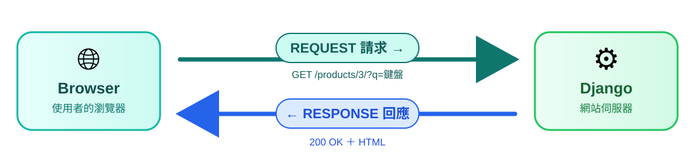

<!-- _class: cover -->

# Django 教學 02
## HTTP路由與View

第 3 章

從最小範例到專案實作與驗收

---

## 本份學習路線

先完成 [01_開發環境與專案建立](01_開發環境與專案建立.md)。

- **第 3 章：Request、URL 與 View**

每章依序：概念、最小範例、語法、專案對照、實作與驗收。

[全課目錄](README.md) · [來源索引](SOURCE_MAP.md) · [實作手冊對照](WORKBOOK_MAP.md)

---

<!-- _class: cover -->

<a id="chapter-3"></a>

# 第 3 章
## Request、URL 與 View

完成固定路由、動態路由與 query 回應，通過 200／404 的頁面測試。

---

## 本章的操作環境與成果

操作環境：自己的 django_lab；保留前章的 config 與 pages。

**完成成果：** 完成固定路由、動態路由與 query 回應，通過 200／404 的頁面測試。

完整範例可依步驟操作；標示「節錄／重排」的程式用來閱讀，不當作整檔覆蓋。
進階頁可回查，但所有基本驗收需完成。

---

<!-- source: A:045 | 01_django_foundations_and_two_projects/01_django_foundations_and_two_projects.md | line 800 -->

## 3-1 HTTP：瀏覽器與伺服器交換訊息

瀏覽器送出 **request**，Django 回傳 **response**：



---

## 3-2 Request 與 Response 的內容

Request 常見部分：

- method：GET、POST…
- path：例如 `/products/3/`
- query string：例如 `?q=鍵盤`
- headers、body、登入資訊

Response 常見部分：status、headers、body。HTML 只是 body 的一種內容。

---

<!-- source: A:046 | 01_django_foundations_and_two_projects/01_django_foundations_and_two_projects.md | line 851 -->

## 3-3 拆開網址，找出路由真正比對的部分

```text
http://127.0.0.1:8000/products/3/?from=home
```

| 部分 | 值 |
|---|---|
| scheme | `http` |
| host | `127.0.0.1` |
| port | `8000` |
| path | `/products/3/` |
| query string | `from=home` |

URLconf 主要比對 path；query string 通常在 View 透過 `request.GET` 讀取。

---

<!-- source: A:047 | 01_django_foundations_and_two_projects/01_django_foundations_and_two_projects.md | line 869 -->

## 3-4 在 Network 看見 request 與 response

點選 Network 中重新整理產生的文件請求，觀察：

| 請求／回應 | 欄位 | 本機預覽可觀察的例子 |
|---|---|---|
| Request | method、URL | `GET`、`http://127.0.0.1:8000/` |
| Request | headers | `Host`、`Cookie`（若有） |
| Response | status | 成功頁面通常是 `200` |
| Response | headers | `Content-Type` 說明內容型別 |
| Response | body | Response 分頁內的 HTML 或文字 |

GET 通常用來讀取內容，POST 通常用來提交資料。
Query string 與 request body 是不同位置；登入狀態常透過 cookie / session 關聯。

---

<!-- source: A:048 | 01_django_foundations_and_two_projects/01_django_foundations_and_two_projects.md | line 886 -->

## 3-5 常見 response status

| 狀態 | 初學者可先這樣理解 |
|---|---|
| 200 | 成功取得內容 |
| 302 | 請瀏覽器再到另一個網址 |
| 403 | 已理解請求，但沒有權限 |
| 404 | 找不到符合的路由或物件 |
| 500 | 伺服器執行時發生未處理錯誤 |

狀態碼不是完整錯誤原因，但能先判斷問題在哪一層。

---

<!-- source: A:049 | 01_django_foundations_and_two_projects/01_django_foundations_and_two_projects.md | line 900 -->

## 3-6 第一個 View：先回傳固定文字

**把 `pages/views.py` 改成：**

```python
from django.http import HttpResponse


def hello(request):
    return HttpResponse("Hello Django", content_type="text/plain; charset=utf-8")
```

Django 呼叫 `hello` 時傳入 request 物件。
函式是一種 callable（可呼叫物件），View 必須回傳 response。
這裡明訂純文字型別，將 `Hello Django` 放進 response body。

檔案存好後還不能用網址找到它，下一步要設定路由。

---

<!-- source: A:050 | 01_django_foundations_and_two_projects/01_django_foundations_and_two_projects.md | line 920 -->

## 3-7 自行新增 app 的 urls.py

**新增 `pages/urls.py`，內容如下：**

```python
from django.urls import path
from . import views

app_name = "pages"

urlpatterns = [
    path("hello/", views.hello, name="hello"),
]
```

`from . import views` 匯入同一個 app 的 `views.py`。
`views.hello` 交出函式供 Django 之後呼叫，此處不加 `()`。
`app_name` 與路由 `name` 稍後用來反向產生網址。

---

<!-- source: A:051 | 01_django_foundations_and_two_projects/01_django_foundations_and_two_projects.md | line 941 -->

## 3-8 `path()` 四個重要位置

**剛才新增的 `pages/urls.py` 路由節錄**

```python
path("hello/", views.hello, name="hello")
```

1. `"hello/"`：要比對的 route，不以 `/` 開頭
2. `views.hello`：匹配後呼叫的 callable
3. 可選 extra kwargs：本例未使用
4. `name="hello"`：反向產生 URL 時使用的名稱

---

<!-- source: A:052 | 01_django_foundations_and_two_projects/01_django_foundations_and_two_projects.md | line 956 -->

## 3-9 把 project URL 接到 app URL

**把 `config/urls.py` 改成以下完整內容，保留 admin 路由：**

```python
from django.contrib import admin
from django.urls import include, path

urlpatterns = [
    path("admin/", admin.site.urls),
    path("", include("pages.urls")),
]
```

根 URL 比對空前綴 `""`，把剩餘路徑交給 `pages.urls`。
`/hello/` 會由 app 找到 `hello/`，再呼叫 `views.hello`。
`INSTALLED_APPS` 啟用 app，`include()` 接入路由，兩件事都要做好。

---

<!-- source: A:053 | 01_django_foundations_and_two_projects/01_django_foundations_and_two_projects.md | line 976 -->

## 3-10 立刻驗收：第一個頁面確實可用

瀏覽器開啟 `http://127.0.0.1:8000/hello/`。
應看到 `Hello Django`，Network 的文件請求應為 `200`。

也可在**另一個終端機**執行：

```bash
curl -i http://127.0.0.1:8000/hello/
```

Windows PowerShell 如遇命令別名問題，使用 `curl.exe -i`。
觀察狀態列、`Content-Type: text/plain; charset=utf-8` 與 body。
根網址 `/` 目前沒有自訂路由，顯示 404 屬於預期結果。

**檢查點：** 能從三個檔案解釋為什麼 `/hello/` 回應成功。

---

<!-- source: A:054 | 01_django_foundations_and_two_projects/01_django_foundations_and_two_projects.md | line 995 -->

## 3-11 動態路徑：把網址片段傳入函式

**在 `pages/views.py` 後面新增：**

```python
def hello_name(request, name):
    return HttpResponse(f"歡迎 {name}", content_type="text/plain; charset=utf-8")
```

**在 `pages/urls.py` 的 `urlpatterns` 清單中新增：**

```python
path("hello/<str:name>/", views.hello_name, name="hello-name"),
```

`<str:name>` 匹配非空且不含 `/` 的片段，以 `name=...` 傳入。
瀏覽 `/hello/Ada/` 應看到「歡迎 Ada」。參數名必須對得上。

---

<!-- source: A:055 | 01_django_foundations_and_two_projects/01_django_foundations_and_two_projects.md | line 1015 -->

## 3-12 常用 converter

| converter | 匹配結果 | 常見用途 |
|---|---|---|
| `<int:pk>` | 非負十進位整數（包含 0），傳入 Python `int` | 物件主鍵 |
| `<str:name>` | 非空且不含 `/` 的字串 | 短文字 |
| `<slug:slug>` | 字母、數字、`-`、`_` | 可讀網址代稱 |
| `<path:value>` | 可含 `/` | 子路徑 |

`pk` 是常用的主鍵參數名。以下為後續資料頁的形式示意：

```python
path("products/<int:pk>/", views.product_detail,
     name="product-detail")
```

此處尚未建立 `product_detail`，不用貼入練習。
`<slug:slug>` 接受的是 ASCII 英文字母、數字、`-`、`_`。

---

<!-- source: A:056 | 01_django_foundations_and_two_projects/01_django_foundations_and_two_projects.md | line 1036 -->

## 3-13 Query string 由 request.GET 讀取

**在 `pages/views.py` 後面新增：**

```python
def search(request):
    keyword = request.GET.get("q", "")
    return HttpResponse(f"查詢：{keyword}", content_type="text/plain; charset=utf-8")
```

**在 app 的 `urlpatterns` 中新增：**

```python
path("search/", views.search, name="search"),
```

開啟 `/search/?q=django` 應看到「查詢：django」。
路由比對 `search/`，`request.GET.get("q", "")` 讀參數，沒有值時用空字串。
這裡只是顯示查詢文字，尚未搜尋資料庫。

---

<!-- source: A:057 | 01_django_foundations_and_two_projects/01_django_foundations_and_two_projects.md | line 1058 -->

## 3-14 命名 URL：把名稱與路徑分開

剛才的設定包含：

```python
app_name = "pages"
# urlpatterns 內：
path("hello/", views.hello, name="hello")
```

完整路由名稱為 `pages:hello`：

- `pages`：命名空間（namespace），區分不同 app 的同名路由。
- `hello`：這條路由的名稱。
- `hello/`：瀏覽器實際請求的路徑。

其他程式透過名稱產生 URL，日後改路徑時就能減少逐處修改。

---

<!-- source: A:058 | 01_django_foundations_and_two_projects/01_django_foundations_and_two_projects.md | line 1078 -->

## 3-15 在 Python 反向產生網址

開第二個終端機，進入 `django_lab/`，執行：

```bash
uv run python manage.py shell
```

再於 Python 互動環境執行：

```python
from django.urls import reverse
reverse("pages:hello")                       # '/hello/'
reverse("pages:hello-name", kwargs={"name": "Ada"})  # '/hello/Ada/'
```

反向解析需要「完整名稱＋必要參數」。結束使用 `exit()`。
若出現 `NoReverseMatch`，檢查 namespace、name 及必要參數。

---

<!-- source: A:059 | 01_django_foundations_and_two_projects/01_django_foundations_and_two_projects.md | line 1099 -->

## 3-16 在 template 反向產生網址

之後建立 HTML 樣板時，可以寫：

```django
<a href="">打招呼</a>
<a href="">歡迎 Ada</a>
```

`` 是 Django template 標籤，不是 Python 語法。
它必須經過 Django 樣板引擎處理，瀏覽器不會自行解讀。

後續的 Model、Template 章節會完成 HTML 頁面。
此處先理解與 Python 的 `reverse()` 使用同一套路由名稱。

---

<!-- source: A:060 | 01_django_foundations_and_two_projects/01_django_foundations_and_two_projects.md | line 1116 -->

## 3-17 `HttpResponse` 與安全顯示

危險的誤解：

```python
def hello_name(request, name):
    return HttpResponse(f"歡迎 {name}")
```

若 `name` 來自使用者，f-string 已先把文字直接插入 body；Django template engine 根本沒有參與，因此**沒有自動 escaping**。

初學階段的安全方向：

- 動態 HTML 優先交給 template 顯示
- 或使用明確 escaping 工具
- 不要把「Django 預設 escape」誤套到所有 `HttpResponse`

---

<!-- source: A:061 | 01_django_foundations_and_two_projects/01_django_foundations_and_two_projects.md | line 1135 -->

## 3-18 需要 HTML 時，明確處理使用者輸入

本次動態範例用 `content_type="text/plain; charset=utf-8"`，
讓瀏覽器當成文字。如果要建立 HTML，可明確跳脫動態值：

```python
from django.utils.html import format_html


def hello_html(request, name):
    body = format_html("<p>歡迎 {}</p>", name)
    return HttpResponse(body)
```

**補充範例，不需加入本次路由。** `format_html` 會跳脫替換參數。
實際 HTML 頁面通常使用 template 的預設 escaping。
不要對不可信資料使用 `safe` 或 `mark_safe` 來略過保護。

---

<!-- source: A:062 | 01_django_foundations_and_two_projects/01_django_foundations_and_two_projects.md | line 1155 -->

## 3-19 追蹤一次最小 request 的旅程

```text
GET /hello/
  config/urls.py    include("pages.urls")
       ↓
  pages/urls.py     path("hello/", views.hello, ...)
       ↓
  pages/views.py    hello(request)
       ↓
  HttpResponse     status 200、headers、文字 body
       ↓
  瀏覽器顯示 Hello Django
```

這裡省略共用 middleware 等處理，先追蹤自己的程式。
此流程沒有 Model 與 Template，每個 View 不一定要用到所有層。

---

<!-- source: A:063 | 01_django_foundations_and_two_projects/01_django_foundations_and_two_projects.md | line 1175 -->

## 3-20 404 與 500：沿著流程找問題

| 狀態 | 常見原因 |
|---|---|
| 404 | 路徑拼錯或沒有匹配路由、忘記 `include()` |
| 404 | converter 不接受輸入，例如 `<int:pk>` 收到文字 |
| 404 | Detail View 找不到符合的物件 |
| 500 | View 執行時發生未處理例外，或沒有回傳 response |
| 500 | template 或資料存取發生未處理的錯誤 |

語法或 import 錯誤也可能讓伺服器無法啟動，
此時不一定收到 HTTP 500，應先查看終端機。

開發模式的 traceback 是除錯線索，正式環境不可公開。

---

<!-- source: A:064 | 01_django_foundations_and_two_projects/01_django_foundations_and_two_projects.md | line 1192 -->

## 3-21 按順序排除常見問題

| 現象 | 先檢查 |
|---|---|
| 找不到 `manage.py` | 終端機是否在 `django_lab/` |
| 找不到 Django | `uv run python -m django --version` 是否成功 |
| 瀏覽器連不上 | 伺服器仍在運作嗎？網址及 port 相同嗎？ |
| `/hello/` 得到 404 | 根 `include`、app 的 route、結尾斜線 |
| TypeError：參數不符 | converter 的變數名是否等於 View 參數名 |
| NoReverseMatch | namespace、name 與參數是否一致 |

先讀 traceback 最後一行的例外，再找自己程式的檔案與行號。
一次修改一個原因，重新測同一網址，確認結果有改變。

---

<!-- source: A:065 | 01_django_foundations_and_two_projects/01_django_foundations_and_two_projects.md | line 1208 -->

## 3-22 把驗收寫進 tests.py

**把 `pages/tests.py` 改成以下內容：**

```python
from django.test import SimpleTestCase
from django.urls import reverse


class PageTests(SimpleTestCase):
    def test_hello(self):
        response = self.client.get(reverse("pages:hello"))
        self.assertEqual(response.status_code, 200)
        self.assertEqual(response.content.decode(), "Hello Django")
        self.assertTrue(response["Content-Type"].startswith("text/plain"))
```

`self.client` 模擬請求，不需要先開 `runserver`。
這些頁面不使用資料庫，因此選擇 `SimpleTestCase`。

---

<!-- source: A:066 | 01_django_foundations_and_two_projects/01_django_foundations_and_two_projects.md | line 1230 -->

## 3-23 再確認動態網址、query 與 404

**接在同一個 `PageTests` 類別內，保留四格縮排：**

```python
    def test_name_and_reverse(self):
        url = reverse("pages:hello-name", kwargs={"name": "Ada"})
        self.assertEqual(url, "/hello/Ada/")
        self.assertContains(self.client.get(url), "歡迎 Ada")

    def test_search(self):
        response = self.client.get(reverse("pages:search"), {"q": "django"})
        self.assertContains(response, "查詢：django")

    def test_missing_url(self):
        self.assertEqual(self.client.get("/missing/").status_code, 404)
```

執行 `uv run python manage.py test pages`，應顯示 4 個測試通過。

---

<!-- source: L:011 | 01_django_foundations_and_two_projects/02_first_contact_lab_and_debugging.md | line 174 -->

## 3-24 Request log 是第一個 debugger

瀏覽一頁後 terminal 會出現：

```text
"GET / HTTP/1.1" 200 ...
```

觀察：

- method：GET / POST
- path
- status code

先從 HTTP 層判斷問題，再進 Python。

---

<!-- source: L:013 | 01_django_foundations_and_two_projects/02_first_contact_lab_and_debugging.md | line 205 -->

## 3-25 Traceback 要從哪裡開始？

不要從最上面一路讀到失去方向。

先找 traceback 最下面：

```text
ExceptionType: 最終錯誤訊息
```

再往上找第一個屬於你專案的檔案：

```text
.../board/views.py, line 23
```

先修最靠近 exception 的「自己程式碼」。

---

<!-- source: L:016 | 01_django_foundations_and_two_projects/02_first_contact_lab_and_debugging.md | line 257 -->

## 3-26 `NoReverseMatch`

常見訊息：

```text
NoReverseMatch: Reverse for 'detail' ...
```

問三件事：

1. URL name 對嗎？
2. namespace 對嗎？
3. required args/kwargs 有傳嗎？

可以用 shell 驗證：

```bash
uv run python manage.py shell
```

```python
from django.urls import reverse
reverse("board:list")
```

---

<!-- source: A:067 | 01_django_foundations_and_two_projects/01_django_foundations_and_two_projects.md | line 1252 -->

## 3-27 先完成自己的練習，再進行專案對照

- **步驟 A**：從空資料夾完成 uv、Python、Django、project 與 app。
- **步驟 B**：指出 `.venv`、鎖檔、Git、settings、migration 的用途。
- **步驟 C**：完成 `/hello/`、`/hello/Ada/`、`/search/?q=django`。
- **步驟 D**：用 Network 記錄成功的 200 與不存在路徑的 404。
- **步驟 E**：用 `reverse()` 產生網址，並讓 4 個測試通過。
- **步驟 F**：畫出 root URL、app URL、View、response 的流程。

**加練：** 把 `hello/` 改成 `greeting/`，保留名稱 `hello`，
觀察 `reverse("pages:hello")` 與使用該名稱的測試如何跟著改變。
完成後將路徑改回來，再保存一個 Git commit。

---

<!-- source: A:080 | 01_django_foundations_and_two_projects/01_django_foundations_and_two_projects.md | line 1493 -->

## 3-28 從文字回應走向資料頁


圖中以 `product_detail(request, pk)` 示意；LearnMart 實際使用 `ProductDetailView.as_view()`。

---

<!-- source: A:081 | 01_django_foundations_and_two_projects/01_django_foundations_and_two_projects.md | line 1501 -->

## 3-29 從自己的最小流程擴充到完整頁面

| 層次 | `django_lab` | 完成專案 |
|---|---|---|
| URL | 指向 `hello` | 指向留言／商品 View |
| View | 建立文字 response | 取得資料並準備頁面內容 |
| Model | 此次沒有使用 | `Message`、`Product` 等資料模型 |
| Template | 此次沒有使用 | HTML 頁面與反向 URL 標籤 |
| Response | 純文字 body | 通常是 HTML body |

MVT 分別是 Model、View、Template。
前頁圖是較完整的資料頁流程，用來和 `/hello/` 比較，
不是宣稱每個請求都必須走過 Model 與 Template。

---

<!-- source: A:087 | 01_django_foundations_and_two_projects/01_django_foundations_and_two_projects.md | line 1591 -->

## 3-30 觀念檢核：URL 與 request flow

1. `/products/3/?q=django` 中，URLconf 主要比對哪個部分？
2. `path()` 的 route、view、name 各負責什麼？
3. `<int:pk>` 如何和 View 參數連接？
4. 為什麼原始 `HttpResponse(f"{name}")` 沒有 template escaping？
5. 404 與 500 分別可能發生在哪裡？如何區分啟動失敗？

**繳交：** 命名路由、200 / 404 紀錄、reverse 結果、測試與流程圖。

配套手冊：[LearnBoard 原第 2 章](workbooks/learnboard_01_django_foundations_and_message_board_workbook.md#chapter-2)、[LearnMart 原第 2 章](workbooks/learnmart_01_django_foundations_and_data_backed_catalog_workbook.md#chapter-2)。
接著在第 4～5 章完成 Template，再於第 6～11 章建立資料層。

---

<!-- source: A:088 | 01_django_foundations_and_two_projects/01_django_foundations_and_two_projects.md | line 1606 -->

## 3-31 查閱來源與參考資料

- [uv 安裝](https://docs.astral.sh/uv/getting-started/installation/)、[專案操作](https://docs.astral.sh/uv/guides/projects/)、[專案檔案結構](https://docs.astral.sh/uv/concepts/projects/layout/)
- [Django 6.1.1 入門第一部分](https://docs.djangoproject.com/en/6.1/intro/tutorial01/)
- [Django 命令列工具](https://docs.djangoproject.com/en/6.1/ref/django-admin/)
- [Django URL dispatcher](https://docs.djangoproject.com/en/6.1/topics/http/urls/)

教學實作採用本份 `django_lab` 範例；F 段才是既有專案實際對照。
安裝、指令及路由觀念已依官方文件核對。

---

## 第 3 章實作與離堂檢核

**任務：** 完成固定路由、動態路由與 query 回應，通過 200／404 的頁面測試。

1. 展示操作結果或測試紀錄，指出對應檔案與資料。
2. 解釋一個輸入如何得到結果，以及規則在哪一層檢查。
3. 改變一個條件或製造一次失敗，記錄觀察與修正。

**配套練習：** [LearnBoard 01 原第 2 章](workbooks/learnboard_01_django_foundations_and_message_board_workbook.md#chapter-2)；[LearnMart 01 原第 2 章](workbooks/learnmart_01_django_foundations_and_data_backed_catalog_workbook.md#chapter-2)。手冊保留原章號，對照表列出本課位置。

---

## 本份完成與後續

下一份：[03_Template與頁面呈現](03_Template與頁面呈現.md)。

- 保留本份操作紀錄，確認使用正確的專案與資料庫。
- 章節與實作對應可由 [全課目錄](README.md) 回查。
- 原始教材與合併去向見 [來源索引](SOURCE_MAP.md)。
