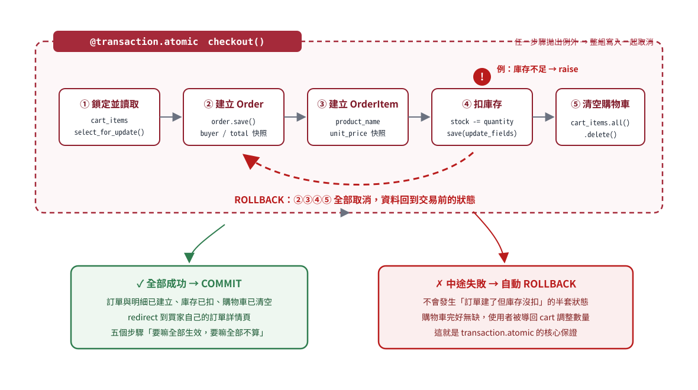

# 第 5 章
## 訂單、結帳、Transaction 與鎖定

目標：讓一個 checkout 不是「做了很多 save」，而是可說明其資料一致性與失敗行為。

<!--
授課提示：全冊技術高峰，完整一堂課；transaction_rollback.svg 圖解頁務必停留 3 分鐘。
-->

---

## 為什麼需要 Order 與 OrderItem？

```text
Order（訂單主檔）
├─ buyer、收件資料、狀態、總額、時間
└─ OrderItem（每一項商品）
   ├─ product、seller
   ├─ product_name、unit_price 快照
   └─ quantity
```

一張訂單可包含多項商品；每項商品又需要購買當下的資料。

---

## Order 保存交易層資訊

```python
class Order(models.Model):
    buyer = models.ForeignKey(User, on_delete=models.PROTECT,
                              related_name="orders")
    recipient_name = models.CharField(max_length=80)
    address = models.CharField(max_length=255)
    phone = models.CharField(max_length=30)
    status = models.CharField(...)
    total = models.DecimalField(...)
```

`PROTECT` 避免刪除 buyer 時破壞歷史訂單關聯。

---

## OrderItem 為什麼同時有 FK 與快照？

```python
class OrderItem(models.Model):
    product = models.ForeignKey(Product, on_delete=models.PROTECT)
    seller = models.ForeignKey(User, on_delete=models.PROTECT)
    product_name = models.CharField(max_length=150)
    unit_price = models.DecimalField(...)
    quantity = models.PositiveIntegerField()
```

- FK 保留追蹤關係
- `product_name`／`unit_price` 保留購買時歷史
- 商品日後改名或漲價，舊訂單不應跟著改

<!--
授課提示：提問：商品改名或改價後，舊訂單應該顯示什麼？答案決定為什麼需要 product_name / unit_price 快照。
-->

---

## 訂單總額也由伺服器保存快照

危險：

```html
<input type="hidden" name="total" value="1980">
```

hidden input 仍可修改。正確：

```python
order.total = sum(item.subtotal for item in items)
```

價格、seller、buyer、status 都是 server-owned data，不列入 CheckoutForm。

---

## CheckoutForm 的 allowlist

<span class="label current">目前 LearnMart｜節錄／重排｜marketplace/forms.py</span>

```python
class CheckoutForm(BootstrapFormMixin, forms.ModelForm):
    class Meta:
        model = Order
        fields = ("recipient_name", "phone", "address")
```

使用者只輸入收件資料。Order 的 buyer、total、status 與 items 由 View 根據 authenticated user 與 database state 建立。

---

## Checkout 的入口先處理身份與 cart

```python
@login_required
@transaction.atomic
def checkout(request):
    items = list(
        request.user.cart_items
        .select_related("product", "product__seller")
        .select_for_update()
    )
    if not items:
        messages.info(request, "購物車目前是空的。")
        return redirect("marketplace:cart")
```

目前 implementation 在 GET 與 POST 都先 materialize queryset；後面會討論鎖定位置。

---

## `list(queryset)` 讓查詢立即執行

QuerySet 原本 lazy；轉成 list 會立刻讀資料。

這裡的效果：

- 後續多次迭代使用同一批 CartItem object
- 若 backend 支援 `select_for_update()`，evaluation 時才嘗試取得鎖
- 鎖定必須在 transaction 內才有意義

---

## GET 與 POST 在 checkout 扮演不同角色

- GET：建立 unbound CheckoutForm，顯示收件 form 與 cart summary，不應改資料
- POST：建立 bound form，驗證收件資料後建立訂單、扣庫存、清 cart

目前 `@transaction.atomic` 包住兩者。教學上要看懂現況，也要知道更精準的設計可只在 POST mutation 階段進 transaction／lock。

---

## POST 先建立 bound CheckoutForm

```python
form = CheckoutForm(request.POST or None)
if request.method == "POST" and form.is_valid():
    ...
```

這是目前原始碼的簡寫。因 View 已另外檢查 method，仍能區分成功分支；但本冊先前建議初學範例用明確 GET/POST 分支，以避免空 POST 的 bound/unbound 歧義。

---

## 寫入前再次檢查庫存

```python
for item in items:
    if item.quantity > item.product.stock:
        messages.error(
            request,
            f"「{item.product.name}」庫存不足，請調整數量。",
        )
        return redirect("marketplace:cart")
```

Cart 頁看到的庫存可能在結帳前已改變，因此 checkout 必須重新驗證。

---

## `commit=False` 補上 buyer 與 total

```python
order = form.save(commit=False)
order.buyer = request.user
order.total = sum(item.subtotal for item in items)
order.save()
```

表單只提供收件欄位；View 補上 authenticated buyer 與 server-calculated total，再寫入資料庫。

---

## 建立 OrderItem 快照

```python
for item in items:
    OrderItem.objects.create(
        order=order,
        product=item.product,
        seller=item.product.seller,
        product_name=item.product.name,
        unit_price=item.product.price,
        quantity=item.quantity,
    )
```

每個值都來自 database object，不從 hidden field 信任 client。

---

## 扣庫存並清 cart

```python
item.product.stock -= item.quantity
item.product.save(update_fields=["stock"])

request.user.cart_items.all().delete()
```

`update_fields` 只更新 stock column。清 cart 必須在所有 order items 建立與庫存更新成功後，且仍在同一 transaction 中。

---

## 最後 redirect 到 buyer-scoped 訂單

```python
messages.success(request, f"訂單 #{order.pk} 已成立。")
return redirect("marketplace:order-detail", pk=order.pk)
```

後續 OrderDetailView 仍要用 buyer-scoped queryset。剛建立成功不代表可以讓任意登入者讀取其 URL。

---

## `transaction.atomic` 的核心保證

```python
@transaction.atomic
def checkout(request):
    ...
```

在同一 database connection 上，block 內寫入：

- 全部成功 → commit
- exception 往外拋出 → rollback
- 明確標記 rollback → rollback

<span class="label warning">普通 `return` 不會自動 rollback 已完成寫入。</span>

---

## 圖解：Checkout 的成功路徑與 rollback 路徑



<!--
授課提示：先問「哪幾步在寫入資料庫？」（②③④⑤），再指紅色分支討論沒有 atomic 時的半套狀態。此頁停留 3 分鐘，是全冊最重要的概念圖之一；SQLite 的 row-lock 注意事項在後兩頁補充。
-->

---

## 為什麼 validation 要盡量在寫入前？

若先建立 Order，再發現庫存不足並普通 return，atomic 不會因「回傳錯誤頁」自動 rollback。

目前程式在任何寫入前先檢查所有 item 庫存，避免這個陷阱。

更複雜流程中可：

- raise exception
- 使用 nested atomic/savepoint
- 明確 `transaction.set_rollback(True)`

但先把 validation 排在 mutation 前最清楚。

---

## Atomicity 與 locking 是不同問題

- **Atomicity**：一組寫入要一起 commit 或 rollback
- **Locking／concurrency control**：兩個 transaction 同時讀改同一份庫存時如何協調

只有 atomic 不一定防止 lost update；只有鎖定也不代表多筆寫入會整體 rollback。

<!--
授課提示：一句話分工：atomic 管「全有全無」、select_for_update 管「排隊」。兩者常被混為一談。
-->

---

## `select_for_update()` 的意圖與範圍

```python
items = request.user.cart_items.select_for_update()
```

在支援的 database 中，query evaluation 後會鎖住 query 選到的 rows，直到 transaction 結束。它必須位於 `atomic()` 中、真正 evaluation，且 target 要是共享競爭資源。

若 query 同時以 `select_related()` join 其他 tables，支援的 backend 也可能鎖 joined Product／seller rows；需要 backend 支援的 `of=(...)` 才能限制鎖定範圍。不能只看到起點是 CartItem 就斷言只鎖 CartItem。

---

## SQLite 不提供這個 row-lock 保證

<span class="label warning">目前 LearnMart 使用 SQLite</span>

Django 在 SQLite 上的 `select_for_update()` 沒有 row-lock effect；不會因此取得 PostgreSQL 那種資料列鎖。

所以本教學版可以理解 API 與意圖，但不能宣稱已具備 production-grade 的並行扣庫存保證。

<!--
授課提示：明講教學環境與 production 的差異：正式環境用 PostgreSQL/MySQL 才有完整 row lock 語意。
-->

---

## 優先明確鎖定 Product

真正競爭的共享資源是 Product stock；不同買家的 CartItem 不同。較清楚的 production 方向是：

1. 先取得 cart 中的 product PKs。
2. 在 POST 的 `atomic()` 內，以固定 PK 順序查詢 Product。
3. 對 Product queryset 使用 `select_for_update()`。
4. 用鎖後最新 stock 重新驗證與扣減。

固定順序可降低多商品 checkout 的 deadlock 風險。`of=(...)` 可調整 joined query 的鎖定範圍，但 explicit Product lock 更直接；仍需在支援 row locks 的 database 做 concurrency test。

---

## Buyer 只能看自己的 Order

```python
class OrderDetailView(LoginRequiredMixin, DetailView):
    model = Order

    def get_queryset(self):
        return Order.objects.filter(
            buyer=self.request.user
        ).prefetch_related("items__product")
```

URL `pk` 由 generic view 在這個範圍中查找；別人的 order 會 404。

---

## Snapshot template 不依賴目前 Product 名稱／價格

```django

  <span>{{ item.product_name }} × {{ item.quantity }}</span>
  <span>NT$ {{ item.subtotal }}</span>

```

顯示 `product_name` 與 `unit_price` 衍生的 subtotal，符合歷史快照目的。

---

## 目前 checkout test 已保護哪些行為？

```python
def test_checkout_creates_order_and_reduces_stock(self):
    ...
    self.assertRedirects(response, order_detail_url)
    self.assertEqual(self.product.stock, 3)
    self.assertEqual(order.total, 1980)
```

已測：建立 order、redirect、扣庫存、server total。

尚未測：OrderItem snapshot、cart 清空、收件欄位、rollback／庫存不足。

---

## Order privacy test 是 IDOR regression test

```python
def test_user_cannot_read_another_users_order(self):
    ...
    response = self.client.get(
        reverse("marketplace:order-detail", args=[order.pk])
    )
    self.assertEqual(response.status_code, 404)
```

它驗證 URL id 存在但不在 buyer-scoped queryset 中，View 不會洩漏他人訂單。

---

## 第 5 章概念檢核

1. OrderItem 為何同時保存 FK 與 snapshot？
2. `commit=False` 在 checkout 補了哪些 server-owned 值？
3. 普通 `return` 是否會讓 atomic rollback？
4. Atomicity 與 row locking 的差異是什麼？
5. 為何 SQLite 上不能宣稱 `select_for_update()` 保護庫存競爭？

<span class="label check">答案見配套實作手冊第 5 章</span>

<!--
授課提示：rollback 測試設計題討論 5 分鐘：「如何讓失敗發生在寫入之後？」（workbook 實作 5E）
-->

---

## 第 5 章 LearnMart 實作

任務：擴充 checkout test，驗證 snapshot、cart 清空與失敗時資料不變。

驗收重點：

- OrderItem name／price／seller 正確
- 成功後 cart 為空
- 庫存不足時不建立 Order、不扣 stock、不清 cart
- 他人仍無法讀取 order

[LearnMart 測試步驟與參考斷言](../workbooks/learnmart_02_forms_auth_and_marketplace_workflows_workbook.md#chapter-5)；[LearnBoard 安全／測試對應](../workbooks/learnboard_02_forms_auth_and_board_workflows_workbook.md#chapter-5)
