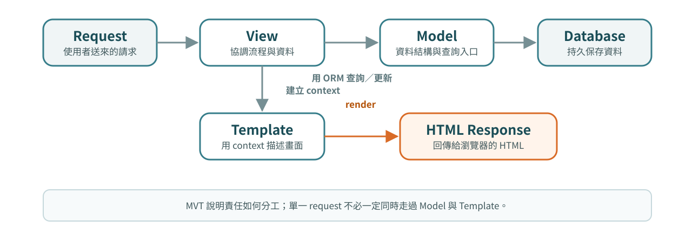
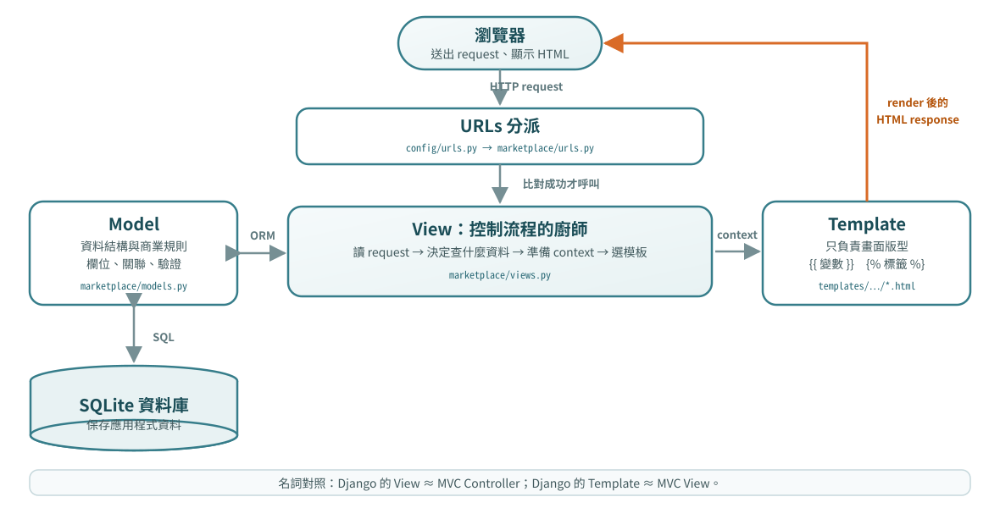

<!-- _class: cover -->

# Django 教學 03
## Template與頁面呈現

第 4～5 章

從最小範例到專案實作與驗收

---

## 本份學習路線

先完成 [02_HTTP路由與View](02_HTTP路由與View.md)。

- **第 4 章：Template 與資料呈現**
- **第 5 章：版型、靜態資源與響應式頁面**

每章依序：概念、最小範例、語法、專案對照、實作與驗收。

[全課目錄](../README.md) · [來源索引](../SOURCE_MAP.md) · [實作手冊對照](../WORKBOOK_MAP.md)

---

<!-- _class: cover -->

<a id="chapter-4"></a>

# 第 4 章
## Template 與資料呈現

把 context 傳入模板，驗證列表、空資料、格式化與 HTML escaping。

---

## 本章的操作環境與成果

操作環境：自己的 django_lab；保留前章的 config 與 pages。

**完成成果：** 把 context 傳入模板，驗證列表、空資料、格式化與 HTML escaping。

完整範例可依步驟操作；標示「節錄／重排」的程式用來閱讀，不當作整檔覆蓋。
進階頁可回查，但所有基本驗收需完成。

---

<!-- source: A:090 | 01_django_foundations_and_two_projects/01_django_foundations_and_two_projects.md | line 1633 -->

## 4-1 從字串 response 到 template

直接拼 HTML 很快失去可讀性：

```python
return HttpResponse("<h1>商品</h1><p>...</p>")
```

Template 把責任分開：

- View：準備資料與流程
- Template：描述 HTML 顯示
- context：View 傳給 Template 的命名資料

這也讓 template autoescaping、繼承與重用機制能參與。

---

<!-- source: A:091 | 01_django_foundations_and_two_projects/01_django_foundations_and_two_projects.md | line 1651 -->

## 4-2 `render()` 的三個核心參數

<div class="two-column">
<div>

**教學用最小範例｜`marketplace/views.py`**

```python
from django.shortcuts import render


def catalog(request):
  products = ["鍵盤", "筆記本"]
  return render(
    request,
    "marketplace/catalog.html",
    {"products": products},
  )
```

</div>
<div>

**三個核心參數**

- `request`：目前 request
- template name：由設定好的搜尋路徑尋找
- context dict：key 會成為 template 變數名

`render()` 最後仍回傳 `HttpResponse`。

</div>
</div>

---

<!-- source: A:092 | 01_django_foundations_and_two_projects/01_django_foundations_and_two_projects.md | line 1687 -->

## 4-3 步驟 A：MVT 心智模型



---

## 4-4 MVT 各層的責任

- **Model**：資料結構、關聯與查詢入口
- **View**：接 request、協調 Model、選 template、回 response　（Function View 可只回 `HttpResponse`；使用 template 的完整頁面也不一定每次查 Model。）
- **Template**：使用 context 描述輸出 HTML

---

<!-- source: A:093 | 01_django_foundations_and_two_projects/01_django_foundations_and_two_projects.md | line 1697 -->

## 4-5 步驟 B：MVT 如何分工圖解



<!--
授課提示：強調三個方塊各自住在哪個資料夾（models.py／views.py／templates/）。底部 MVC 對照常被考：Django 的 View ≈ MVC Controller、Template ≈ MVC View。若班上有人學過 MVC，務必在此對焦名詞。
-->

---

<!-- source: A:094 | 01_django_foundations_and_two_projects/01_django_foundations_and_two_projects.md | line 1707 -->

<!-- _class: compact -->

## 4-6 Template 到底放在哪裡？

**目前 LearnMart 節錄｜部分 template tree**

```text
templates/
├── base.html
├── registration/
└── marketplace/
    ├── home.html
    ├── product_detail.html
    └── pagination.html
```

對應設定：

```python
"DIRS": [BASE_DIR / "templates"],
"APP_DIRS": True,
```

Template name 用 `/` 分層，如 `marketplace/home.html`，不是絕對路徑。

---

<!-- source: A:095 | 01_django_foundations_and_two_projects/01_django_foundations_and_two_projects.md | line 1733 -->

## 4-7 三種 Django template delimiter

```django
{{ product.name }}          {# 輸出 value #}
  {# 執行 template tag #}
  有庫存

{# 只給 template 作者看的註解 #}
```

- `{{ ... }}`：求值並輸出
- ``：流程、載入、繼承、URL 等 tag
- `{# ... #}`：不輸出到回應

Django template language 刻意受限；複雜商業邏輯應留在 Python。

<!--
授課提示：板書三種 delimiter 各一例。{{ }} 誤打成  是最高頻 template 錯誤，出現時請學生自己讀錯誤訊息定位。
-->

---

<!-- source: A:096 | 01_django_foundations_and_two_projects/01_django_foundations_and_two_projects.md | line 1755 -->

## 4-8 變數與 dot lookup

```django
{{ product.name }}
{{ product.seller.username }}
```

依序查找 dictionary key、attribute、list index；解析出的無參數 callable 可能被呼叫。

對 model relation 而言：

```text
product.seller          → User instance
product.seller.username → User 的 username
```

缺少的 template 變數常呈現空字串，不一定像 Python 一樣立刻拋錯，因此名稱要特別核對。

---

<!-- source: A:097 | 01_django_foundations_and_two_projects/01_django_foundations_and_two_projects.md | line 1780 -->

## 4-9 Template autoescaping 的正確邊界

```django
<p>{{ post.content }}</p>
```

預設情況下，`<`、`>` 等特殊字元會被 escape，瀏覽器把它們當文字而不是 HTML tag。

這個保護只適用於 template engine 的輸出流程：

- `{{ value }}`：通常 autoescape
- `HttpResponse(f"{value}")`：沒有 template，沒有 autoescape
- `{{ value|safe }}`：主動關閉保護，使用者內容不應隨意使用

<!--
授課提示：demo：在留言板輸入 <script>alert(1)</script>，觀察被 escape 的輸出。伏筆在 第 15～21 章 第 13 章 XSS 收割。
-->

---

<!-- source: A:098 | 01_django_foundations_and_two_projects/01_django_foundations_and_two_projects.md | line 1800 -->

## 4-10 Filter：改變顯示，不改資料庫

```django
{{ review.created_at|date:"Y/m/d" }}
{{ product.description|truncatechars:80 }}
{{ query|default:"全部商品" }}
```

語法：`value|filter_name:argument`

- filter 處理 presentation
- 原本 model value 不會被存回資料庫
- 可串接多個 filter
- 有參數時常以冒號接字串

LearnMart 也使用 `linebreaksbr`、`urlencode` 等 filter。

---

<!-- source: A:099 | 01_django_foundations_and_two_projects/01_django_foundations_and_two_projects.md | line 1819 -->

## 4-11 `if`：依狀態決定顯示

```django

  <span>有現貨</span>

  <span>已售完</span>

```

注意：

- `` 必須以 `` 結束
- 比較運算子兩側保留空格較易讀
- 隱藏按鈕只是 UI；真正的庫存規則仍須由 server 驗證

---

<!-- source: A:100 | 01_django_foundations_and_two_projects/01_django_foundations_and_two_projects.md | line 1837 -->

## 4-12 `for` 與 ``

```django

  <h2>{{ product.name }}</h2>

  <p>目前沒有商品。</p>

```

- `products` 來自 context
- `product` 只在 loop 內代表目前項目
- `` 處理空 QuerySet/list，比在外層再寫一個 `if` 更直接
- `forloop.counter` 可取得從 1 開始的序號

---

<!-- source: A:101 | 01_django_foundations_and_two_projects/01_django_foundations_and_two_projects.md | line 1854 -->

## 4-13 URL tag 接回上一章的命名路由

```django
<a href="">
  {{ product.name }}
</a>
```

`marketplace:product-detail` 需要一個 `pk`，因此 tag 後面提供 `product.pk`。

優點：

- 不硬寫 `/products/3/`
- route 文字改動時，只要 name 與參數契約不變，template 不必逐頁搜尋替換

---

<!-- source: C:211 | 02_forms_auth_and_two_projects/02_forms_auth_and_two_projects.md | line 3367 -->

## 4-14 Filter 可以串接

```django
{{ article.title|default:"未命名"|truncatechars:40 }}
```

心智模型：

```text
article.title
  ↓ default
  ↓ truncatechars
  ↓ render
```

每個 filter 都接收前一個輸出。

---

<!-- source: C:212 | 02_forms_auth_and_two_projects/02_forms_auth_and_two_projects.md | line 3386 -->

## 4-15 `default` vs `default_if_none`

```django
{{ value|default:"沒有資料" }}
{{ value|default_if_none:"沒有資料" }}
```

差異：

- `default`：空字串、False、空 list 等 falsy 值也會被替換
- `default_if_none`：只有 `None` 才替換

如果 `0` 是有意義的值，常常要用 `default_if_none`。

---

<!-- source: C:213 | 02_forms_auth_and_two_projects/02_forms_auth_and_two_projects.md | line 3402 -->

## 4-16 日期格式 `date`

```django
{{ article.published_at|date:"Y-m-d" }}
{{ article.published_at|date:"Y/m/d H:i" }}
```

常見格式：

- `Y`：四位年份
- `m`：月份 01–12
- `d`：日期 01–31
- `H`：24 小時制
- `i`：分鐘

不要在 view 手動 `strftime()` 只為了顯示格式。

---

<!-- source: C:214 | 02_forms_auth_and_two_projects/02_forms_auth_and_two_projects.md | line 3421 -->

## 4-17 只顯示時間：`time`

```django
{{ event.starts_at|time:"H:i" }}
```

當畫面只需要時間，不需要日期時，比 `date` 語意更清楚。

---

<!-- source: C:220 | 02_forms_auth_and_two_projects/02_forms_auth_and_two_projects.md | line 3530 -->

## 4-18 長文字：`truncatechars`

```django
{{ article.title|truncatechars:40 }}
```

超過 40 characters 時會截斷並加省略符號。

最常用在：

- card title
- table column
- sidebar link
- mobile layout

---

<!-- source: C:221 | 02_forms_auth_and_two_projects/02_forms_auth_and_two_projects.md | line 3547 -->

## 4-19 長文字：`truncatewords`

```django
{{ article.excerpt|truncatewords:25 }}
```

以「單字數」截斷。

英文文章很好用；中文沒有空白斷詞時，`truncatechars` 通常更直覺。

---

<!-- source: C:223 | 02_forms_auth_and_two_projects/02_forms_auth_and_two_projects.md | line 3575 -->

## 4-20 純文字換行：`linebreaks`

```django
{{ comment.body|linebreaks }}
```

會把換行轉成 `<p>` / `<br>` 結構。

如果只想換行變 `<br>`：

```django
{{ comment.body|linebreaksbr }}
```

很適合簡單 textarea 內容。

---

<!-- source: C:225 | 02_forms_auth_and_two_projects/02_forms_auth_and_two_projects.md | line 3611 -->

## 4-21 小數格式：`floatformat`

```django
{{ rating|floatformat:1 }}
{{ completion_ratio|floatformat:2 }}
```

例：

```text
4.6
0.83
```

如果是 money，仍建議 model/backend 使用 `Decimal`，不要把精度責任交給 template。

---

<!-- source: L:015 | 01_django_foundations_and_two_projects/02_first_contact_lab_and_debugging.md | line 241 -->

## 4-22 `TemplateDoesNotExist`

```text
TemplateDoesNotExist: board/message_list.html
```

檢查：

- template path 拼字
- `templates/` 放哪裡
- `TEMPLATES["DIRS"]`
- app templates convention
- `render()` / CBV `template_name`

---

## 第 4 章實作與離堂檢核

**任務：** 把 context 傳入模板，驗證列表、空資料、格式化與 HTML escaping。

1. 展示操作結果或測試紀錄，指出對應檔案與資料。
2. 解釋一個輸入如何得到結果，以及規則在哪一層檢查。
3. 改變一個條件或製造一次失敗，記錄觀察與修正。

**配套練習：** [LearnBoard 01 原第 3 章](../workbooks/learnboard_01_django_foundations_and_message_board_workbook.md#chapter-3)；[LearnMart 01 原第 3 章](../workbooks/learnmart_01_django_foundations_and_data_backed_catalog_workbook.md#chapter-3)。手冊保留原章號，對照表列出本課位置。

---

<!-- _class: cover -->

<a id="chapter-5"></a>

# 第 5 章
## 版型、靜態資源與響應式頁面

建立共用 base、子模板與 CSS，驗證桌面／手機版面及缺圖狀態。

---

## 本章的操作環境與成果

操作環境：自己的 django_lab；保留前章的 config 與 pages。

**完成成果：** 建立共用 base、子模板與 CSS，驗證桌面／手機版面及缺圖狀態。

完整範例可依步驟操作；標示「節錄／重排」的程式用來閱讀，不當作整檔覆蓋。
進階頁可回查，但所有基本驗收需完成。

---

<!-- source: A:102 | 01_django_foundations_and_two_projects/01_django_foundations_and_two_projects.md | line 1871 -->

## 5-1 Template inheritance：先看 parent

**目前 LearnMart 節錄｜`templates/base.html`**

```django
<title>學購 LearnMart</title>

<main class="container py-4">
  
</main>
```

Parent template 定義可被 child 取代的 block：

- `title` 有預設文字
- `content` 提供每頁主要內容插槽
- 導覽列、CSS、messages、footer 只需放在 parent 一次

<!--
授課提示：先看 base.html 再看 child。block 名稱拼錯不會報錯、只會默默空白——現場示範一次讓全班印象深刻。
-->

---

<!-- source: A:103 | 01_django_foundations_and_two_projects/01_django_foundations_and_two_projects.md | line 1895 -->

<!-- _class: compact -->

## 5-2 Template inheritance：再看 child

**目前 LearnMart 節錄／重排｜`templates/marketplace/home.html`**

```django



  <h1 class="display-5 fw-bold">
    學習 Django，也學會打造購物網站
  </h1>
  {# 商品網格與 pagination 省略 #}

```

- `` 應放在 child 的最前面
- block name 必須與 parent 相同
- 最終 response 是 parent 與 child 合成的完整 HTML
- Child 不必重新寫 `<html>`、navbar、footer

---

<!-- source: A:104 | 01_django_foundations_and_two_projects/01_django_foundations_and_two_projects.md | line 1917 -->

## 5-3 `include` 與 `extends` 的工作不同

```django

```

- `extends`：整張頁面的骨架／繼承關係
- `include`：在某個位置插入局部 template
- include 預設可使用目前 context

LearnMart 把分頁導覽抽成 `pagination.html`；home template 保留商品頁主結構。

如果 partial 依賴 `page_obj`，呼叫它的 View 必須提供該 context。

---

<!-- source: A:105 | 01_django_foundations_and_two_projects/01_django_foundations_and_two_projects.md | line 1933 -->

## 5-4 static：開發者提供的固定資產

**目前 LearnMart 節錄｜`templates/base.html`**

```django

<link rel="stylesheet" href="">
```

對應來源：

```text
static/css/site.css
```

`` 產生可供瀏覽器請求的 URL；它不是把 CSS 內容讀入 template。

設定中的 `STATICFILES_DIRS = [BASE_DIR / "static"]` 告訴 Django 開發工具去哪裡找來源檔。

---

<!-- source: A:106 | 01_django_foundations_and_two_projects/01_django_foundations_and_two_projects.md | line 1954 -->

## 5-5 static 與 media 不要混淆

| 類型 | 誰提供 | LearnMart 範例 |
|---|---|---|
| static | 開發者隨程式碼提供 | `site.css` |
| media | 使用者／管理者上傳 | 商品圖片 |

目前設定：

```python
STATIC_URL = "static/"
MEDIA_URL = "media/"
MEDIA_ROOT = BASE_DIR / "media"
```

本章先認識差異；`ImageField` 與 media 路由會在 Model 章一起說明，上傳表單放在第 15 章。

---

<!-- source: A:107 | 01_django_foundations_and_two_projects/01_django_foundations_and_two_projects.md | line 1973 -->

## 5-6 Bootstrap 與 Django 各做什麼？

**目前 LearnMart 節錄｜`templates/base.html`**

```html
<link href="https://cdn.jsdelivr.net/npm/bootstrap@5.3.8/dist/css/bootstrap.min.css"
      rel="stylesheet">
```

- Django：server-side request、資料、template rendering
- Bootstrap：瀏覽器端 CSS/JS 元件與 utility class
- CDN：瀏覽器從外部網站下載檔案，因此需要網路
- LearnMart 沒有 Django frontend build；本地只保留 `site.css`

Bootstrap class 不會改變 Python 或資料庫邏輯。

---

<!-- source: A:108 | 01_django_foundations_and_two_projects/01_django_foundations_and_two_projects.md | line 1991 -->

## 5-7 viewport 為何必須放在 `<head>`？

```html
<meta name="viewport"
      content="width=device-width, initial-scale=1">
```

- `width=device-width`：CSS viewport 使用裝置寬度
- `initial-scale=1`：初始縮放比例為 1

沒有這行時，手機可能以較寬的虛擬畫布縮小整頁，導致 responsive breakpoint 與閱讀效果不如預期。

---

<!-- source: A:109 | 01_django_foundations_and_two_projects/01_django_foundations_and_two_projects.md | line 2005 -->

## 5-8 Bootstrap grid 的 12 欄心智模型

```html
<div class="container">
  <div class="row">
    <div class="col-md-6">左</div>
    <div class="col-md-6">右</div>
  </div>
</div>
```

- `container`：限制與置中內容寬度
- `row`：建立欄位列與 gutter
- `col-md-6`：從 `md` 寬度起占 6/12，也就是一半
- 小於 `md` 時沒有指定欄寬，兩個 block 會自然堆疊

---

<!-- source: A:110 | 01_django_foundations_and_two_projects/01_django_foundations_and_two_projects.md | line 2023 -->

## 5-9 Mobile-first：breakpoint 代表「以上」

| 前綴 | 起始寬度 | 說明 |
|---|---:|---|
| 無前綴 | 0 | 所有寬度先適用 |
| `sm` | 576px | 576px 以上 |
| `md` | 768px | 768px 以上 |
| `lg` | 992px | 992px 以上 |
| `xl` | 1200px | 1200px 以上 |
| `xxl` | 1400px | 1400px 以上 |

`row-cols-2 row-cols-md-3` 表示：預設 2 欄；到 `md` 及以上改為 3 欄。

<!--
授課提示：用裝置模擬在 767px / 768px 各停一次親眼看欄數切換；HTML/CSS 先備 第 10 章已鋪墊，此處正式回收。
-->

---

<!-- source: A:111 | 01_django_foundations_and_two_projects/01_django_foundations_and_two_projects.md | line 2042 -->

## 5-10 商品網格：完整父子結構

**目前 LearnMart 節錄｜`templates/marketplace/home.html`**

```django
<div class="row row-cols-2 row-cols-md-3 row-cols-xl-4 g-3">
  
    <div class="col">
      <article class="card h-100">...</article>
    </div>
  
    <div class="col-12">目前找不到商品。</div>
  
</div>
```

`row-cols-*` 作用在直接 `.col` 子元素；`g-3` 是 gutter spacing scale，不是 3px。

---

<!-- source: A:112 | 01_django_foundations_and_two_projects/01_django_foundations_and_two_projects.md | line 2062 -->

## 5-11 Utility class 要讀成組合語言

```html
<section class="rounded-4 p-4 p-md-5 mb-4 text-white">
```

拆解：

- `rounded-4`：圓角尺度
- `p-4`：所有寬度 padding
- `p-md-5`：`md` 以上使用更大 padding
- `mb-4`：margin-bottom
- `text-white`：文字顏色

數字是 Bootstrap 設計尺度，不等於相同數值的 px。

---

<!-- source: A:113 | 01_django_foundations_and_two_projects/01_django_foundations_and_two_projects.md | line 2080 -->

## 5-12 語意與無障礙不是最後才補

商品頁範例應同時做到：

- `<nav>`、`<main>`、`<article>` 表示結構
- `` 提供替代文字
- 每個 form control 都要有可存取名稱；優先使用可見 `<label for="...">`
- 緊湊控制項在適當情況可使用 `aria-label`，例如目前 navbar 搜尋欄
- 教學範例明確寫 button 的 `type`；目前部分 templates 仍依賴預設 submit，不能把省略當推薦寫法
- 不能只靠顏色傳達「售完」或錯誤

這些是 HTML 正確性的一部分，不是裝飾。

---

<!-- source: A:114 | 01_django_foundations_and_two_projects/01_django_foundations_and_two_projects.md | line 2095 -->

## 5-13 常見 template 問題如何定位？

| 現象 | 優先檢查 |
|---|---|
| `TemplateDoesNotExist` | template name、`DIRS`、App template 路徑 |
| `NoReverseMatch` | URL namespace/name、必要參數 |
| 變數顯示空白 | context key、attribute 名稱 |
| `TemplateSyntaxError` | tag 拼字、未關閉 block/if/for、未 load static |
| CSS 沒套用 | static URL、瀏覽器 Network、class 拼字 |

先讀 exception type 與指出的 template 行號，不要一開始就隨機改多個檔案。

---

<!-- source: A:115 | 01_django_foundations_and_two_projects/01_django_foundations_and_two_projects.md | line 2109 -->

## 5-14 觀念檢核與實作

1. `render()` 的 template name 與 context 各扮演什麼角色？
2. `{{ }}`、``、`{# #}` 有何不同？
3. `extends` 與 `include` 解決的是哪兩種重複？
4. 為什麼 `row-cols-md-3` 不是「只有 md 時三欄」？
5. 為什麼在 UI 隱藏按鈕不能取代 server-side security？

**實作任務：** 建立繼承 `base.html` 的頁面，顯示 context、命名 URL，追蹤 parent 的 static CSS 載入鏈，並驗證 HTML-looking 文字被 escape。

**配套實作手冊：** LearnMart [原第 3 章](../workbooks/learnmart_01_django_foundations_and_data_backed_catalog_workbook.md#chapter-3)；LearnBoard [原第 3 章](../workbooks/learnboard_01_django_foundations_and_message_board_workbook.md#chapter-3)

<!--
授課提示：第 5 題連向安全意識，可預告 第 15～21 章 的 XSS 與 trust boundary。
-->

---

## 第 5 章實作與離堂檢核

**任務：** 建立共用 base、子模板與 CSS，驗證桌面／手機版面及缺圖狀態。

1. 展示操作結果或測試紀錄，指出對應檔案與資料。
2. 解釋一個輸入如何得到結果，以及規則在哪一層檢查。
3. 改變一個條件或製造一次失敗，記錄觀察與修正。

**配套練習：** [LearnBoard 01 原第 3 章](../workbooks/learnboard_01_django_foundations_and_message_board_workbook.md#chapter-3)；[LearnMart 01 原第 3 章](../workbooks/learnmart_01_django_foundations_and_data_backed_catalog_workbook.md#chapter-3)。手冊保留原章號，對照表列出本課位置。

---

## 本份完成與後續

下一份：[04_Model與欄位設計](04_Model與欄位設計.md)。

- 保留本份操作紀錄，確認使用正確的專案與資料庫。
- 章節與實作對應可由 [全課目錄](../README.md) 回查。
- 原始教材與合併去向見 [來源索引](../SOURCE_MAP.md)。
