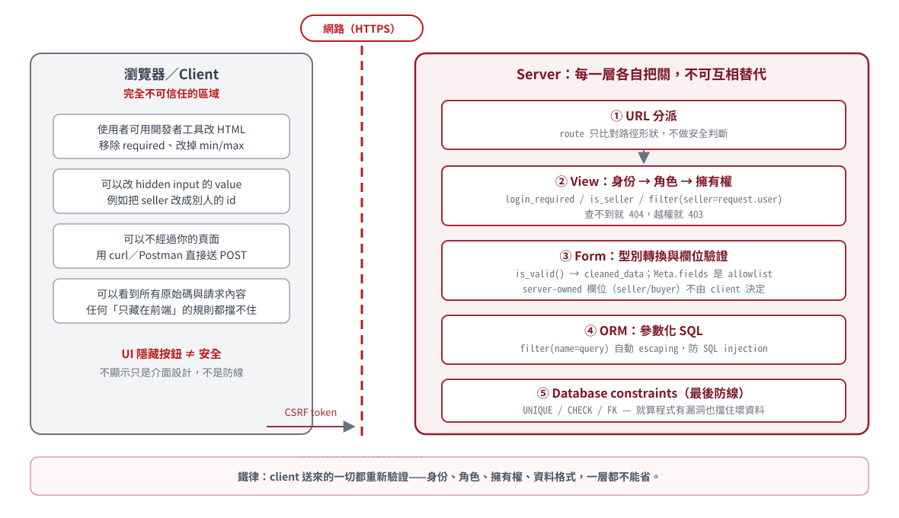

<!-- _class: cover -->

# Django 教學 15
## 安全與回歸測試整合

第 21 章

從最小範例到專案實作與驗收

---

## 本份學習路線

先完成 [14_出貨評價與狀態規則](14_出貨評價與狀態規則.md)。

- **第 21 章：完整流程的安全驗收**

每章依序：概念、最小範例、語法、專案對照、實作與驗收。

[全課目錄](../README.md) · [來源索引](../SOURCE_MAP.md) · [實作手冊對照](../WORKBOOK_MAP.md)

---

<!-- _class: cover -->

<a id="chapter-21"></a>

# 第 21 章
## 完整流程的安全驗收

完成一份含成功、失敗、越權與副作用的安全回歸驗收表。

---

## 本章的操作環境與成果

在 LearnMart 的練習分支操作；LearnBoard 用來比較相同規則。

**完成成果：** 完成一份含成功、失敗、越權與副作用的安全回歸驗收表。

完整範例可依步驟操作；標示「節錄／重排」的程式用來閱讀，不當作整檔覆蓋。
進階頁可回查，但所有基本驗收需完成。

---

<!-- source: C:156 | 02_forms_auth_and_two_projects/02_forms_auth_and_two_projects.md | line 2498 -->

## 21-1 安全不是最後才加的一頁

前面各章已經在功能旁使用：

- Template autoescaping：輸出 user content
- CSRF：token 與 Origin／Referer policy 防跨站 mutation
- Form validation：輸入型別與規則
- Authentication：確認身份
- Role／ownership：限制操作範圍
- Server-owned fields：價格、seller、buyer、status
- Transaction：多筆寫入一致性
- Tests：把預期行為固定下來

---

<!-- source: C:157 | 02_forms_auth_and_two_projects/02_forms_auth_and_two_projects.md | line 2513 -->

## 21-2 Trust boundary 地圖

```text
Browser-controlled
URL pk / query string / POST / hidden input / uploaded file
        ↓ validate + authorize
Django View / Form / QuerySet scope
        ↓ server-owned decisions
Models / Database / Transaction
        ↓ encode output
Template / Response
```

每跨一條邊界，都要問：「這個值從哪來？誰有權決定？」

---

<!-- source: C:158 | 02_forms_auth_and_two_projects/02_forms_auth_and_two_projects.md | line 2530 -->

## 21-3 圖解：信任邊界與五層伺服器防線



<!--
授課提示：左側四張卡片可各配實演（devtools 改 required、改 hidden input、curl 送 POST）。右側五層對應回收：② 第 17 章、③ 第 15 章、④⑤ 第 19 章。收尾提問：「哪一層可以省？」（都不能）
-->

---

<!-- source: C:159 | 02_forms_auth_and_two_projects/02_forms_auth_and_two_projects.md | line 2540 -->

## 21-4 XSS：Template autoescaping 的邊界

安全預設：

```django
{{ post.content }}
{{ post.content|linebreaksbr }}
```

危險：

```django
{{ post.content|safe }}
```

`safe` 告訴 Django 不要 escape；若資料來自使用者，就可能形成 stored XSS。

<!--
授課提示：demo 回收 第 1～14 章 3-6：留言板輸入 <b>粗體</b> 與 <script>，觀察 escape 差異與 |safe 的危險。
-->

---

<!-- source: C:160 | 02_forms_auth_and_two_projects/02_forms_auth_and_two_projects.md | line 2563 -->

## 21-5 Raw HttpResponse 不會套 Template autoescaping

```python
return HttpResponse(f"歡迎 {name}")
```

若 `name` 是 user-controlled HTML，這個字串會直接成為 response body。

更好的教學方向：

```python
return render(request, "hello.html", {"name": name})
```

或在確實需要時使用明確 escaping utility。不要把「Django 預設安全」誤解成所有字串都自動 escape。

---

<!-- source: C:161 | 02_forms_auth_and_two_projects/02_forms_auth_and_two_projects.md | line 2581 -->

## 21-6 BoardPost 是 stored XSS 的實際觀察點

Board create 儲存 user content；list template 顯示：

```django
<div>{{ post.content|linebreaksbr }}</div>
```

測試可建立 `<script>alert(1)</script>` 文字，再 assert response 包含 escaped 版本而非 raw executable markup。

安全測試要針對輸出，不只看「建立成功」。

---

<!-- source: C:162 | 02_forms_auth_and_two_projects/02_forms_auth_and_two_projects.md | line 2595 -->

## 21-7 SQL injection：ORM value 會參數化

```python
Product.objects.filter(name__icontains=query)
```

`query` 當參數傳給 database driver，不要用字串拼 SQL：

```python
# 危險示意，不要用 f-string 拼接 user input
Product.objects.raw(
    f"SELECT * FROM marketplace_product "
    f"WHERE name LIKE '%{query}%'"
)
```

ORM 防 SQL injection 不代表自動做 authorization。

<!--
授課提示：f-string 拼 SQL 的反例只看不跑；強調 ORM 參數化是預設，raw SQL 才需要警戒。
-->

---

<!-- source: C:163 | 02_forms_auth_and_two_projects/02_forms_auth_and_two_projects.md | line 2619 -->

## 21-8 Dynamic field name 仍需要 allowlist

即使 filter value 安全，使用者控制排序欄位也要限制：

```python
allowed = {"price", "-price", "created_at"}
ordering = request.GET.get("ordering", "-created_at")
if ordering not in allowed:
    ordering = "-created_at"
queryset = queryset.order_by(ordering)
```

不要把任意 query string 直接當 field/expression。

---

<!-- source: C:164 | 02_forms_auth_and_two_projects/02_forms_auth_and_two_projects.md | line 2635 -->

## 21-9 CSRF、Login、Role、Ownership 不可互相替代

以 ship_order 為例：

- CSRF：token 與 Origin／Referer policy 是否通過；不判斷 user 是否有權
- login：是誰
- role：是不是 seller
- ownership/membership：是否參與這張 order
- POST：method 語意與 405 enforcement

只通過其中一層不代表操作安全。

<!--
授課提示：表格快問快答：只做其中一項時，攻擊腳本會長怎樣？
-->

---

<!-- source: C:165 | 02_forms_auth_and_two_projects/02_forms_auth_and_two_projects.md | line 2653 -->

<!-- _class: compact -->

## 21-10 Upload：ImageField 不是完整安全策略

目前已有：

- `ImageField`
- Pillow 支援基本 image 驗證
- `upload_to="products/%Y/%m/"`
- local media storage

尚未完整處理：

- 明確 file size policy
- 內容重新編碼／metadata 移除
- 隨機命名與隔離
- malware scanning
- production object storage／CDN

---

<!-- source: C:168 | 02_forms_auth_and_two_projects/02_forms_auth_and_two_projects.md | line 2702 -->

## 21-11 現有六個測試保護什麼？

1. 搜尋找到商品
2. 匿名 add-to-cart redirect
3. buyer 可加入 cart
4. buyer 進 seller dashboard 得到 403
5. checkout 建 order、扣 stock、算 total
6. 不能讀別人的 order（404）

不要把「教材列出的測試主題」誤說成「目前都已實作」。

---

<!-- source: C:169 | 02_forms_auth_and_two_projects/02_forms_auth_and_two_projects.md | line 2715 -->

## 21-12 測試矩陣：一個 workflow 至少看五面

| 面向 | 問題 |
|---|---|
| 正常路徑 | 合法使用者能完成嗎？ |
| Invalid input | 邊界值會被拒絕且資料不變嗎？ |
| Authorization | 匿名、錯角色、錯 owner 的結果？ |
| Side effects | 相關 rows、stock、status、message 都正確嗎？ |
| Failure integrity | 中途失敗是否留下半套資料？ |

---

<!-- source: C:170 | 02_forms_auth_and_two_projects/02_forms_auth_and_two_projects.md | line 2727 -->

## 21-13 Response 與 database assertion 都重要

```python
response = self.client.post(url, data)
self.assertRedirects(response, expected_url)

order = Order.objects.get(buyer=self.buyer)
self.assertEqual(order.total, 1980)
self.product.refresh_from_db()
self.assertEqual(self.product.stock, 3)
```

HTTP 正確但資料錯，或資料正確但洩漏 URL，都算 workflow bug。

---

<!-- source: C:173 | 02_forms_auth_and_two_projects/02_forms_auth_and_two_projects.md | line 2773 -->

## 21-14 一次跑完整與單一測試

```bash
uv run python manage.py test
```

單一 method：

```bash
uv run python manage.py test \
  marketplace.tests.MarketplaceFlowTests.test_checkout_creates_order_and_reduces_stock
```

Dotted label 可指定 app、module、class 或 method，適合快速迭代。

---

<!-- source: C:174 | 02_forms_auth_and_two_projects/02_forms_auth_and_two_projects.md | line 2790 -->

## 21-15 Migration drift 不是 behavior test

```bash
uv run python manage.py makemigrations --check
```

它檢查 models 是否有尚未建立 migration 的變更。

它不會測試：

- View 權限
- Template 輸出
- checkout transaction
- status transition

三種命令目的不同，要一起使用而不是互相取代。

---

<!-- source: C:175 | 02_forms_auth_and_two_projects/02_forms_auth_and_two_projects.md | line 2809 -->

## 21-16 Security regression 的優先順序

先為高風險、容易退步的規則加測試：

1. ownership-scoped update/detail
2. server-calculated total
3. checkout failure integrity
4. seller order membership
5. review eligibility
6. POST-only state changes
7. user content output escaping

測試不能證明完全安全，但能阻止已知規則被後續修改破壞。

---

<!-- source: C:176 | 02_forms_auth_and_two_projects/02_forms_auth_and_two_projects.md | line 2825 -->

<!-- _class: compact -->

## 21-17 課堂版與正式商城的界線

目前適合學習：

- Django MVT 與 ORM
- 表單、auth、permissions
- transaction 與測試思維

正式營運仍缺：

- payment、tax、refund
- seller onboarding
- shipment grouping
- production concurrency
- object storage、monitoring、audit log
- 更完整 threat model 與 test coverage

<!--
授課提示：念一遍缺漏清單並宣佈：期末考觀念不考部署；想挑戰的同學指向 check --deploy。
-->

---

<!-- source: C:177 | 02_forms_auth_and_two_projects/02_forms_auth_and_two_projects.md | line 2848 -->

## 21-18 概念檢核

1. Template autoescaping 與 raw HttpResponse 的邊界在哪？
2. ORM 防 injection 是否同時保證 ownership？
3. 為何 CSRF、login、role、ownership 都要存在？
4. 一個 workflow test 為何要同時 assert response 與 side effects？
5. `check`、`makemigrations --check`、`test` 各自檢查什麼？

<span class="label check">答案見配套實作手冊原第 7 章</span>

<!--
授課提示：測試矩陣五面（匿名/身份/角色/資料/併發）讓學生對照自己的 lab 補洞。
-->

---

<!-- source: C:178 | 02_forms_auth_and_two_projects/02_forms_auth_and_two_projects.md | line 2864 -->

## 21-19 LearnMart 實作

任務：新增一個 ownership regression test 與一個失敗完整性 test。

驗收重點：

- 非 owner 得到預期 403／404
- forbidden object 不被修改
- 失敗 checkout 不留下 Order 或 stock/cart 半套狀態
- 完整 test suite 與 migration check 都通過

[LearnMart 安全測試手冊](../workbooks/learnmart_02_forms_auth_and_marketplace_workflows_workbook.md#chapter-7)；LearnBoard 安全與測試對應見第 17～18 章的 `board/tests.py` 對照。

---

<!-- source: C:183 | 02_forms_auth_and_two_projects/02_forms_auth_and_two_projects.md | line 2945 -->

## 21-20 全冊整合：兩個專案的兩條旅程

```text
LearnBoard:
GET message list → ORM filter → Template
POST create/update/delete → Form → CSRF/login → ownership → redirect
Tests → response + Message author/content + 403/404 invariants

LearnMart:
GET catalog → ORM filter → Template
POST cart → CSRF/login/stock/ownership
GET checkout → CheckoutForm + cart summary
POST checkout → validation → atomic writes → redirect
GET order → buyer-scoped queryset
POST ship/review → role or purchase rule → constraint
Tests → response + database + failure invariants
```

---

<!-- source: C:184 | 02_forms_auth_and_two_projects/02_forms_auth_and_two_projects.md | line 2967 -->

## 21-21 你現在應該能回答

- 哪些值由 browser 決定，哪些必須由 server 決定？
- 一個 protected CBV 在哪裡檢查 login、role、ownership？
- atomic 與 row locking 的保證有何不同？
- SQLite 對 `select_for_update()` 有何限制？
- 一項規則應放 Form、View、Model validator、constraint 還是 test？

---

<!-- source: C:185 | 02_forms_auth_and_two_projects/02_forms_auth_and_two_projects.md | line 2977 -->

## 21-22 建議驗證命令

```bash
uv run python manage.py check
uv run python manage.py makemigrations --check
uv run python manage.py test
```

接著使用 workbook 逐章完成 labs；每次只改一個可觀察行為，先跑單一測試，再跑完整 suite。

---

<!-- source: C:206 | 02_forms_auth_and_two_projects/02_forms_auth_and_two_projects.md | line 3288 -->

## 21-23 安全測試不是「掃描器章節」

你可以直接寫 regression tests：

- anonymous POST 被擋
- non-owner 不能 edit
- CSRF template 有 token
- XSS input 被 escape
- stock 不足不建立 order
- GET 不應觸發 state change

Security rule 要變成可重跑的 test。

---

<!-- source: C:207 | 02_forms_auth_and_two_projects/02_forms_auth_and_two_projects.md | line 3303 -->

## 21-24 每個 lab 的最終 checklist

```text
[ ] GET 頁面正常
[ ] invalid POST 顯示 errors
[ ] valid POST 寫入正確資料
[ ] 成功採 PRG
[ ] anonymous/other user 被正確阻擋
[ ] DB side effects 已驗證
[ ] 單支測試 green
[ ] 全部測試 green
```

---

<!-- source: C:208 | 02_forms_auth_and_two_projects/02_forms_auth_and_two_projects.md | line 3318 -->

## 21-25 下一步

你已建立兩個 server-rendered Django 專案共用的核心心智模型。

後續可深入：

- REST API 與前後端分離
- PostgreSQL transaction isolation／locking
- background jobs、email、cache
- payments、refund、shipment domain
- deployment、observability、security hardening

先把「資料完整性、權限、輸出安全與測試」守穩，再增加複雜度。

---

## 第 21 章實作與離堂檢核

**任務：** 完成一份含成功、失敗、越權與副作用的安全回歸驗收表。

1. 展示操作結果或測試紀錄，指出對應檔案與資料。
2. 解釋一個輸入如何得到結果，以及規則在哪一層檢查。
3. 改變一個條件或製造一次失敗，記錄觀察與修正。

**配套練習：** [LearnBoard 02 原第 5 章](../workbooks/learnboard_02_forms_auth_and_board_workflows_workbook.md#chapter-5)；[LearnBoard 02 原第 6 章](../workbooks/learnboard_02_forms_auth_and_board_workflows_workbook.md#chapter-6)；[LearnMart 02 原第 7 章](../workbooks/learnmart_02_forms_auth_and_marketplace_workflows_workbook.md#chapter-7)。手冊保留原章號，對照表列出本課位置。

---

## 本份完成與後續

下一份：[16_部署設定與正式環境](16_部署設定與正式環境.md)。

- 保留本份操作紀錄，確認使用正確的專案與資料庫。
- 章節與實作對應可由 [全課目錄](../README.md) 回查。
- 原始教材與合併去向見 [來源索引](../SOURCE_MAP.md)。
