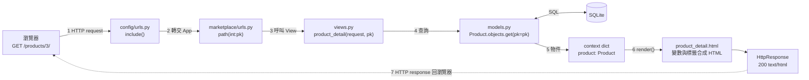
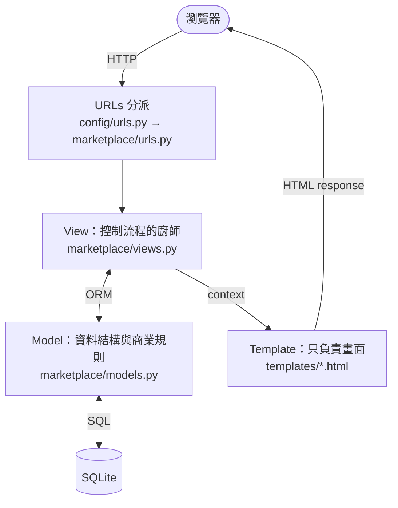
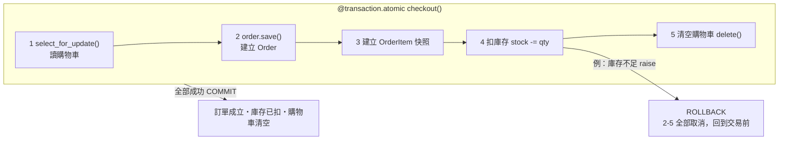
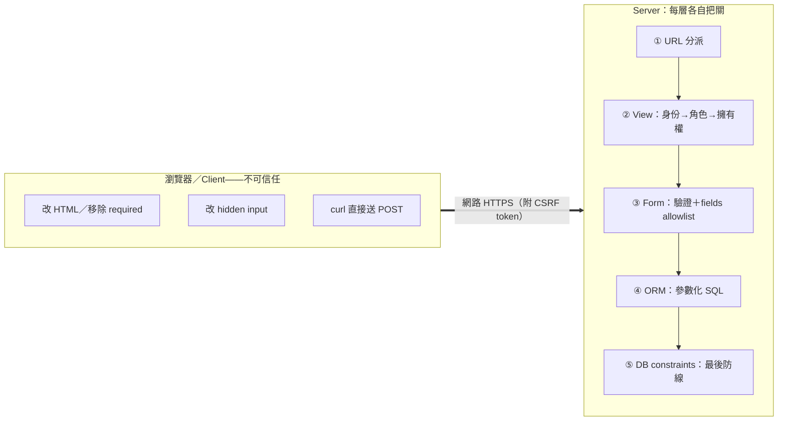
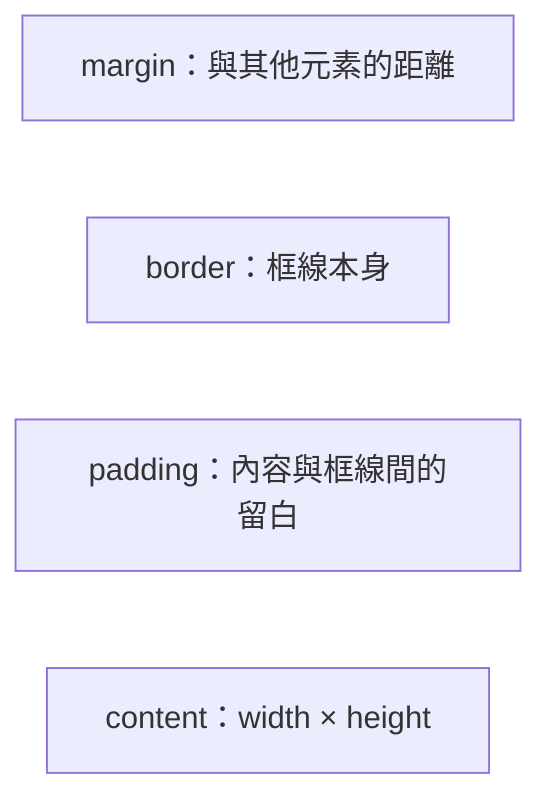

# 教學圖解：重製與再生成指南

本資料夾的圖解以手寫 SVG 儲存在 `slides/assets/`，投影片以相對路徑嵌入。SVG 是純文字檔，可以直接用編輯器修改文字、顏色與位置；也可以用瀏覽器開啟預覽。

| 檔案 | 內容 | 使用位置 |
|---|---|---|
| `request_flow.svg` | 一次 HTTP request 的完整旅程（8 步） | Deck 01 第 2 章、第 6 章 |
| `mvt_model.svg` | MVT 分工與 MVC 名詞對照 | Deck 01 第 3 章 |
| `transaction_rollback.svg` | checkout 在 `transaction.atomic` 內的成功／失敗兩條路徑 | Deck 02 第 5 章 |
| `trust_boundary.svg` | Client／Server 信任邊界與五層伺服器防線 | Deck 02 第 7 章 |
| `box_model.svg` | CSS box model 四層結構 | Deck 00b HTML/CSS 先備 |

## 為什麼主要用手寫 SVG，而不是 AI 生圖？

- DALL·E、Midjourney、Imagen 等**點陣生圖工具目前無法可靠渲染中文字與精確技術名詞**（`select_for_update()`、`` 等），幾乎必然出現亂碼或拼錯。
- 流程圖需要「文字完全正確」，建議優先順序：
  1. 直接編輯本資料夾的 SVG；
  2. 下述 Mermaid 源碼（貼到 <https://mermaid.live> 即時預覽、匯出 PNG/SVG）；
  3. draw.io / Excalidraw 手動重繪。
- 若仍想用 AI 工具產生插畫式配圖，請使用下方提示詞讓 AI **產生 SVG/Mermaid 程式碼**（而非直接生圖），輸出後逐一檢查中文字串。

## 提示詞（適用 ChatGPT / Gemini / Copilot）

### 圖 1：Request flow

```text
請產生一張教學用的流程圖（輸出 SVG 原始碼，16:9，中文標籤），主題：
Django 處理一次 HTTP request 的完整旅程。需求：
1. 第一列由左至右：瀏覽器 → config/urls.py（include 到 app）→
   marketplace/urls.py（path("<int:pk>/")）→ views.py 的 product_detail(request, pk)。
2. 第二列由右至左：models.py 的 Product.objects.get(pk=pk) →
   context dict {"product": ...} → templates/marketplace/product_detail.html。
3. models.py 底下接一個 SQLite 圓柱，標注 SQL。
4. 最後是 HttpResponse（status 200, text/html），用明顯的返回箭頭回到瀏覽器，
   標注「HTTP response」。每個箭頭加 1–8 步驟編號圓圈。
5. 配色：主色 #8f1d2c、輔助 #a52a3a、淡底 #faf1f2、灰箭頭 #6b7280。
   檔名用等寬字型；中文用 PingFang TC / Microsoft JhengHei 字族。
```

### 圖 2：MVT 分工

```text
請產生一張 Django MVT 架構圖（輸出 SVG，中文標籤）：
1. 頂部「瀏覽器」膠囊，向下經「HTTP」箭頭到 URLs 分派框
   （config/urls.py → marketplace/urls.py）。
2. URLs 向下到中央大框 View（marketplace/views.py），說明：
   「讀 request → 查資料 → 準備 context → 選模板」。
3. View 左側雙向箭頭連 Model（marketplace/models.py，標注 ORM），
   Model 向下連 SQLite 圓柱（標注 SQL）。
4. View 右側單向箭頭連 Template（templates/，標注 context），
   Template 用粗箭頭回到頂部瀏覽器，標注「HTML response」。
5. 底部註解框：「Django 的 View ≈ MVC 的 Controller；
   Django 的 Template ≈ MVC 的 View」。
```

### 圖 3：Transaction rollback

```text
請產生一張交易示意圖（輸出 SVG，中文標籤）：
1. 虛線圓角大容器，頁籤寫 @transaction.atomic checkout()。
2. 容器內五個步驟方塊依序以箭頭連接：
   ① select_for_update() 讀購物車 → ② order.save() 建立 Order
   → ③ 建立 OrderItem 快照 → ④ 扣庫存 stock -= quantity → ⑤ 清空購物車 .delete()。
3. 步驟④上方紅色「!」標記，標注「例：庫存不足 → raise」，
   並從④畫紅色虛線回溯箭頭掃回②，標注「ROLLBACK：②③④⑤ 全部取消」。
4. 容器下方兩張結果卡：
   綠卡（#2f7d4f）「COMMIT：訂單成立、庫存已扣、購物車清空」；
   紅卡（#b91c1c）「ROLLBACK：不會有『訂單建了但庫存沒扣』的半套狀態，
   購物車完好，導回 cart」。
```

### 圖 4：Trust boundary

```text
請產生一張安全信任邊界圖（輸出 SVG，中文標籤）：
1. 左側灰色區域「瀏覽器／Client——完全不可信任」，四張卡片：
   可用 devtools 改 HTML 移除 required/min；可改 hidden input；
   可用 curl 直接送 POST；可看到所有原始碼。底部紅字「UI 隱藏按鈕 ≠ 安全」。
2. 中間紅色虛線垂直邊界，上方標籤「網路（HTTPS）」，並畫一條跨界的 CSRF token 箭頭。
3. 右側深紅區域「Server：每一層各自把關」，五層堆疊：
   URL 分派 → View（身份→角色→擁有權）→ Form（驗證＋fields allowlist）
   → ORM（參數化 SQL）→ DB constraints（UNIQUE/CHECK/FK，最後防線），層間向下箭頭。
4. 底部橫幅：「client 送來的一切都重新驗證——身份、角色、擁有權、資料格式」。
```

### 圖 5：Box model

```text
請產生一張 CSS box model 教學圖（輸出 SVG，中文標籤）：
四層同心矩形，由外而內：margin（灰虛線透明）、border（深紅粗實線 #8f1d2c）、
padding（淺紅底 #f7ecee）、content（白底，標 width × height）。
每層左上角有名稱與一句說明。底部計算範例：
content 300 + padding 左右 48 + border 左右 8 = 佔位 356px，
並註明 Chrome DevTools Computed 面板顯示同一張圖。
```

## Mermaid 替代源碼

貼到 <https://mermaid.live> 即可預覽與匯出；改完後匯出 SVG 存回 `assets/` 同名檔案（投影片不用改）。注意：Mermaid 對複雜版面的控制力低於手寫 SVG，適合快速改文字。

### Request flow



### MVT 分工



### Transaction rollback



### Trust boundary



### Box model


