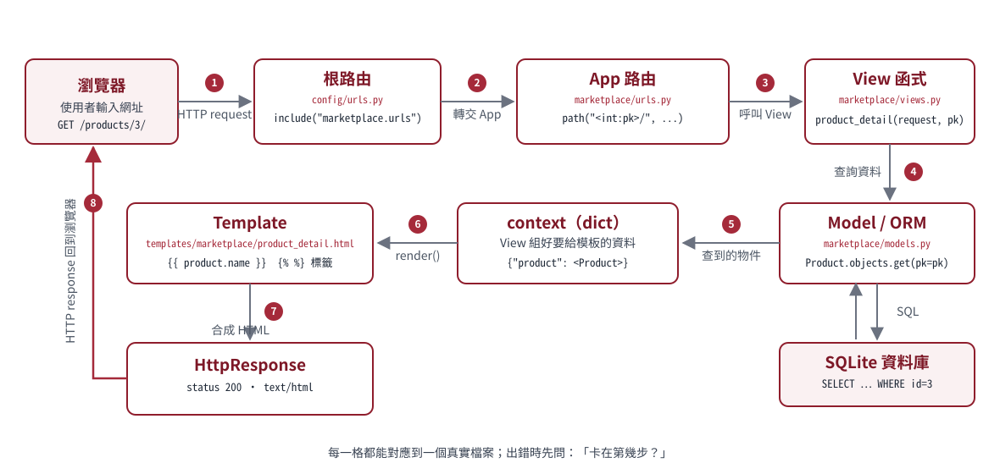

# 第 6 章
## 整合：可搜尋的留言牆

**本章成果：**能把 URL、CBV、ORM、template 串成一條完整資料流，並親手驗收。

<!--
授課提示：本章是第一冊的總驗收。驗收清單 6-7 每一格都要學生自己打勾，不要由講師代打。
-->

---

## 6-1 ListView：把列表頁模式化

```python
# board/views.py（目前 LearnBoard 實作｜逐字摘錄）
class MessageListView(ListView):
    model = Message
    template_name = "board/message_list.html"
    context_object_name = "posts"
    paginate_by = 10
```

ListView 幫你做完的事：查詢、分頁、渲染指定模板、把列表放進 context。

`context_object_name="posts"` 決定模板裡用 ``。

> 這是你遇到的第一個 CBV（Class-based View）。它等價於一段你已經看得懂的 function view＋查詢＋render。

---

## 6-2 搜尋：GET 參數進入 QuerySet

```python
def get_queryset(self):
    queryset = Message.objects.select_related("author")
    query = self.request.GET.get("q", "").strip()
    if query:
        queryset = queryset.filter(Q(content__icontains=query))
    return queryset
```

資料流：搜尋框 `name="q"` → `?q=…` → `request.GET` → filter → 模板。

**注意：**搜尋用 GET 而非 POST——查詢不改變資料，也可以分享網址與收藏。

---

## 6-3 get_context_data：額外塞東西給模板

```python
def get_context_data(self, **kwargs):
    context = super().get_context_data(**kwargs)
    context["query"] = self.request.GET.get("q", "")
    return context
```

把原始 query 塞回 context，模板才能：

- 在搜尋框回填 `value="{{ query }}"`
- 在標題顯示「『django』的搜尋结果」
- 分頁連結帶上 `&q={{ query|urlencode }}`

---

## 6-4 分頁：一行設定＋一段共用模板

```python
paginate_by = 10
```

```html
{# board/pagination.html #}

<nav><ul class="pagination justify-content-center">
  
    <li><a href="?page={{ page_obj.previous_page_number }}&q={{ query|urlencode }}">上一頁</a></li>
  
  <li class="active"><span>{{ page_obj.number }} / {{ page_obj.paginator.num_pages }}</span></li>
   …下一頁… 
</ul></nav>

```

ListView 自動提供 `page_obj`、`is_paginated`、`paginator` 三個 context 變數。

---

## 6-5 卡片迴圈：資料變畫面

```html

<article class="card border-0 shadow-sm mb-3 post-card">
  <div class="card-body">
    <span class="avatar rounded-circle">{{ post.author.username|first|upper }}</span>
    <div class="fw-semibold small">
      {{ post.author.username }}訪客
    </div>
    <p class="mb-0 post-content">{{ post.content|linebreaksbr }}</p>
  </div>
</article>

<div class="alert alert-light">目前還沒有留言。</div>

```

`author` 可能為空（訪客留言）→ `` 保護。防禦式渲染從第一天就養成。

---

## 6-6 完整資料流回顧



以 `GET /?q=django` 為例：

1. URLconf → `MessageListView`
2. `get_queryset()` → `SELECT … WHERE content LIKE … ORDER BY created_at DESC LIMIT 10`
3. `get_context_data()` → 補上 `query`
4. template 迴圈 → 十張卡片＋分頁
5. 200 OK 回瀏覽器

**你能回答開場三問了嗎？**資料從哪裡來？經過什麼？最後在哪裡顯示？

---

## 6-7 驗收清單：你應該看到

- [ ] `http://127.0.0.1:8000/` 顯示留言牆，最新的在最上面
- [ ] 搜尋 `paginate` 只剩下相關留言，搜尋框保留關鍵字
- [ ] 搜尋不存在的字 → 顯示「找不到符合…」而非錯誤頁
- [ ] admin 新增第 11 筆留言 → 首頁出現分頁「1 / 2」
- [ ] 點上一頁／下一頁，query 不會消失

全部打勾 → 恭喜，第一冊 vertical slice 完成。

---

## 6-8 分辨：目前的牆還缺什麼？

| 缺口 | 現況 | 補上的地方 |
|---|---|---|
| 發文表單 | 只有 admin 能新增 | Deck 02 第 1 章（Form 生命週期） |
| 帳號 | 只有 admin 帳號 | Deck 02 第 2 章（註冊／登入） |
| 留言歸屬 | 訪客留言無作者 | Deck 02 第 3 章（加 author 欄位） |
| 編輯／刪除權限 | admin 全能、他人不可 | Deck 02 第 4 章（擁有權） |
| 測試 | 無 | Deck 02 第 6 章（TestCase） |

**現在的牆是「唯讀展示版」。**下一冊把它變成真正的個人留言板。

---

## 第 6 章｜觀念檢核

1. `context_object_name` 改掉會發生什麼事？
2. 為什麼搜尋要用 GET？用 POST 會失去什麼？
3. `page_obj.number` 與 `paginator.num_pages` 各是什麼？
4. 若模板拿掉 ``，哪一則留言會壞掉？

---

## 總結與下一站

你已經走完：

**環境 → HTTP/URL → Template/static → Model/migration → ORM → 完整留言牆**

下一冊 LearnBoard 02：

1. 表單生命週期與 POST
2. 註冊、登入與 session
3. 把留言連回作者（migration 演進）
4. 編輯／刪除與擁有權
5. CSRF／XSS／IDOR 安全三課
6. 測試守住以上一切

完成後，你就具備進入 LearnMart 商城的所有前置能力。

<!--
授課提示：提醒學生保留 learnboard 專案——Deck 02 直接在其上繼續開發；商城階段也會不時回來對照。
-->
